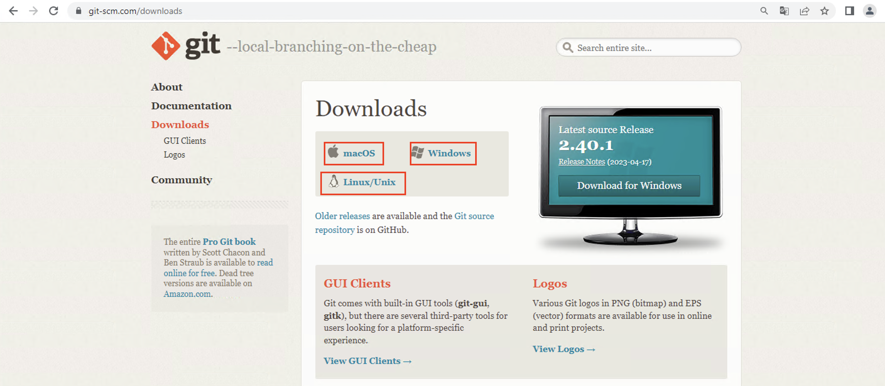
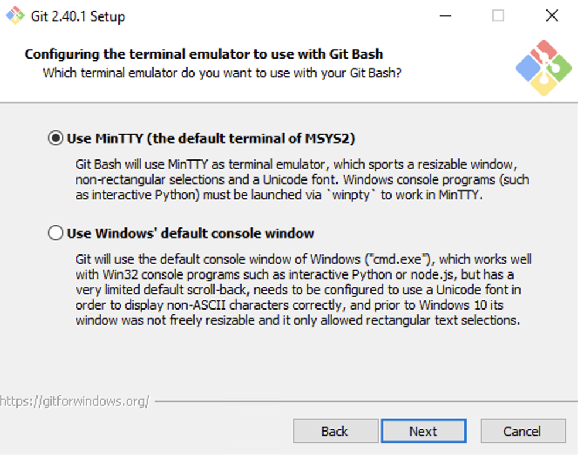
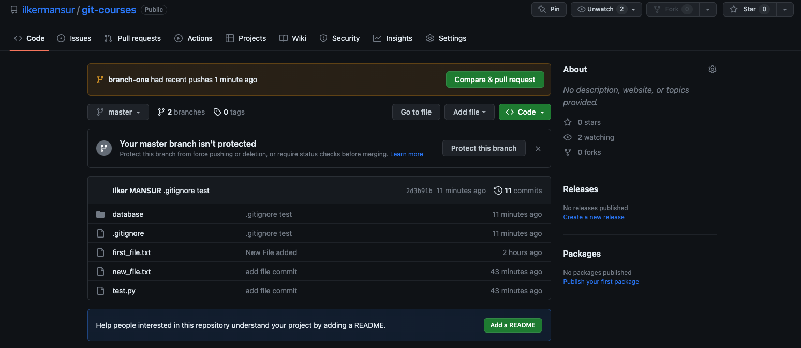

# clauto

## Virtualenv and PIP

**PIP**

For sharing project, you should share virtual environment libraries. There is a easy way. You can use `pip freeze` for this.

```
(newproject) PS C:\Users\ILKER\Desktop\Devnet\python3.11\newproject\Scripts> pip freeze > requirements.txt
(newproject) PS C:\Users\ILKER\Desktop\Devnet\python3.11\newproject\Scripts> dir


    Directory: C:\Users\ILKER\Desktop\Devnet\python3.11\newproject\Scripts


Mode                 LastWriteTime         Length Name
----                 -------------         ------ ----
-a----         5/26/2023  10:05 PM           2174 activate
-a----         5/26/2023  10:05 PM           1027 activate.bat
-a----         5/26/2023  10:05 PM           3051 activate.fish
-a----         5/26/2023  10:05 PM           3370 activate.nu
-a----         5/26/2023  10:05 PM           1758 activate.ps1
-a----         5/26/2023  10:05 PM           1207 activate_this.py
-a----         5/26/2023  10:05 PM            511 deactivate.bat
-a----         5/26/2023  10:45 PM         108452 normalizer.exe
-a----         5/26/2023  10:05 PM         108429 pip-3.11.exe
-a----         5/26/2023  10:05 PM         108429 pip.exe
-a----         5/26/2023  10:05 PM         108429 pip3.11.exe
-a----         5/26/2023  10:05 PM         108429 pip3.exe
-a----         5/26/2023  10:05 PM             24 pydoc.bat
-a----         5/26/2023  10:05 PM         270616 python.exe
-a----         5/26/2023  10:05 PM         259344 pythonw.exe
-a----         5/26/2023  10:59 PM         #   560 requirements.txt
-a----         5/26/2023  10:05 PM         108416 wheel-3.11.exe
-a----         5/26/2023  10:05 PM         108416 wheel.exe
-a----         5/26/2023  10:05 PM         108416 wheel3.11.exe
-a----         5/26/2023  10:05 PM         108416 wheel3.exe
```

If you want to share your project you should share two things

1 - Project code
2 - `requirements.txt` file.

For installing libraries list  use this `requirements.txt` file:

```powershell
pip install -r requirements.txt
```

this command will install all required libraries. 

**Virtual Enviroment**

`virtualenv` is a tool in Python that allows you to create isolated Python environments. It helps you manage dependencies and keep the packages required by different projects separate from each other.

When you create a virtual environment using virtualenv, it creates a directory that contains a Python interpreter and its own site-packages directory. This means that any packages you install or modify within the virtual environment will not affect the system-wide Python installation or other virtual environments.

* Install `virtualenv`

```powershell
python.exe -m pip install --user virtualenv
!
PS C:\Users\ILKER\Desktop\Devnet\python3.11\Scripts> .\pip.exe list                 
Package      Version
------------ -------
distlib      0.3.6
filelock     3.12.0
pip          22.3.1
platformdirs 3.5.1
setuptools   65.5.0
virtualenv   20.23.0
```
After installation `virtualenv` create new environment like `newproject`

```powershell
PS C:\Users\ILKER\Desktop\Devnet\python3.11> .\python.exe -m virtualenv newproject
created virtual environment CPython3.11.3.final.0-64 in 6863ms
  creator CPython3Windows(dest=C:\Users\ILKER\Desktop\Devnet\python3.11\newproject, clear=False, no_vcs_ignore=False, global=False)
  seeder FromAppData(download=False, pip=bundle, setuptools=bundle, wheel=bundle, via=copy, app_data_dir=C:\Users\ILKER\AppData\Local\pypa\virtualenv)
    added seed packages: pip==23.1.2, setuptools==67.7.2, wheel==0.40.0
  activators BashActivator,BatchActivator,FishActivator,NushellActivator,PowerShellActivator,PythonActivator
```
Now, there is a **new** directory now.

```powershell
PS C:\Users\ILKER\Desktop\Devnet\python3.11> dir


    Directory: C:\Users\ILKER\Desktop\Devnet\python3.11


Mode                 LastWriteTime         Length Name
----                 -------------         ------ ----
d-----         5/26/2023   9:34 PM                DLLs
d-----         5/26/2023   9:33 PM                Doc
d-----         5/26/2023   9:33 PM                include
d-----         5/26/2023   9:33 PM                Lib
d-----         5/26/2023   9:33 PM                libs
d-----         5/26/2023  10:05 PM              # newproject
d-----         5/26/2023   9:34 PM                Scripts
d-----         5/26/2023   9:34 PM                tcl
d-----         5/26/2023   9:33 PM                Tools
-a----          4/5/2023  12:04 AM          32768 LICENSE.txt
-a----          4/5/2023  12:05 AM        1481302 NEWS.txt
-a----          4/5/2023  12:04 AM         103192 python.exe
-a----          4/5/2023  12:04 AM          67344 python3.dll
-a----          4/5/2023  12:04 AM        5760784 python311.dll
-a----          4/5/2023  12:04 AM         101648 pythonw.exe
-a----          4/5/2023  12:04 AM         109392 vcruntime140.dll
-a----          4/5/2023  12:04 AM          49520 vcruntime140_1.dll
```
which is include its own `Lib` and `Scripts` directory

```powershell
PS C:\Users\ILKER\Desktop\Devnet\python3.11> cd .\newproject\
PS C:\Users\ILKER\Desktop\Devnet\python3.11\newproject> dir


    Directory: C:\Users\ILKER\Desktop\Devnet\python3.11\newproject


Mode                 LastWriteTime         Length Name
----                 -------------         ------ ----
d-----         5/26/2023  10:05 PM                Lib
d-----         5/26/2023  10:05 PM                Scripts
-a----         5/26/2023  10:05 PM             42 .gitignore
-a----         5/26/2023  10:05 PM            354 pyvenv.cfg


PS C:\Users\ILKER\Desktop\Devnet\python3.11\newproject> 
```
!!! Note 
    If you are using `VSCODE Terminal` you might getting error about permission. Set below parameter on power shell for permission.

    ```powershell
    Set-ExecutionPolicy -ExecutionPolicy RemoteSigned -Scope CurrentUser
    ```

then activate `virtualenv`

```powershell
PS C:\Users\ILKER\Desktop\Devnet\python3.11> cd .\newproject\Scripts
PS C:\Users\ILKER\Desktop\Devnet\python3.11\newproject\Scripts> .\activate
(newproject) PS C:\Users\ILKER\Desktop\Devnet\python3.11\newproject\Scripts> 
```
 Now you are in relevant virtual environment. You can download `Python Library` which you want. These libraries is in just this virtual environment.

??? note "  Install Library with    --->   `pip install ciscoaxl`   "
    
    (newproject) PS C:\Users\ILKER\Desktop\Devnet\python3.11\newproject\Scripts> .\pip.exe install ciscoaxl
    Collecting ciscoaxl
      Downloading ciscoaxl-0.163-py3-none-any.whl (2.5 MB)
        ━━━━━━━━━━━━━━━━━━━━━━━━━━━━━━━━━━━━━━━━ 2.5/2.5 MB 532.0 kB/s eta 0:00:00
    Collecting requests<3.0.0,>=2.27.1 (from ciscoaxl)
      Downloading requests-2.31.0-py3-none-any.whl (62 kB)
        ━━━━━━━━━━━━━━━━━━━━━━━━━━━━━━━━━━━━━━━━ 62.6/62.6 kB 418.7 kB/s eta 0:00:00
    Collecting termcolor<2.0.0,>=1.1.0 (from ciscoaxl)
      Downloading termcolor-1.1.0.tar.gz (3.9 kB)
      Preparing metadata (setup.py) ... done
    Collecting zeep<5.0.0,>=4.1.0 (from ciscoaxl)
      Downloading zeep-4.2.1-py3-none-any.whl (101 kB)
        ━━━━━━━━━━━━━━━━━━━━━━━━━━━━━━━━━━━━━━━━ 101.2/101.2 kB 448.1 kB/s eta 0:00:00
    Collecting charset-normalizer<4,>=2 (from requests<3.0.0,>=2.27.1->ciscoaxl)
      Downloading charset_normalizer-3.1.0-cp311-cp311-win_amd64.whl (96 kB)
        ━━━━━━━━━━━━━━━━━━━━━━━━━━━━━━━━━━━━━━━━ 96.7/96.7 kB 691.6 kB/s eta 0:00:00
    Collecting idna<4,>=2.5 (from requests<3.0.0,>=2.27.1->ciscoaxl)
      Downloading idna-3.4-py3-none-any.whl (61 kB)
        ━━━━━━━━━━━━━━━━━━━━━━━━━━━━━━━━━━━━━━━━ 61.5/61.5 kB 219.2 kB/s eta 0:00:00
    Collecting urllib3<3,>=1.21.1 (from requests<3.0.0,>=2.27.1->ciscoaxl)
      Downloading urllib3-2.0.2-py3-none-any.whl (123 kB)
        ━━━━━━━━━━━━━━━━━━━━━━━━━━━━━━━━━━━━━━━━ 123.2/123.2 kB 482.9 kB/s eta 0:00:00
    Collecting certifi>=2017.4.17 (from requests<3.0.0,>=2.27.1->ciscoaxl)
      Downloading certifi-2023.5.7-py3-none-any.whl (156 kB)
        ━━━━━━━━━━━━━━━━━━━━━━━━━━━━━━━━━━━━━━━━ 157.0/157.0 kB 494.0 kB/s eta 0:00:00
    Collecting attrs>=17.2.0 (from zeep<5.0.0,>=4.1.0->ciscoaxl)
      Downloading attrs-23.1.0-py3-none-any.whl (61 kB)
        ━━━━━━━━━━━━━━━━━━━━━━━━━━━━━━━━━━━━━━━━ 61.2/61.2 kB 361.1 kB/s eta 0:00:00
    Collecting isodate>=0.5.4 (from zeep<5.0.0,>=4.1.0->ciscoaxl)
      Downloading isodate-0.6.1-py2.py3-none-any.whl (41 kB)
        ━━━━━━━━━━━━━━━━━━━━━━━━━━━━━━━━━━━━━━━━ 41.7/41.7 kB ? eta 0:00:00
    Collecting lxml>=4.6.0 (from zeep<5.0.0,>=4.1.0->ciscoaxl)
      Downloading lxml-4.9.2-cp311-cp311-win_amd64.whl (3.8 MB)
        ━━━━━━━━━━━━━━━━━━━━━━━━━━━━━━━━━━━━━━━━ 3.8/3.8 MB 520.4 kB/s eta 0:00:00
    Collecting platformdirs>=1.4.0 (from zeep<5.0.0,>=4.1.0->ciscoaxl)
      Using cached platformdirs-3.5.1-py3-none-any.whl (15 kB)
    Collecting requests-toolbelt>=0.7.1 (from zeep<5.0.0,>=4.1.0->ciscoaxl)
      Downloading requests_toolbelt-1.0.0-py2.py3-none-any.whl (54 kB)
        ━━━━━━━━━━━━━━━━━━━━━━━━━━━━━━━━━━━━━━━━ 54.5/54.5 kB 313.8 kB/s eta 0:00:00
    Collecting requests-file>=1.5.1 (from zeep<5.0.0,>=4.1.0->ciscoaxl)
      Downloading requests_file-1.5.1-py2.py3-none-any.whl (3.7 kB)
    Collecting pytz (from zeep<5.0.0,>=4.1.0->ciscoaxl)
      Downloading pytz-2023.3-py2.py3-none-any.whl (502 kB)
        ━━━━━━━━━━━━━━━━━━━━━━━━━━━━━━━━━━━━━━━━ 502.3/502.3 kB 492.1 kB/s eta 0:00:00
    Collecting six (from isodate>=0.5.4->zeep<5.0.0,>=4.1.0->ciscoaxl)
      Downloading six-1.16.0-py2.py3-none-any.whl (11 kB)
    Building wheels for collected packages: termcolor
      Building wheel for termcolor (setup.py) ... done
      Created wheel for termcolor: filename=termcolor-1.1.0-py3-none-any.whl size=4855 sha256=e9524761cce50dfcece5932fb4a385d31a2091fe904f4da696ff01839cccb4c2
      Stored in directory: c:\users\ilker\appdata\local\pip\cache\wheels\9f\ca\d7\8f2399d70f5d641d4fef951a78d6aa4ab64cc582e1c4dec9a3
    Successfully built termcolor
    Installing collected packages: termcolor, pytz, urllib3, six, platformdirs, lxml, idna, charset-normalizer, certifi, attrs, requests, isodate, requests-toolbelt, requests-file, zeep, ciscoaxl
    Successfully installed attrs-23.1.0 certifi-2023.5.7 charset-normalizer-3.1.0 ciscoaxl-0.163 idna-3.4 isodate-0.6.1 lxml-4.9.2 platformdirs-3.5.1 pytz-2023.3 requests-2.31.0 requests-file-1.5.1 requests-toolbelt-1.0.0 six-1.16.0 termcolor-1.1.0 urllib3-2.0.2 zeep-4.2.1


```powershell

(newproject) PS C:\Users\ILKER\Desktop\Devnet\python3.11\newproject\Scripts> pip list 
Package            Version
------------------ --------
attrs              23.1.0
certifi            2023.5.7
charset-normalizer 3.1.0
ciscoaxl           0.163
idna               3.4
isodate            0.6.1
lxml               4.9.2
pip                23.1.2
platformdirs       3.5.1
pytz               2023.3
requests           2.31.0
requests-file      1.5.1
requests-toolbelt  1.0.0
setuptools         67.7.2
six                1.16.0
termcolor          1.1.0
urllib3            2.0.2
wheel              0.40.0
zeep               4.2.1

```

???+ tip "Attention"
    But These libraries are not in global python library. Lets test it

    (newproject) PS C:\Users\ILKER\Desktop\Devnet\python3.11\newproject\Scripts> deactivate  

    PS C:\Users\ILKER\Desktop\Devnet\python3.11\Scripts> .\pip.exe list

    Package      Version
    
    distlib      0.3.6

    filelock     3.12.0

    pip          23.1.2

    platformdirs 3.5.1

    setuptools   65.5.0

    virtualenv   20.23.0

**Fundamental Of Python**

Devices can be manage by human with three ways. Python can be sumilate these with ==Python Libraries==


Python can be used for network devices with below reason

- [x] Backup Configuration
- [x] Daily routine
- [x] Automation Bulk Configuration
- [x] Configuration Depend on Condition
- [x] Pull information from device
- [x] Health check

{height="80%" width="80%"}


## Data type in PYTHON

**String**

* String can use single, double quotes

```python
  ip_1 = '10.0.0.1'
  print (ip_1)
  print (len(ip_1))
```

  > 10.0.0.1

  > 8

```py
  ip_2 = "10.0.0.2"
  print (ip_2) 
```
> 10.0.0.2

* or both

```py
  Einstein = "If you can't explain it simply, you don't understand it well enough"
  print (Einstein)
  print (len(Einstein))
```
> If you can't explain it simply, you don't understand it well enough

> 67

* STRING OPERATIONS

* You can add strings together to concatenate them

```python
  ipaddr = ip_1 + ip_2
  print (ipaddr)                      
```
> 10.0.0.110.0.0.2

* You can use whitespace between strings

```python
  ipaddr = ip_1 + ' ' +ip_2
  print (ipaddr)                      
```
> 10.0.0.1 10.0.0.2

* Easy way to add more whitespace between strings another words strings can be multiply

```python
  ipaddr = ip_1 + ' '*10 +ip_2
  print(ipaddr)                      
```
> 10.0.0.1          10.0.0.2

* You can't add strings and numbers

```python
  age=40
  print("You are " + age)           
```
> TypeError: can only concatenate str (not "int") to str

* But you can if you turn the number into a string first:
  
```python
  age=40
  age_as_string = str(40)
  print("You are " + age_as_string) 
```
> You are 40

* SOME ESCAPE CHARACTERS

```python 
  Einstein = "If you can't explain it simply,\n you don't understand it well enough"
  print (Einstein)
```
> If you can't explain it simply,
> you don't understand it well enough

```python
Einstein = "If you can't explain it simply,\n\n you don't understand it well enough"
  print (Einstein)
```

> If you can't explain it simply,
		
> you don't understand it well enough

```python
  nameandsurname = 'ilker\tmansur'
  print (nameandsurname)
  ```
> ilker    mansur

```python
  Einstein = 'If you can\'t explain it simply, you don\'t understand it well enough'
  print (Einstein)
```

> 'If you can\'t explain it simply, you don\'t understand it well enough'
 
* INDEX of STRING

```python 
  adsoyad = 'ilker mansur'
  print(adsoyad[0])
```
> i
		
```python
  print(adsoyad[1])
```
> l

```python		
  print(adsoyad[2])
```
> k

```python		
print(adsoyad[3])
```
> e

```python		
print(adsoyad[4])
```
> r

* or specific part of string

```python
  print (adsoyad[0:])
```
> ilker mansur

```python		
  print (adsoyad[6:])
```
> mansur

```python		
  print (adsoyad[:6])
```
> ilker

```python		
  print(adsoyad[2:4])
```
> ke

* Actually data types ,that we use, are classes at the same time<class 'str'>

```python		
  print (type (adsoyad))
```
> <class 'str'>

* SOME METHOD of STR CLASS

```python		
  adsoyad = "    İlker Mansur    "

  print(adsoyad.count('r'))
```
> 2

```python		
  print(adsoyad.endswith('r'))
```
> False

```python		
  print(adsoyad.endswith(' '))
```
> True

```python		
  print(adsoyad.startwith('İ'))
```
> True

```python		
  print(adsoyad.lower())
```

>     ilker mansur

```python		  
  print(adsoyad.upper())
```

>     İLKER MANSUR

```python		
  print(adsoyad.strip())
```
> İlker Mansur

```python		
  print(adsoyad.rstrip())
```
>     İlker Mansur

```python		
  print(adsoyad.lstrip())
```
> İlker Mansur
		
```python
  ip_address = "10.0.0.1 255.255.255.0"

  print(ip_address.split(' '))
```
> ['10.0.0.1', '255.255.255.0']

```python  
  print (ip_address.split('.'))
```
> ['10', '0', '0', '1 255', '255', '255', '0']

```python
  new_ip_address = ip_address.replace('10','20')
  print(new_ip_address)
```
> 20.0.0.1 255.255.255.0

PS: `replace` converts all parameters which is match the given parameter, if you want to use one time or specific times, you should use extra parameter like ('10','20',2). 

```python
  new_ip_address = ip_address[::-1]
```
> 0.552.552.552 1.0.0.01
		
**Integer & Float**

```python
  number = 10
  print(type(number))
```
> <class 'int'>

```python		
  number = 10.0
  print(type(number))
```
> <class 'float'>
	
* In network automation scripts, use str for expressing ip address instead of integer because of syntax

```python
ipaddr_int = 10.0.0.1
ipaddr_str = '10.0.0.1'
```

* MATH with operator ('+' '-' '*' '/' '//' '%')

```python
  a = 9
  b = 2
  
  c = a + b
  print (c)
```
> 11

```python  
  c = a - b
  print (c)
```
> 7
  
```python
  c = a / b
  print (c)
```
> 4.5

```python  
  c = a // b
  print (c)
```
> 4

```python  
  c = a % b
  print (c)
```
> 1

* It is possibble to convert int <-> float

```python	
  a = 9
  b = float(a)
  print(b)
```
> 9.0

```python
  c = 7.0
  d = int(c)
  print (d)
```
> 7

```python
  e = 5.9
  f = int(e)
  print (f)
```
> 5
		
**Boolean**
  
* Booleans returns only 'True' or 'False'

```python
  a = 9
  b = 6
  print (a == b)
  print (a != b)
```
> False

> True

```python
  a = 'Router01'
  b = 'router_02'
  print (a == b)
```

> False

```python
  a = True
  b = False
  
  print (a or b)
  print (a and b)
  print (a or a)
  print (a and a)
  print (b and b)
```
> True

> False

> True

> True

> False
		
**List**
  
* Lists are the object type called list, and at their most basic level are an ordered sequence of objects.

```python
  hostnames = ['r1' , 'r2' , 'r3' , 'r4' , 'r5']
  commands = ['conf t' , 'interface Ethernet1/1' , 'no shutdown']
```

* Each object can be different data type

```python
  my_list = ['router1' , False , 3]
```

* Can be use each element from list

```python
  voiceinterfaces = ['Eth1/1' , 'Eth1/2' , 'Eth1/3' , 'Eth1/4']

  print(voiceinterfaces[0])           
```

> Eth1/1

```python		
  print(voiceinterfaces[1])           
```
> Eth1/2
  
* SOME METHOD of LIST

```python  
  voice_interfaces = ['Eth1/1' , 'Eth1/2']
  data_interfaces = ['Eth1/1' , 'Eth1/2' , 'Eth1/3' , 'Eth1/4']

  voice_interfaces.append('Eth1/3')
  print(voice_interfaces)
```

> ['Eth1/1', 'Eth1/2', 'Eth1/3']

```python
  voice_interfaces.clear()
  print(voice_interfaces)
```
> []

```python
  print (data_interfaces.index('Eth1/4'))
```

> 3

```python
  data_interfaces.insert(3, 'Eth1/5')
  print (data_interfaces)
```

> ['Eth1/1', 'Eth1/2', 'Eth1/3', 'Eth1/5', 'Eth1/4']

```python
  data_interfaces.append('Eth1/6')
  print(data_interfaces)
```

> ['Eth1/1', 'Eth1/2', 'Eth1/3', 'Eth1/5', 'Eth1/4', 'Eth1/6']

```python
  data_interfaces.remove('Eth1/2')
  print (data_interfaces)
```

> ['Eth1/1', 'Eth1/3', 'Eth1/5', 'Eth1/4', 'Eth1/6']

```python
  data_interfaces.pop()
  print(data_interfaces)
```
> ['Eth1/1', 'Eth1/3', 'Eth1/5', 'Eth1/4']

```python		
  data_interfaces.pop(1)
  print(data_interfaces)
```
> ['Eth1/1', 'Eth1/5', 'Eth1/4']

```python
  data_interfaces.sort()
  print(data_interfaces)
```

> ['Eth1/1', 'Eth1/4', 'Eth1/5']

```python
  port_status = ['connected' , 'notconnected', 'notconnected', 'notconnected' , 'connected']

  print (port_status.count('connected'))
  print (port_status.count('notconnected'))
```
> 2

> 3


**Tuple**

  The tuple is an interesting  data type and also best understood when compared to a list. It is like a list, but cannot be modified. We saw that lists are  mutable, meaning that it is  possible to update, extend, and modify them. Tuples, on the other hand, are immutable, and it is not possible to modify them once they’re created. Also, like lists, it’s possible to
  access individual elements of tuples.
 

```python  
  deviceslist = ['cisco', 'juniper', 'HP', 'Dell', 'Huawei', 'cisco']
  print(type(devicelist))
```
> <class 'list'>

```python
  devicetuple = tuple(deviceslist)
  print (devicetuple)
  print(type(devicetuple))
```

> ('cisco', 'juniper', 'HP', 'Dell', 'Huawei', 'cisco')

> <class 'tuple'>

```python
  print (devicetuple.count('cisco'))
```
> 2

```python
  print (devicetuple.index ('cisco'))
```
> 0

```python
  print (devicetuple[1])
```
> juniper

```python
  print (devicetuple[1:3])
```
> ('juniper', 'HP')

```python
  device_short_list = devicetuple[0:2]
  print (device_short_list)
  print (type(device_short_list))
```
> ('cisco', 'juniper')

> class 'tuple'>
		
**Set**
		
  If you understand lists, you’ll understand sets. Sets are a list of elements, but there can only be one of a given element in a set, and additionally elements cannot be indexed.

```python
  deviceslist = ['cisco', 'juniper', 'HP', 'Dell', 'Huawei', 'cisco']

  device_set = set (deviceslist)
  print (device_set)
```
> {'Huawei', 'HP', 'Dell', 'juniper', 'cisco'}

```python		
  device_set.pop()
  print (device_set)
```
> {'Dell', 'Huawei', 'cisco', 'juniper'}

* The pop() method removes a random item from the set. This method returns the removed item.

```python
  device_set.pop(0)
  print (device_set)
```
> TypeError: pop() takes no arguments (1 given)

```python
  device_set.remove('Dell')
  print (device_set)
```
> {'Huawei', 'cisco', 'juniper'}

* ADD \OR UPDATE USING SET

```python
  deviceset_1 = {'Huawei', 'Cisco', 'Juniper'}
  deviceset_2 = {'Arista', 'Dell'}

  deviceset_1.update(deviceset_2)
  print (deviceset_1)
```
> {'Arista', 'Juniper', 'Cisco', 'Dell', 'Huawei'}

```python
  deviceset_1.add('Apple')
  print (deviceset_1)
```
> {'Arista', 'Juniper', 'Cisco', 'Apple', 'Dell', 'Huawei'}

```python
  deviceset_1.update('Meraki')
  print (deviceset_1)
```
> {'r', 'Dell', 'Huawei', 'e', 'a', 'Arista', 'M', 'i', 'k', 'Juniper', 'Cisco', 'Apple'}
		
**Dictionary**
	
   We’ve now reviewed  some of the most common data types, including strings, integers, booleans, and lists, which exist across all programming languages. In this section we take a look at  the dictionary, which is a  Python-specific data type. In other 
  languages, they  are known  as associative arrays, maps, or hash  maps. Dictionaries are unordered lists and their values are  accessed  by names, otherwise known as keys, instead of by index (integer). Dictionaries are simply a collection of unordered
  key-value pairs called items.


```python
  devices = {'vendor': 'cisco', 'hostname': 'router01', 'OS': 'IOS-XE'}
  print(type(devices))
```
> <class 'dict'>

```python
  print(devices.keys())
```
> dict_keys(['vendor', 'hostname', 'OS'])

```python
  print(devices.values())
```
> dict_values(['cisco', 'router01', 'IOS-XE'])

```python
  print (devices.items())
```
> dict_items([('vendor', 'cisco'), ('hostname', 'router01'), ('OS', 'IOS-XE')])

```python
  print(devices['vendor'])
```
> cisco

```python		
  copy_devices = devices.copy()
  print (copy_devices)
```
> {'vendor': 'cisco', 'hostname': 'router01', 'OS': 'IOS-XE'}

## Working with File

The key function for working with files in Python is the open() function. The open() function takes two parameters; filename and mode.

"r" - Read - Default value. Opens a file for reading, error if the file does not exist

"a" - Append - Opens a file for appending, creates the file if it does not exist

"w" - Write - Opens a file for writing, creates the file if it does not exist

"x" - Create - Creates the specified file, returns an error if the file exists
	
  * EXP-1

```python
  test_file = open("testfile.txt", "w")
  test_file.write("Bu bir deneme yazısıdır")
  test_file.close()

  x = open('testfile.txt')
  print(x.read())
```
* EXP-2

```python
  dosya = open('RT_01.txt', 'x')
  dosya.write('conf t\ninterface gigabitethernet0/1\nno shutdown\n')
  dosya.close()

  x = open('RT_01.txt')
  print(x.read())
```		

## Conditions in Python

* There are two things to take note of with regard to syntax when you’re working with an if statement. First, all if statements end with a colon (:). Second, the code that gets executed if your condition is true is part of an indented block of code

* EXP - 1

```python
a = 5
  b = 4
  c = a + b

  if c == 10:
	  print ('c is equal "10" ')
  else:
	  print ('c is not equal 10')
```

> c is not equal 10

```python
if c != 10:
	  print ('c is not equal "10" ')
  else:
	  print ('c is equal "10" ')
```

> c is not equal "10"

* EXP - 2

```python
  number = input('Enter a number: ')
  number = int(number)
  
  if 50 <= number <= 100:
	  print (" your number is between 50 and 100")
  elif number <= 50:
	  print (" Your number is smaller then 50")
  else:
	  print (" Your number is bigger then 100")
```

* EXP - 3

```python 
our_staff_list = ['ahmet', 'ayla', 'bilal', 'berrin']
  staff = input ('Please enter your name :')

  if staff in our_staff_list:
  print ('Hello '+staff+ ' you are welcome')
  else :
  print ('You are not our staff')
```

* EXP - 4

```python
version = "CSR1000V Software (X86_64_LINUX_IOSD-UNIVERSALK9-M), Version 16.3.1, RELEASE"
  if '16.3' in version:
  print ('Your device is up to date')
```

> Your device is up to date

## Loops in Python

* The general premise behind a while loop is that some set of code is executed while some condition is true. The syntax required is similar to what we used when creating if-elif-else statements. The while statement is completed with a colon (:) and the code to be executed is also indented four spaces.

* EXP - 1 

```python

  counter = 1
  
  while counter <= 5:
	  print (counter)
	  counter += 1
  print ('End of loop')
  
```

> 1

> 2

> 3

> 4

> 5

> End of loop

* EXP - 2

```python
  counter = 1
  
  while counter <= 5:
	  if counter % 2 == 0:
		  print (counter, ' is even number')
		  counter += 1 
	  else:
		  print (counter, ' is odd number')
		  counter += 1 
  print ('End of loop')
  
```

> 1 is odd number

> 2 is even number

> 3 is odd number

> 4 is even number

> 5 is odd number

> End of loop

* EXP - 3

```python
  vendor_list = ['cisco', 'juniper', 'dell']
  for vendor in vendor_list:
	  print (vendor)
```

> cisco

> juniper

> dell

* EXP - 4

- find prime number between two numbers

```python
num_1 = 1
num_2 = 15

for num in range (int(num_1),int(num_2)+1):
	if num > 1:
		for i in range (2,num):
			if num % i ==0:
				break
		    else:
			  print (str(num)+ ' is prime number')
```

> 2 is prime number

> 3 is prime number

> 5 is prime number

> 7 is prime number

> 11 is prime number

> 13 is prime number

## Break / Continue / Pass usage

`Break` stop the loop

```python

Devices = ['RT01','RT02','RT03','SW01','SW02']

for dev in Devices:
    if dev == 'RT03':
        break
    print (dev)
print ('end of loop')
```
> RT01
> RT02
> end of loop

---

`Continue` bypass the item but not stop the loop

```python
Devices = ['RT01','RT02','RT03','SW01','SW02']

for dev in Devices:
    if dev == 'RT03':
        continue
    print (dev)
print ('end of loop')
```

> RT01
> RT02
> SW01
> SW02
> end of loop

---

The `pass` statement is used as a placeholder for future code. When the pass statement is executed, nothing happens, but you avoid getting an error when empty code is not allowed. Empty code is not allowed in loops, function definitions, class definitions, or in if statements.

```python
def passFunc ():
    pass

passFunc()
```
## Functions

If you want to use code block againg and again, you should use `function`.

```python

def firstFunc ():
    print ('this is first function')

firstFunc()
```

> this is first function

Functions insert between codes then continue after execution from this point

```python
print ('this is 1')
print ('this is 2')
firstFunc()
print ('this is 3')
print ('this is 4')
firstFunc()
print ('this is 5')
```

> this is 1
> this is 2
> this is function
> this is 3
> this is 4
> this is function
> this is 5

You can use parameter

```python
def config_sw_port (interface,VlanID):
    cfgstr = f'''
Interface {interface}
Switchport mode access
Switchport access vlan {VlanID}
'''
    return cfgstr

print (config_sw_port ('gi0/1/0','10'))
print (config_sw_port ('gi0/1/1','20'))


```
> Interface gi0/1/0
> Switchport mode access
> Switchport access vlan 10

> Interface gi0/1/1
> Switchport mode access
> Switchport access vlan 20

PS: You have to use all parameters.

If you want to use parameter as optional:

```python
def sum (num1,num2=5):
    print (num1 + num2)

sum (13)
sum (13,10)
```

> 18
> 23

For using result of function, there is an option 'return'. Lets test on example

```python
def sum (num1,num2=5):
    print (num1 + num2)

a = sum(5,15)

b = a + 5
print (b)
```
> TypeError: unsupported operand type(s) for +: 'NoneType' and 'int'

```python
def sum (num1,num2=5):
    return (num1 + num2)

a = sum(5,15)

b = a + 5
print (b)
```
> 25

When first return execute, function will end. Attention!

```python
def sum (num1,num2=5):
    return num1
    return (num1 + num2)

a = sum(5,15)

b = a + 5
print (b)
```

> 10

## ARG and KWARG Usage

If you don't know that how many argument is insert to founction, you should use 'ARGS'

```python
def sum (num1, num2):
    print (num1 + num2)
    
sum(14,15) # 29

# lets use with 3 argument

sum (12,13,14)
```
> TypeError: sum() takes 2 positional arguments but 3 were given

you should use `arg`

```python
def sum (Val):
    print (type(Val))
sum(14) # type is 'int'
sum ('14') # type is 'str'
sum ({'hostname':'RT01'}) # type is 'dict'
```
> <class 'int'>
> <class 'str'>
> <class 'dict'>

```python
def sum (*Val): 
    result = 0
    for item in Val:
        result += item
    print (result)
sum(14,17,19,10) 
```
> 60

If your values are dict, you should use 'kwargs'

```python
def sum (**Val):
    print (type(Val))
sum() 
```

> <class 'dict'>

```python
def get_pers (**detail):
    for data in detail:
        print (data)

get_pers(username='cisco',password='Cisco1',port = 22)
```

> username
> password
> port

```python
def get_pers (**detail):
    for data in detail.keys():
        print (data)

get_pers(username='cisco',password='Cisco1',port = 22)
```
> username
> password
> port

```python

def get_pers (**detail):
    for data in detail.values():
        print (data)

get_pers(username='cisco',password='Cisco1',port = 22)
```
> cisco
> Cisco1
> 22

```python
def get_pers (**detail):
    for data in detail.items():
        print (data)

get_pers(username='cisco',password='Cisco1',port = 22)
```

> ('username', 'cisco')
> ('password', 'Cisco1')
> ('port', 22)

```python
def get_pers (**detail):
    for key,val in detail.items():
        print (key,val)

get_pers(username='cisco',password='Cisco1',port = 22)
```

> username cisco
> password Cisco1
> port 22

## ZIP Function Usage

The zip() function returns a zip object, which is an iterator of tuples where the first item in each passed iterator is paired together, and then the second item in each passed iterator are paired together etc.

```python
VlanIDs = [10,20,30]
InterfaceList = ['Gi0/1', 'Gi0/2', 'Gi0/3']

for intcfg in zip (VlanIDs, InterfaceList):
    vlan, interface = intcfg [0], intcfg [1]
    cfgstr = f'''inter {interface}\nswitchport mode access\nswitchport access vlan {vlan}\n'''
    print (cfgstr)
```

> inter Gi0/1<br>
> switchport mode access<br>
> switchport access vlan 10

> inter Gi0/2<br>
> switchport mode access<br>
> switchport access vlan 20

> inter Gi0/3<br>
> switchport mode access<br>
> switchport access vlan 30

## Class Structure

Python is an object oriented programming language.Almost everything in Python is an object, with its properties and methods.

Lets compare with class and without class

```python
dev1host = 'RT01'
dev1user = 'admin'
dev1password = 'admin1'

dev2host = 'SW01'
dev2user = 'cisco'
dev2password = 'cisco1'
```

```python
class device ():
    def __init__ (self,devhost,devusr,devpass):
        self.host = devhost
        self.user = devusr
        self.password = devpass

dev1 = device('RT01','admin','admin1')
print (dev1.ad)
dev2 = device ('SW01','cisco','cisco1')
print (dev2.password)
```

`device` class has three parameters: devhost,devusr,devpass. We clone a copy from this class and create an `object` which has name `dev1`. And we can create `dev2` easly.


## Some Python Libraries and Examples

* EXP - 1 (First netmiko program)

[for website of netmiko](https://pypi.org/project/netmiko/)

```python
import netmiko

ip = "192.168.81.101"
user = "cisco"
pw = "cisco1"
device_type = "cisco_ios"
port = "22"

net_connect = netmiko.ConnectHandler(ip = ip, device_type = device_type, username = user, password = pw, port = port)
show_version = net_connect.send_command("show ip int brief")
print (show_version)
```

* Alternative

```python
import netmiko

Cisco_IOSXE = {

"host" : "192.168.81.101",
"username" : "cisco",
"password" : "cisco1",
"device_type" : "cisco_ios"
}

net_connect = netmiko.ConnectHandler(**Cisco_IOSXE)
output = net_connect.send_command("show ip int brief")
print (output)
```
output

```text
GigabitEthernet1 192.168.81.112 YES NVRAM up up
GigabitEthernet2 unassigned YES NVRAM administratively down down
GigabitEthernet3 unassigned YES NVRAM administratively down down
```

* EXP - 2 (While loop usage)

```python
import netmiko

first_3_Octet = "192.168.81."
last_Octet = 101

while last_Octet <= 103 :
    
    ip_ADDR = first_3_Octet + str(last_Octet)
    Cisco_IOSXE = {
    "ip" : ip_ADDR,
    "username" : "cisco",
    "password" : "cisco1",
    "device_type" : "cisco_ios"
}
    net_connect = netmiko.ConnectHandler(**Cisco_IOSXE)
    output = net_connect.send_command("show ip int brief")
    print (output)
    print ("-"*80)
    last_Octet += 1
```

output 

```text
----------------------------------- OUTPUT -------------------------------------
--------------------------------------------------------------------------------
Interface              IP-Address      OK? Method Status                Protocol
GigabitEthernet1       192.168.81.101  YES manual up                    up      
GigabitEthernet2       unassigned      YES NVRAM  administratively down down    
GigabitEthernet3       unassigned      YES NVRAM  administratively down down       
--------------------------------------------------------------------------------
Interface              IP-Address      OK? Method Status                Protocol
GigabitEthernet1       192.168.81.102  YES manual up                    up
GigabitEthernet2       unassigned      YES NVRAM  administratively down down
GigabitEthernet3       unassigned      YES NVRAM  administratively down down
--------------------------------------------------------------------------------

Interface              IP-Address      OK? Method Status                Protocol
GigabitEthernet1       192.168.81.103  YES manual up                    up
GigabitEthernet2       unassigned      YES NVRAM  administratively down down
GigabitEthernet3       unassigned      YES NVRAM  administratively down down
--------------------------------------------------------------------------------
```

* EXP - 3 (Define function)

```python
import netmiko

first_Three_Octet = "192.168.81."
last_Octet = 101

username = "cisco"
password = "cisco1"
device_type = "cisco_ios"

def sorgu(ip_Addr):
    net_connect = netmiko.ConnectHandler(ip=ip_Addr, username=username, password=password, device_type=device_type)
    return net_connect.send_command("show ip int brief")
  
while last_Octet <= 103:
    ip_Addr = first_Three_Octet + str(last_Octet)
    ip_Int_Br = sorgu(ip_Addr)
    print (ip_Int_Br)
    print ("-"*80)
    last_Octet += 1
```

output

```text
----------------------------------- OUTPUT -------------------------------------
--------------------------------------------------------------------------------
Interface              IP-Address      OK? Method Status                Protocol
GigabitEthernet1       192.168.81.101  YES manual up                    up      
GigabitEthernet2       unassigned      YES NVRAM  administratively down down    
GigabitEthernet3       unassigned      YES NVRAM  administratively down down       
--------------------------------------------------------------------------------
Interface              IP-Address      OK? Method Status                Protocol
GigabitEthernet1       192.168.81.102  YES manual up                    up
GigabitEthernet2       unassigned      YES NVRAM  administratively down down
GigabitEthernet3       unassigned      YES NVRAM  administratively down down
--------------------------------------------------------------------------------

Interface              IP-Address      OK? Method Status                Protocol
GigabitEthernet1       192.168.81.103  YES manual up                    up
GigabitEthernet2       unassigned      YES NVRAM  administratively down down
GigabitEthernet3       unassigned      YES NVRAM  administratively down down
--------------------------------------------------------------------------------
```
* EXP - 4 (For loop usage in list)

```python
import netmiko

device_List = ["192.168.81.101", "192.168.81.102", "192.168.81.103"]


for ip in device_List :
    
    Cisco_IOSXE = {
    "ip" : ip,
    "username" : "cisco",
    "password" : "cisco1",
    "device_type" : "cisco_ios"
    }
    
    net_connect = netmiko.ConnectHandler(**Cisco_IOSXE)
    output = net_connect.send_command("show ip int brief")
    print (output)
    print ("-"*80)
```
output

```text
----------------------------------- OUTPUT -------------------------------------
--------------------------------------------------------------------------------
Interface              IP-Address      OK? Method Status                Protocol
GigabitEthernet1       192.168.81.101  YES manual up                    up      
GigabitEthernet2       unassigned      YES NVRAM  administratively down down    
GigabitEthernet3       unassigned      YES NVRAM  administratively down down       
--------------------------------------------------------------------------------
Interface              IP-Address      OK? Method Status                Protocol
GigabitEthernet1       192.168.81.102  YES manual up                    up
GigabitEthernet2       unassigned      YES NVRAM  administratively down down
GigabitEthernet3       unassigned      YES NVRAM  administratively down down
--------------------------------------------------------------------------------

Interface              IP-Address      OK? Method Status                Protocol
GigabitEthernet1       192.168.81.103  YES manual up                    up
GigabitEthernet2       unassigned      YES NVRAM  administratively down down
GigabitEthernet3       unassigned      YES NVRAM  administratively down down
--------------------------------------------------------------------------------
```
* EXP - 5 (File Operations) 


```python
import netmiko

Cisco_IOSXE = {
"ip" : "192.168.81.101",
"username" : "cisco",
"password" : "cisco1",
"device_type" : "cisco_ios"
}

net_connect = netmiko.ConnectHandler(**Cisco_IOSXE)
output = net_connect.send_command("show ip int brief")
print (output)

# for writing output to .txt file

writing_output = open ("config_file.txt","w")
writing_output.write(output)
writing_output.write("\n")
writing_output.write("-" * 80)
writing_output.write("\n")
writing_output.close()

# add some data to existing file


show_cpu = net_connect.send_command("show process cpu")

add_data = open ("config_file.txt", "a")
add_data.write(show_cpu)
add_data.close
```
## Python for ios devices 

**SSH for Cisco Devices**

```python
from netmiko import ConnectHandler

cisco_ios = {
    'device_type': 'cisco_ios',
    'host':   '192.168.71.204',
    'username': 'cisco',
    'password': 'cisco1',
    'port' : 22,          # optional, defaults to 22
}

net_connect = ConnectHandler(**cisco_ios)
output = net_connect.send_command('show ip int brief')

print(output)
```

**Using `send_config_set`**

```python
from netmiko import ConnectHandler

cisco_ios = {
    'device_type': 'cisco_ios',
    'host':   '192.168.71.204',
    'username': 'cisco',
    'password': 'cisco1',
    'port' : 22,          # optional, defaults to 22
}

net_connect = ConnectHandler(**cisco_ios)

command_set = ['show ip int brief']

output = net_connect.send_config_set(command_set)

print(output)
```
**Parse Configuration**

```python
from netmiko import ConnectHandler

cisco_ios = {
    'device_type': 'cisco_ios',
    'host':   '192.168.71.204',
    'username': 'cisco',
    'password': 'cisco1',
    'port' : 22,          # optional, defaults to 22
}

net_connect = ConnectHandler(**cisco_ios)
output = net_connect.send_command('show ip int brief')

for lines in output.split('\n'):
    if 'up' in lines:
        print(lines.split()[0])
        
```

**File Operations**

```python
from netmiko import ConnectHandler

cisco_ios = {
    'device_type': 'cisco_ios',
    'host':   '192.168.71.204',
    'username': 'cisco',
    'password': 'cisco1',
    'port' : 22,          # optional, defaults to 22
}

net_connect = ConnectHandler(**cisco_ios)
output = net_connect.send_command('show ip int brief')

with open ('show_ip_int_brief.txt', 'w') as f:
    f.write(output)
    f.close()

```

**Using `textfsm`** 

```python
from netmiko import ConnectHandler
from pprint import pprint

cisco_ios = {
    'device_type': 'cisco_ios',
    'host':   '192.168.71.204',
    'username': 'cisco',
    'password': 'cisco1',
    'port' : 22,          # optional, defaults to 22
}

net_connect = ConnectHandler(**cisco_ios)
output = net_connect.send_command('show ip int brief',use_textfsm=True)

dict01 = output[0]
# print(dict01)

print(dict01['intf'])
```

**Switch Configuration**

```python

for n in range (1,22):
   access_port_template = ['GigabitEthernet 0/{}','switchport mode access', 'switchport access vlan 10',
   'switchport voice vlan 5','spanning-tree portfast','spanning-tree bpduguard enable']

   a = '\n'.join(access_port_template).format(n)
 
   print (a)

'''

list01 = ['a','b','c']

cfg01 = '\n'.join(list01)
print (type(cfg01))
print (cfg01)

a
b
c

'''

```
**`Telnet` for Cisco Device**

```python
import getpass
import telnetlib

HOST = "192.168.71.204"
user = input("Enter your remote account: ")
password = getpass.getpass()

tn = telnetlib.Telnet(HOST)

tn.read_until(b"Username: ")
tn.write(user.encode('ascii') + b"\n")
if password:
    tn.read_until(b"Password: ")
    tn.write(password.encode('ascii') + b"\n")

tn.write(b"sh ip int brief\n")
tn.write(b"exit\n")

print(tn.read_all().decode('ascii'))
```

**try / except / finally Usage**

```python
list01 = ['a','b','c']
try:
    print (list01[2])

except:
    print ('someting went wrong')
finally:
    print ('run in every conditition')
```

**`Schedule` Usage**

```python
# Schedule Library imported
import schedule
import time

# Functions setup
def tv_time():
	print("TV series time")

def good_luck():
	print("Good Luck for Test")

def work():
	print("Study and work hard")

def bedtime():
	print("It is bed time go rest")
	
def geeks():
	print("Shaurya says Geeksforgeeks")

# Task scheduling
# After every 10mins geeks() is called.
schedule.every(10).minutes.do(geeks)

# After every hour geeks() is called.
schedule.every().hour.do(geeks)

# Every day at 12am or 00:00 time bedtime() is called.
schedule.every().day.at("00:00").do(bedtime)

# After every 5 to 10mins in between run work()
schedule.every(5).to(10).minutes.do(work)

# Every monday good_luck() is called
schedule.every().monday.do(good_luck)

# Every tuesday at 18:00 sudo_placement() is called
schedule.every().tuesday.at("18:00").do(tv_time)

# Loop so that the scheduling task
# keeps on running all time.
while True:

	# Checks whether a scheduled task
	# is pending to run or not
	schedule.run_pending()
	time.sleep(1)

```

**re Usage**

```python
import re

text = "ilker isminde  55 adet karakter ve 2 adet hece vardir."


numbers = re.findall(r'\d', text)
numbers2 = re.findall(r'\d{2}', text) # 2 digitlik ifadeleri bul

print(numbers2)

# print(numbers)

match01 = re.match('i',text) # Match fonksiyonu sadece ilk kelimenin eşleşmesi için kullanılır
print(match01.group())


search01 = re.search('5',text)
print (search01.group())


findall01 = re.findall('5',text)
print(findall01)


ip_address = '192.168.20.15 255.255.255.0'

ip_test = re.search('168',ip_address)
print(ip_test)
```
**Mail Operations**

```python
import smtplib
from email.mime.multipart import MIMEMultipart
from email.mime.text import MIMEText
 
message = MIMEMultipart()
message["To"] = 'saintcisco68@gmail.com'
message["From"] = 'ilker.p4ne@gmail.com'
message["Subject"] = 'Alert !'

title = '<b> Title line here. </b>'
messageText = MIMEText('''Yuksek CPU uyarisi''','html')
message.attach(messageText)

email = 'ilker.p4ne@gmail.com'
password = 'urpellkcjqixlbxd' # Gmail için uygulama passwordü gerekli.

server = smtplib.SMTP('smtp.gmail.com:587')
server.ehlo('Gmail')
server.starttls()
server.login(email,password)
fromaddr = 'ilker.p4ne@gmail.com'
toaddrs  = 'saintcisco68@gmail.com'
server.sendmail(fromaddr,toaddrs,message.as_string())

server.quit()
```
## Connection to CUCM with Python

For connecting to CUCM with `PYTHON` you need some libraries. Most important one is `ZEEP`. `ZEEP` convert your imput to `SOAP`. Other zeep functions `cache`, `HistoryPlugin`, `helpers` use for resource and fault management. The last library is `request`. `request` uses for request and authentication. 

`SOAP` stands for Simple Object Access Protocol, and it is a messaging protocol used in web services to exchange structured information between applications over a network, typically the internet.

`SOAP` defines a standard XML-based format for sending messages that includes a header and a body. The header contains information about the message, such as its content type and destination, while the body contains the actual data being transmitted.

`SOAP` messages can be sent using a variety of transport protocols, including HTTP, SMTP, and TCP. The SOAP protocol is often used in enterprise-level applications, where interoperability between different systems is critical.

`URLLIB3` use generally for bypass certificate warnning.   

```python
from requests import Session
from zeep import Client
from zeep.transports import Transport
from urllib3 import disable_warnings
from urllib3.exceptions import InsecureRequestWarning
from zeep.cache import SqliteCache
from zeep.plugins import HistoryPlugin
from zeep.exceptions import Fault
from zeep.helpers import serialize_object
from lxml import etree
from requests.auth import HTTPBasicAuth
```

If you want to ignore insecure request warning you should use :

```python
disable_warnings(InsecureRequestWarning)
```

If you want to connect `CUCM` you need session like below:

```python
session = Session()
session.verify = False
session.auth = HTTPBasicAuth(username, password)
transport = Transport(cache=SqliteCache(), session=session, timeout=20)
history = HistoryPlugin()
client = Client(wsdl=wsdl, transport=transport, plugins=[history])
axl = client.create_service(binding, address)
```

When you get an error, for analysis this error you should see converted xml data. Below function helps you for this analysis.

```python
def show_history():
    for item in [history.last_sent, history.last_received]:
        print(etree.tostring(item["envelope"], encoding="unicode", pretty_print=True))  
```

Lastly you need credentials:

```python
username = 'username'
password = 'password'
fqdn = 'Ip_Address_of_Cucm'
address = 'https://{}:8443/axl/'.format(fqdn)
wsdl = 'file://C:/Users/imansur/Desktop/Clauto/schema/current/AXLAPI.wsdl'
binding = "{http://www.cisco.com/AXLAPIService/}AXLAPIBinding"

```
* Full Script example for connection `CUCM`

```py
from requests import Session
from zeep import Client
from zeep.transports import Transport
from urllib3 import disable_warnings
from urllib3.exceptions import InsecureRequestWarning
from zeep.cache import SqliteCache
from zeep.plugins import HistoryPlugin
from zeep.exceptions import Fault
from zeep.helpers import serialize_object
from lxml import etree
from requests.auth import HTTPBasicAuth

disable_warnings(InsecureRequestWarning)

username = 'username'
password = 'password'
fqdn = 'Ip_Address_of_Cucm'
address = 'https://{}:8443/axl/'.format(fqdn)
wsdl = 'file://C:/Users/imansur/Desktop/Clauto/schema/current/AXLAPI.wsdl'
binding = "{http://www.cisco.com/AXLAPIService/}AXLAPIBinding"

session = Session()
session.verify = False
session.auth = HTTPBasicAuth(username, password)
transport = Transport(cache=SqliteCache(), session=session, timeout=20)
history = HistoryPlugin()
client = Client(wsdl=wsdl, transport=transport, plugins=[history])
axl = client.create_service(binding, address)

def show_history():
    for item in [history.last_sent, history.last_received]:
        print(etree.tostring(item["envelope"], encoding="unicode", pretty_print=True))    

```

**Partition**

For Adding Partition

```py

pt_list = ['pt_1', 'pt_2', 'pt_3']
description_list = ['desc_pt_1','desc_pt_2','desc_pt_3']

for i in range(len(pt_list)):
 
    try:
        addPartition = axl.addRoutePartition(routePartition = {'name' : pt_list[i],
                                                               'description' : description_list[i]})
    except Fault:
        print(show_history)

```

For Updating Partition

```py

pt_name = 'pt_1'

try:
    updatePartition = axl.updateRoutePartition(name = '{}'.format(pt_name),
                                     newName = 'pt_1_updated')
except Fault:
    print(show_history)

```

For Removing Partition

```py

pt_name =  'pt_2'

try:
    removePartition = axl.removeRoutePartition(name = '{}'.format(pt_name))
    
except Fault:
    print(show_history)

```

For List Partitions

```py

try:
    partitions = axl.listRoutePartition(searchCriteria = {'name':'%'}, returnedTags = {'name':'','description':''})
    for pt in partitions['return']['routePartition']:
        print(pt['name'])

except Fault:
    print (show_history)
```

**Calling Search Space**


For Adding CSS

```py
css_name = 'css_1'
description = 'desc_1'
partitions = 'pt_1, pt_2'

try:
    addPartition = axl.addCss(css = {'name' : '{}'.format(css_name),
                                     'description' : '{}'.format(description),
                                     'members' : {'member': [{'routePartitionName' : 'pt_1',
                                                             'index' : '1'},
                                                            {'routePartitionName' : 'pt_2',
                                                             'index' : '2'}]}})
except Fault:
    print(show_history)

```

For Updating CSS

```py

css_name = 'css_1'
description = 'desc_1_updated'

try:
    addPartition = axl.updateCss(name = '{}'.format(css_name),
                              description = '{}'.format(description),
                              members = {'member': {'routePartitionName' : 'pt_3',
                                                    'index' : '1'}})
except Fault:
    print(show_history)
```

For Remoce CSS

```py

css_name = 'css_1'

try:
    addPartition = axl.removeCss(name = '{}'.format(css_name))

except Fault:
    print(show_history)
```

For List CSS

```py

try:
    listCss = axl.listCss(searchCriteria = {'name':'%'},returnedTags = {'name':''})
    print (listCss)


except Fault:
    show_history()
```

**Phone**

 For Adding Phone

```py

phone_mac = '000100020003'
phone_model = '7945'
full_name = 'P4Collab Test Device'
phone_protocol = 'SCCP'
phone_css = 'CSS_DEMO'
phone_dp = 'Default'
phone_loc = 'Hub_None'
phone_mrgl = 'MRGL'
line_no = '2500'
line_pt = 'ABQ_PT'
line_mask = '2XXX'

try:
    add_phone = axl.addPhone (phone={'name':'SEP{}'.format(phone_mac),
                                     'description':'{}'.format(full_name),
                                     'product' : 'Cisco {}'.format(phone_model),
                                     'class':'Phone',
                                     'protocol':'{}'.format(phone_protocol),
                                     'callingSearchSpaceName':'{}'.format(phone_css),
                                     'devicePoolName':'{}'.format(phone_dp),
                                     'locationName':'{}'.format(phone_loc),
                                     'mediaResourceListName':'{}'.format(phone_mrgl),
                                     'commonPhoneConfigName' : 'Standard Common Phone Profile',
                                     'softkeyTemplateName' : 'Standard User',
                                     'enableExtensionMobility' : 'True',
                                     'phoneTemplateName' : 'Standard {0} {1}'.format(phone_model,phone_protocol),
                                     'securityProfileName':'Cisco {0} - Standard {1} Non-Secure Profile'.format(phone_model,phone_protocol),
                                     'lines':{'line':{'index':'1',
                                                      'display':'{}'.format(full_name),
                                                      'displayAscii':'{}'.format(full_name),
                                                      'label':'{}'.format(full_name),
                                                      'e164Mask':'{}'.format(line_mask),
                                                      'dirn': {'pattern':'{}'.format(line_no),
                                                               'routePartitionName':'{}'.format(line_pt)}}}})
                                     
                                                                                                        
except :
    print (show_history)

```

For Update Phone

```py

phone_mac = '000100020003'
phone_model = '7945'
full_name = 'P4Collab Test Device Update'
phone_protocol = 'SCCP'
phone_css = 'CSS_DEMO'
phone_dp = 'Default'
phone_loc = 'Hub_None'
phone_mrgl = 'MRGL'
line_no = '2501'
line_pt = 'ABQ_PT'
line_mask = '2XXX'

try:
    add_phone = axl.updatePhone (name ='SEP{}'.format(phone_mac),
                                 description ='{}'.format(full_name),
                                 lines = {'line':{'index':'1',
                                          'display':'{}'.format(full_name),
                                          'displayAscii':'{}'.format(full_name),
                                          'label':'{}'.format(full_name),
                                          'dirn': {'pattern':'{}'.format(line_no),
                                                   'routePartitionName':'{}'.format(line_pt)}}})    
```

For Listing Phone

```py
try:
    phones = axl.listPhone(searchCriteria={'name': '%'}, returnedTags={'name': '', 'description':''})
    
    for phone in phones['return']['phone']:
       print(phone['name'], phone['description'])
    except Fault:
        print(show_history)

```
`%` means any name. You can use regular expression like `%2222%`. This means phones which name includes `2222`

For Adding Jabber Device

```py

userId = 'imansur'
jabber_model = 'CSF'
jabber_type = 'Unified Client Services Framework'
full_name = 'P4Collab Test Device'
phone_css = 'CSS_DEMO'
phone_dp = 'Default'
phone_loc = 'Hub_None'
phone_mrgl = 'MRGL'
line_no = '2500'
line_pt = 'ABQ_PT'
line_mask = '2XXX'

try:
    add_phone = axl.addPhone (phone={'name':'{0}{1}'.format(jabber_model,userId),
                                     'description':'{}'.format(full_name),
                                     'product' : 'Cisco {}'.format(jabber_type),
                                     'class':'Phone',
                                     'protocol':'SIP',
                                     'ownerUserName':'{}'.format(userId),
                                     'callingSearchSpaceName':'{}'.format(phone_css),
                                     'devicePoolName':'{}'.format(phone_dp),
                                     'locationName':'{}'.format(phone_loc),
                                     'mediaResourceListName':'{}'.format(phone_mrgl),
                                     'commonPhoneConfigName' : 'Standard Common Phone Profile',
                                     'securityProfileName':'Cisco {0} - Standard SIP Non-Secure Profile'.format(jabber_type),
                                     'lines':{'line':{'index':'1',
                                                      'display':'{}'.format(full_name),
                                                      'displayAscii':'{}'.format(full_name),
                                                      'label':'{}'.format(full_name),
                                                      'e164Mask':'{}'.format(line_mask),
                                                      'dirn': {'pattern':'{}'.format(line_no),
                                                               'routePartitionName':'{}'.format(line_pt)},
                                                               'associatedEndusers':{'enduser':'{}'.format(userId)}}}})
                                     
                                                                                                        
except :
    print (show_history)


```
For Getting Phone

```py

try:
    phone = axl.getPhone(name='SEP001EF7C34A49')
    spc_phone = phone['return']['phone']
    print (spc_phone)
    lines = phone['return']['phone']['lines']['line'][0]['dirn']['pattern']
    print (lines)

except Fault:
    show_history()
```

**Line**

For Adding Line

```py

line_no = '1002'
line_pt = 'ABQ_PT'
full_name = 'P4Collab'
line_CSS = 'CSS_DEMO'
vm_profile = 'Default'
vm_enable = True

try:
    phones = axl.addLine(line={'pattern':'{}'.format(line_no),
                               'usage':'Device',
                               #'routePartitionName':'{}'.format(line_pt),
                               #'description':'{}'.format(full_name),
                               #'alertingName':'{}'.format(full_name),
                               #'asciiAlertingName':'{}'.format(full_name),
                               #'shareLineAppearanceCssName':'{}'.format(line_CSS),
                               #'voiceMailProfileName':'{}'.format(vm_profile),
                               'callForwardAll':{'callingSearchSpaceName':'{}'.format(line_CSS),
                                                 'forwardToVoiceMail':f'{vm_enable}'}
                               })
except Fault:
    print (show_history)
```
For Adding Multiple line

```py

line_pt = 'ABQ_PT'
full_name = 'P4Collab'
line_CSS = 'CSS_DEMO'
vm_profile = 'Default'
vm_enable = True

for line_no in range (2010,2020):
    str_line_no = str(line_no)
    try:
        phones = axl.addLine(line={'pattern':'{}'.format(str_line_no),
                                'usage':'Device',
                                'routePartitionName':'{}'.format(line_pt),
                                'description':'{}'.format(full_name),
                                'alertingName':'{}'.format(full_name),
                                'asciiAlertingName':'{}'.format(full_name),
                                'shareLineAppearanceCssName':'{}'.format(line_CSS),
                                'voiceMailProfileName':'{}'.format(vm_profile),
                                'callForwardAll':{'callingSearchSpaceName':'{}'.format(line_CSS),
                                                    'forwardToVoiceMail':f'{vm_enable}'}
                                })
    except Fault:
        print (show_history)
```

For Updating Multiple Line

```py
full_name = 'P4Collab-Updated'

for line_no in range (2010,2015):
    str_line_no = str(line_no)
    try:
        phones = axl.updateLine(pattern='{}'.format(str_line_no),
                                description='{}'.format(full_name)
                                )
    except Fault:
        print (show_history)
```
For Updating Line with New Pattern

```py

str_line_no = '2010'
new_line_no = '2030'

try:
    phones = axl.updateLine(pattern='{}'.format(str_line_no),
                            newPattern = '{}'.format(new_line_no)
                            )
except Fault:
    print (show_history)
        
```
For getting Line

```py

try:
    phone = axl.getLine(pattern='9555',routePartitionName='ABQ_PT')
    print (phone)


except Fault:
    show_history()
```

**Pattern**

Listing Route Pattern

```py

try:
    phones = axl.listRoutePattern(searchCriteria={'pattern': '%'}, returnedTags={'pattern': ''})
    list_pattern = phones['return']['routePattern']
    for i in list_pattern:
        print(i['pattern'])

except Fault:
    show_history()
```

**Route Plan Report**

For Listing Route Plan Report

```py

try:
    phones = axl.listRoutePlan(searchCriteria={'dnOrPattern': '%'}, returnedTags={'dnOrPattern': '', 'routeDetail':'','type':''})
    
    route_plan = phones['return']['routePlan']
    for i in route_plan:
        if i['type']=='Route':
            print (i['dnOrPattern'])

except Fault:
    show_history()
```
**User**

For Adding User

```py

firstName = 'ezo'
lastName = 'mansur'
userid= 'emansur'
pin = '1234'
password = '123456'

try:
    addUser = axl.addUser (user = {'userid' : '{}'.format(userid),
                                  'firstName' : '{}'.format(firstName),
                                  'lastName' : '{}'.format(lastName),
                                  'associatedDevices' : {'device' : 'CSFimansur'},
                                  'pin' : '1234',
                                  'presenceGroupName': 'Standard Presence Group',
                                  'password' : '123456',
                                  'homeCluster' : 'true',
                                  'associatedGroups' : {'userGroup' : {'name' : 'jabber_user',
                                                                      'userRoles' : {'userRole' : 'jabber_user'}}}})
    print (addUser)                                   
                                                                                                        
except :
    print (show_history)
```

For Getting User

```py
try:
    getUser = axl.addUser (userid ='imansur')
    print (getUser)                                   
                                                                                                        
except :
    print (show_history)
```

**Device Profile**

For Adding Device Profile

```py

userId = 'imansur'
full_name = 'P4Collab Extension Mob'
line_no = '2501'
udp_name = 'UDPTEST'
udp_model = 'Cisco 8865'
model = '8865'
udp_protocol = 'SIP'
line_mask = '25XX'
line_pt = 'ABQ_PT'
udp_service = 'EM'

try:
    axl_add_udp = axl.addDeviceProfile(deviceProfile = {'name' : 'UDP{}'.format(userId),
                                                        'description' : '{}'.format(full_name),
                                                        'product' : '{}'.format(udp_model),
                                                        'class' : 'Device Profile',
                                                        'protocol' : '{}'.format(udp_protocol),
                                                        'lines':{
                                                            'line':{
                                                                'index':'1',
                                                                'display':'{}'.format(full_name),
                                                                'displayAscii':'{}'.format(full_name),
                                                                'label':'{}'.format(full_name),
                                                                'e164Mask':'{}'.format(line_mask),
                                                                'dirn': {
                                                                    'pattern':'{}'.format(line_no),
                                                                    'routePartitionName':'{}'.format(line_pt)}}},
                                                        'services' : {
                                                            'service' : {
                                                                'telecasterServiceName' : '{}'.format(udp_service),
                                                                'name' : '{}'.format(udp_service)}},
                                                        'phoneTemplateName' : 'Standard {0} {1}'.format(model,udp_protocol),
                                                        'softkeyTemplateName' : 'Standard User'})
except:
    print(show_history)

```

For Getting Device Profile

```py

userId = 'imansur'
full_name = 'P4Collab Extension Mob'
line_no = '2500'
udp_name = 'UDPTEST'

try:
    axl_get_profile = axl.getDeviceProfile(name='{}'.format(udp_name))
    print(axl_get_profile)                                 
                                                                                                        
except :
    print (show_history)
```

## GIT Usage

**Git Installation**

* Step - 1

Download git app from https://git-scm.com/downloads which is suitable for your `os`



* Step - 2

Install app generally next-next and choose `Use git from bash only`


use default settings on later steps





* Step - 3

Open git bash


configure git account (username/email) and check it

```bash
workstation01@DESKTOP-DTR3GCL MINGW64 ~
$ git config --global user.name "Ilker MANSUR"

workstation01@DESKTOP-DTR3GCL MINGW64 ~
$ git config --global user.email "ilker.p4ne@gmail.com"

workstation01@DESKTOP-DTR3GCL MINGW64 ~
$ git config --global user.name
Ilker MANSUR

workstation01@DESKTOP-DTR3GCL MINGW64 ~
$ git config --global user.email
ilker.p4ne@gmail.com

```
**Create Project** 
* Create project directory on desktop and define this directory as a git project

PS : Some usefull bash commands

```text

pwd                                                     - Print Working Directory
cd                                                      - Change Directory
ls                                                      - LiSt
ls -a                                                   - List hidden file
clear / ctrl+l                                          - Erase terminal
mkdir                                                   - MaKe DIRectory
rmdir                                                   - ReMove DIRectory
```

```bash
workstation01@DESKTOP-DTR3GCL MINGW64 ~/Desktop
$ mkdir Project_01

workstation01@DESKTOP-DTR3GCL MINGW64 ~/Desktop
$ cd Project_01/

workstation01@DESKTOP-DTR3GCL MINGW64 ~/Desktop/Project_01
$ git init
Initialized empty Git repository in C:/Users/workstation01/Desktop/Project_01/.git/

workstation01@DESKTOP-DTR3GCL MINGW64 ~/Desktop/Project_01 (master)
$ ls -a
./  ../  .git/

```

**Adding File**

Create a file which is about your project. It may be .py file or another format. Git support lots of file format. Before adding .py file, check the status with `git status` command.

```bash 
$ git status
On branch master

No commits yet

nothing to commit (create/copy files and use "git add" to track)

workstation01@DESKTOP-DTR3GCL MINGW64 ~/Desktop/Project_01 (master)

```

now add .py file to project directory then check status again

```bash
$ git status
On branch master

No commits yet

Untracked files:
  (use "git add <file>..." to include in what will be committed)
        test.py

nothing added to commit but untracked files present (use "git add" to track)

workstation01@DESKTOP-DTR3GCL MINGW64 ~/Desktop/Project_01 (master)
```

this means, there is a file but you didnt add this file to git repository.

Use `git add .` command for adding all file in this directory to git repository.

```bash
workstation01@DESKTOP-DTR3GCL MINGW64 ~/Desktop/Project_01 (master)
$ git add .

workstation01@DESKTOP-DTR3GCL MINGW64 ~/Desktop/Project_01 (master)
$ git status
On branch master

No commits yet

Changes to be committed:
  (use "git rm --cached <file>..." to unstage)
        new file:   test.py


workstation01@DESKTOP-DTR3GCL MINGW64 ~/Desktop/Project_01 (master)

```

ıt is not enough `git add .` command you should `commit` with `git commit -m "comment etc"` command.

```bash
workstation01@DESKTOP-DTR3GCL MINGW64 ~/Desktop/Project_01 (master)
$ git commit -m "First Commit"
[master (root-commit) 4338f62] First Commit
 1 file changed, 0 insertions(+), 0 deletions(-)
 create mode 100644 test.py

workstation01@DESKTOP-DTR3GCL MINGW64 ~/Desktop/Project_01 (master)

```

* Git Log

Add another file which has name test2.py and add then commit this file. You can check all version with `git log`

```bash

workstation01@DESKTOP-DTR3GCL MINGW64 ~/Desktop/Project_01 (master)
$ git log
commit ad8b1f6ea2cb23558efe078ceb00061f1007abd7 (HEAD -> master)
Author: Ilker MANSUR <ilker.p4ne@gmail.com>
Date:   Sat May 20 15:45:21 2023 +0300

    Second Commit

commit 4338f62d47ec563a255708792160a86c4804015d
Author: Ilker MANSUR <ilker.p4ne@gmail.com>
Date:   Sat May 20 15:39:55 2023 +0300

    First Commit

workstation01@DESKTOP-DTR3GCL MINGW64 ~/Desktop/Project_01 (master)

```

**Git Diff**

Make some changes on test.py

```bash
workstation01@DESKTOP-DTR3GCL MINGW64 ~/Desktop/Project_01 (master)
$ nano test.py
```


check again with `git status`

```bash
$ git status
On branch master
Changes not staged for commit:
  (use "git add <file>..." to update what will be committed)
  (use "git restore <file>..." to discard changes in working directory)
        modified:   test.py

no changes added to commit (use "git add" and/or "git commit -a")

workstation01@DESKTOP-DTR3GCL MINGW64 ~/Desktop/Project_01 (master)
```
`modified` means "someone change this file. If you want to see modification, you should use `git diff` command.

```bash

$ git diff
warning: in the working copy of 'test.py', LF will be replaced by CRLF the next time Git touches it
diff --git a/test.py b/test.py
index e69de29..fdb8af5 100644
--- a/test.py
+++ b/test.py
@@ -0,0 +1,2 @@
+print  ('Merhaba Dunya')
+

workstation01@DESKTOP-DTR3GCL MINGW64 ~/Desktop/Project_01 (master)

```

If you want to approve changes repeat same procedure.

```bash
workstation01@DESKTOP-DTR3GCL MINGW64 ~/Desktop/Project_01 (master)
$ git add .
warning: in the working copy of 'test.py', LF will be replaced by CRLF the next time Git touches it

workstation01@DESKTOP-DTR3GCL MINGW64 ~/Desktop/Project_01 (master)
$ git commit -m "modified commit"
[master 4389a6e] modified commit
 1 file changed, 2 insertions(+)

workstation01@DESKTOP-DTR3GCL MINGW64 ~/Desktop/Project_01 (master)
$ git log
commit 4389a6e712e65256f938235005e1aec00dbcdd80 (HEAD -> master)
Author: Ilker MANSUR <ilker.p4ne@gmail.com>
Date:   Sat May 20 16:09:48 2023 +0300

    modified commit

commit ad8b1f6ea2cb23558efe078ceb00061f1007abd7
Author: Ilker MANSUR <ilker.p4ne@gmail.com>
Date:   Sat May 20 15:45:21 2023 +0300

    Second Commit

commit 4338f62d47ec563a255708792160a86c4804015d
Author: Ilker MANSUR <ilker.p4ne@gmail.com>
Date:   Sat May 20 15:39:55 2023 +0300

    First Commit

workstation01@DESKTOP-DTR3GCL MINGW64 ~/Desktop/Project_01 (master)

```

**PS:** `git diff` command show differences between working directory and git repository. If you want to see differences between staging area and git repository, you should use `git diff staged`

**Remove Directory**

If you want to remove file from git directory. you can use manuel deletion.

```powershell
workstation01@DESKTOP-DTR3GCL MINGW64 ~/Desktop/Project_01 (master)
$ git status
On branch master
Changes not staged for commit:
  (use "git add/rm <file>..." to update what will be committed)
  (use "git restore <file>..." to discard changes in working directory)
        deleted:    test2.py

no changes added to commit (use "git add" and/or "git commit -a")

workstation01@DESKTOP-DTR3GCL MINGW64 ~/Desktop/Project_01 (master)

```
PS: you can use add or rm command to inform git staging area.

```powershell

workstation01@DESKTOP-DTR3GCL MINGW64 ~/Desktop/Project_01 (master)
$ git add .

workstation01@DESKTOP-DTR3GCL MINGW64 ~/Desktop/Project_01 (master)
$ git commit -m "Delete file commit"
[master 0c053c1] Delete file commit
 1 file changed, 0 insertions(+), 0 deletions(-)
 delete mode 100644 test2.py

workstation01@DESKTOP-DTR3GCL MINGW64 ~/Desktop/Project_01 (master)
$ git log
commit 0c053c1a02f09a9e2e59926ff328b0f8e57da5b1 (HEAD -> master)
Author: Ilker MANSUR <ilker.p4ne@gmail.com>
Date:   Sat May 20 16:24:44 2023 +0300

    Delete file commit

commit 4389a6e712e65256f938235005e1aec00dbcdd80
Author: Ilker MANSUR <ilker.p4ne@gmail.com>
Date:   Sat May 20 16:09:48 2023 +0300

    modified commit

commit ad8b1f6ea2cb23558efe078ceb00061f1007abd7
Author: Ilker MANSUR <ilker.p4ne@gmail.com>
Date:   Sat May 20 15:45:21 2023 +0300

    Second Commit

commit 4338f62d47ec563a255708792160a86c4804015d
Author: Ilker MANSUR <ilker.p4ne@gmail.com>
Date:   Sat May 20 15:39:55 2023 +0300

    First Commit

workstation01@DESKTOP-DTR3GCL MINGW64 ~/Desktop/Project_01 (master)

```

you can use `git rm` command directly. For example

```powershell
workstation01@DESKTOP-DTR3GCL MINGW64 ~/Desktop/Project_01 (master)
$ ls
test.py

workstation01@DESKTOP-DTR3GCL MINGW64 ~/Desktop/Project_01 (master)
$ git rm test.py
rm 'test.py'

workstation01@DESKTOP-DTR3GCL MINGW64 ~/Desktop/Project_01 (master)
$ git status
On branch master
Changes to be committed:
  (use "git restore --staged <file>..." to unstage)
        deleted:    test.py


workstation01@DESKTOP-DTR3GCL MINGW64 ~/Desktop/Project_01 (master)
$ git commit -m "delete file with git command"
[master aa3a3d1] delete file with git command
 1 file changed, 2 deletions(-)
 delete mode 100644 test.py

workstation01@DESKTOP-DTR3GCL MINGW64 ~/Desktop/Project_01 (master)
$ git log
commit aa3a3d187742c3c381f1c090c8b6b17c3b28617a (HEAD -> master)
Author: Ilker MANSUR <ilker.p4ne@gmail.com>
Date:   Sat May 20 16:27:40 2023 +0300

    delete file with git command

commit 0c053c1a02f09a9e2e59926ff328b0f8e57da5b1
Author: Ilker MANSUR <ilker.p4ne@gmail.com>
Date:   Sat May 20 16:24:44 2023 +0300

    Delete file commit

commit 4389a6e712e65256f938235005e1aec00dbcdd80
Author: Ilker MANSUR <ilker.p4ne@gmail.com>
Date:   Sat May 20 16:09:48 2023 +0300

    modified commit

commit ad8b1f6ea2cb23558efe078ceb00061f1007abd7
Author: Ilker MANSUR <ilker.p4ne@gmail.com>
Date:   Sat May 20 15:45:21 2023 +0300

    Second Commit

commit 4338f62d47ec563a255708792160a86c4804015d
Author: Ilker MANSUR <ilker.p4ne@gmail.com>
Date:   Sat May 20 15:39:55 2023 +0300

    First Commit

workstation01@DESKTOP-DTR3GCL MINGW64 ~/Desktop/Project_01 (master)

```

**PS**: If you want to erase folder you should use `git rm -r deleted-folder/`

```powershell
workstation01@DESKTOP-DTR3GCL MINGW64 ~/Desktop/Project_01 (master)
$ git rm delete_files/
fatal: not removing 'delete_files/' recursively without -r

workstation01@DESKTOP-DTR3GCL MINGW64 ~/Desktop/Project_01 (master)
$ git rm -r delete_files/
rm 'delete_files/bir.txt'
rm 'delete_files/iki.txt'

workstation01@DESKTOP-DTR3GCL MINGW64 ~/Desktop/Project_01 (master)
$ git status
On branch master
Changes to be committed:
  (use "git restore --staged <file>..." to unstage)
        deleted:    delete_files/bir.txt
        deleted:    delete_files/iki.txt


workstation01@DESKTOP-DTR3GCL MINGW64 ~/Desktop/Project_01 (master)
$ git commit -m "delete folder"
[master 608e47b] delete folder
 2 files changed, 0 insertions(+), 0 deletions(-)
 delete mode 100644 delete_files/bir.txt
 delete mode 100644 delete_files/iki.txt

workstation01@DESKTOP-DTR3GCL MINGW64 ~/Desktop/Project_01 (master)

```

Rollback git Version

Roleback from working directory. For example. I erase words in this file then check with `git status`

```powershell
$ git status
On branch master
Changes not staged for commit:
  (use "git add <file>..." to update what will be committed)
  (use "git restore <file>..." to discard changes in working directory)
        modified:   first_file.txt

no changes added to commit (use "git add" and/or "git commit -a")

workstation01@DESKTOP-DTR3GCL MINGW64 ~/Desktop/Project_01 (master)

```

you should use `git restore`

```powershell
workstation01@DESKTOP-DTR3GCL MINGW64 ~/Desktop/Project_01 (master)
$ git restore  first_file.txt

workstation01@DESKTOP-DTR3GCL MINGW64 ~/Desktop/Project_01 (master)
$ git status
On branch master
nothing to commit, working tree clean

workstation01@DESKTOP-DTR3GCL MINGW64 ~/Desktop/Project_01 (master)

```

Roleback from Staging area. I erase words in this file then check with `git status` then add staging area with `git add .` command

```powershell

workstation01@DESKTOP-DTR3GCL MINGW64 ~/Desktop/Project_01 (master)
$ git add .

workstation01@DESKTOP-DTR3GCL MINGW64 ~/Desktop/Project_01 (master)
$ git status
On branch master
Changes to be committed:
  (use "git restore --staged <file>..." to unstage)
        modified:   first_file.txt


workstation01@DESKTOP-DTR3GCL MINGW64 ~/Desktop/Project_01 (master)
$ git restore --staged first_file.txt

workstation01@DESKTOP-DTR3GCL MINGW64 ~/Desktop/Project_01 (master)
$ git status
On branch master
Changes not staged for commit:
  (use "git add <file>..." to update what will be committed)
  (use "git restore <file>..." to discard changes in working directory)
        modified:   first_file.txt

no changes added to commit (use "git add" and/or "git commit -a")

workstation01@DESKTOP-DTR3GCL MINGW64 ~/Desktop/Project_01 (master)
$ git restore first_file.txt

workstation01@DESKTOP-DTR3GCL MINGW64 ~/Desktop/Project_01 (master)

```

* Roleback from git repository. 

```powershell
$ git log
commit eb5e513f00d6fd60695a21382b6aac0109849e34 (HEAD -> master)
Author: Ilker MANSUR <ilker.p4ne@gmail.com>
Date:   Sat May 20 16:43:43 2023 +0300

    New File added

commit 608e47bfa86564b4247566c9bea74dab421ee939
Author: Ilker MANSUR <ilker.p4ne@gmail.com>
Date:   Sat May 20 16:34:06 2023 +0300

    delete folder

commit e5b40a1b25c00dfd3b75107c534e496d77f42f09
Author: Ilker MANSUR <ilker.p4ne@gmail.com>
Date:   Sat May 20 16:32:49 2023 +0300

    Add folder delete_files

commit aa3a3d187742c3c381f1c090c8b6b17c3b28617a
Author: Ilker MANSUR <ilker.p4ne@gmail.com>
Date:   Sat May 20 16:27:40 2023 +0300

    delete file with git command

commit 0c053c1a02f09a9e2e59926ff328b0f8e57da5b1
Author: Ilker MANSUR <ilker.p4ne@gmail.com>
Date:   Sat May 20 16:24:44 2023 +0300

    Delete file commit

commit 4389a6e712e65256f938235005e1aec00dbcdd80
Author: Ilker MANSUR <ilker.p4ne@gmail.com>
Date:   Sat May 20 16:09:48 2023 +0300

    modified commit

commit ad8b1f6ea2cb23558efe078ceb00061f1007abd7
Author: Ilker MANSUR <ilker.p4ne@gmail.com>
Date:   Sat May 20 15:45:21 2023 +0300

    Second Commit

commit 4338f62d47ec563a255708792160a86c4804015d
Author: Ilker MANSUR <ilker.p4ne@gmail.com>
Date:   Sat May 20 15:39:55 2023 +0300

    First Commit

workstation01@DESKTOP-DTR3GCL MINGW64 ~/Desktop/Project_01 (master)

```

copy `commit` hash which version do you want to go then:

```powershell
git checkout 4338f62d47ec563a255708792160a86c4804015d -- .
```

**GitHub Access**

GitHub is a git repository. It is not related to GIT just works with GIT like `gitlab` etc. Create a github account and new repository for the lab and clone access path.


add this repository to local machine.

```powershell
$ git remote add GitHubRepo https://github.com/ilkermansur/git-courses.git

workstation01@DESKTOP-DTR3GCL MINGW64 ~/Desktop/Project_01 (master)

```
```powershell
git remote add                                      - Add remote
GitHubRepo                                          - Name of repo you can use anything
https://github.com/ilkermansur/git-courses.git      - PATH of repository
```

Browser ask a username/password credential for github.

then check for adding repo with `git remote` and add `$git push -u GitHubRepo master`

```powershell
workstation01@DESKTOP-DTR3GCL MINGW64 ~/Desktop/Project_01 (master)
$ git remote
GitHubRepo

workstation01@DESKTOP-DTR3GCL MINGW64 ~/Desktop/Project_01 (master)
$ git push -u GitHubRepo master
Enumerating objects: 19, done.
Counting objects: 100% (19/19), done.
Delta compression using up to 2 threads
Compressing objects: 100% (11/11), done.
Writing objects: 100% (19/19), 1.66 KiB | 423.00 KiB/s, done.
Total 19 (delta 1), reused 0 (delta 0), pack-reused 0
remote: Resolving deltas: 100% (1/1), done.
To https://github.com/ilkermansur/git-courses.git
 * [new branch]      master -> master
branch 'master' set up to track 'GitHubRepo/master'.

workstation01@DESKTOP-DTR3GCL MINGW64 ~/Desktop/Project_01 (master)
```

```
git push                                            - Push files
- u                                                 - All files 
GitHubRepo                                          - where do you push
master                                              - This is master not branch
```
**Push to Github**

Add a new file and commit/push the github

```bash
$ git status
On branch master
Your branch is up to date with 'GitHubRepo/master'.

Changes to be committed:
  (use "git restore --staged <file>..." to unstage)
        new file:   test.py

Untracked files:
  (use "git add <file>..." to include in what will be committed)
        new_file.txt


workstation01@DESKTOP-DTR3GCL MINGW64 ~/Desktop/Project_01 (master)
$ git add .
$ git commit -m "add file commit"
[master ad0a5a4] add file commit
 2 files changed, 0 insertions(+), 0 deletions(-)
 create mode 100644 new_file.txt
 create mode 100644 test.py

workstation01@DESKTOP-DTR3GCL MINGW64 ~/Desktop/Project_01 (master)
$ git push -u GitHubRepo master
Enumerating objects: 4, done.
Counting objects: 100% (4/4), done.
Delta compression using up to 2 threads
Compressing objects: 100% (2/2), done.
Writing objects: 100% (3/3), 294 bytes | 294.00 KiB/s, done.
Total 3 (delta 0), reused 0 (delta 0), pack-reused 0
To https://github.com/ilkermansur/git-courses.git
   eb5e513..ad0a5a4  master -> master
branch 'master' set up to track 'GitHubRepo/master'.

```
**PS**: You can use `git remote -v` to show all added remote repositories.


**GitIgnore**

If you dont want to push any directory on your project you can add your directory to gitignore.Example Lets create a directory which name is `database` and .gitignore file. Then in .gitignore, write the directory name you dont want to push.


```powershell
$ git status
On branch master
Your branch is up to date with 'GitHubRepo/master'.

Untracked files:
  (use "git add <file>..." to include in what will be committed)
        .gitignore

nothing added to commit but untracked files present (use "git add" to track)

workstation01@DESKTOP-DTR3GCL MINGW64 ~/Desktop/Project_01 (master)

```

as you see we see `.gitignore` file but dont see `database` file.

now add `.gitignore` file to git repo and push github

```powershell
workstation01@DESKTOP-DTR3GCL MINGW64 ~/Desktop/Project_01 (master)
$ git add .

workstation01@DESKTOP-DTR3GCL MINGW64 ~/Desktop/Project_01 (master)
$ git commit -m ".gitignore added"
[master 7a42c5c] .gitignore added
 1 file changed, 1 insertion(+)
 create mode 100644 .gitignore

workstation01@DESKTOP-DTR3GCL MINGW64 ~/Desktop/Project_01 (master)
$ git push -u GitHubRepo master
Enumerating objects: 4, done.
Counting objects: 100% (4/4), done.
Delta compression using up to 2 threads
Compressing objects: 100% (2/2), done.
Writing objects: 100% (3/3), 341 bytes | 341.00 KiB/s, done.
Total 3 (delta 0), reused 0 (delta 0), pack-reused 0
To https://github.com/ilkermansur/git-courses.git
   ad0a5a4..7a42c5c  master -> master
branch 'master' set up to track 'GitHubRepo/master'.

workstation01@DESKTOP-DTR3GCL MINGW64 ~/Desktop/Project_01 (master)

```
**Ps**:If you have a directory and include files, but you want to push a specific file not all files in directory. You can write `.gitignore` file like this


**Branch Github**

first of all lets create a branch on github which name is `branch-one` and add a file to this branch. 


then check on master branch



if you want to merge differences to master branch


check diffrences


and `merge`


**Github Pull**

Now there is a file `br-one.txt` just on github.com not local machine. Lets `pull` it to local git repository.

```bash
workstation01@DESKTOP-DTR3GCL MINGW64 ~/Desktop/Project_01 (master)
$ git pull
remote: Enumerating objects: 5, done.
remote: Counting objects: 100% (5/5), done.
remote: Compressing objects: 100% (3/3), done.
remote: Total 4 (delta 1), reused 0 (delta 0), pack-reused 0
Unpacking objects: 100% (4/4), 1.26 KiB | 99.00 KiB/s, done.
From https://github.com/ilkermansur/git-courses
   2d3b91b..49b3c3a  master     -> GitHubRepo/master
 * [new branch]      branch-one -> GitHubRepo/branch-one
Updating 2d3b91b..49b3c3a
Fast-forward
 br-one.txt | 1 +
 1 file changed, 1 insertion(+)
 create mode 100644 br-one.txt

workstation01@DESKTOP-DTR3GCL MINGW64 ~/Desktop/Project_01 (master)

```
**Branch Local Repo**

lets look at branches

```powershell
workstation01@DESKTOP-DTR3GCL MINGW64 ~/Desktop/Project_01 (master)
$ git branch
* master

workstation01@DESKTOP-DTR3GCL MINGW64 ~/Desktop/Project_01 (master)
$ git branch --all
* master
  remotes/GitHubRepo/branch-one
  remotes/GitHubRepo/master

```
Create new branch

```powershell
workstation01@DESKTOP-DTR3GCL MINGW64 ~/Desktop/Project_01 (master)
$ git branch branch-two

workstation01@DESKTOP-DTR3GCL MINGW64 ~/Desktop/Project_01 (master)
$ git branch
  branch-two
* master

workstation01@DESKTOP-DTR3GCL MINGW64 ~/Desktop/Project_01 (master)
$ git checkout branch-two
Switched to branch 'branch-two'

```
Create new file br-two.txt on this branch. Then switch again to `master` branch and check differences

```powershell
workstation01@DESKTOP-DTR3GCL MINGW64 ~/Desktop/Project_01 (branch-two)
$ git checkout master
Switched to branch 'master'
Your branch is up to date with 'GitHubRepo/master'.

workstation01@DESKTOP-DTR3GCL MINGW64 ~/Desktop/Project_01 (master)
$ git diff master branch-two
diff --git a/br-two.txt b/br-two.txt
new file mode 100644
index 0000000..e69de29

workstation01@DESKTOP-DTR3GCL MINGW64 ~/Desktop/Project_01 (master)

```
lets `merge` these two branches

```powershell
workstation01@DESKTOP-DTR3GCL MINGW64 ~/Desktop/Project_01 (master)
$ git merge branch-two
Updating 49b3c3a..8034137
Fast-forward
 br-two.txt | 0
 1 file changed, 0 insertions(+), 0 deletions(-)
 create mode 100644 br-two.txt

workstation01@DESKTOP-DTR3GCL MINGW64 ~/Desktop/Project_01 (master)
$ git status
On branch master
Your branch is ahead of 'GitHubRepo/master' by 1 commit.
  (use "git push" to publish your local commits)

nothing to commit, working tree clean

workstation01@DESKTOP-DTR3GCL MINGW64 ~/Desktop/Project_01 (master)
$ git push -u GitHubRepo master
Enumerating objects: 3, done.
Counting objects: 100% (3/3), done.
Delta compression using up to 2 threads
Compressing objects: 100% (2/2), done.
Writing objects: 100% (2/2), 262 bytes | 262.00 KiB/s, done.
Total 2 (delta 1), reused 0 (delta 0), pack-reused 0
remote: Resolving deltas: 100% (1/1), completed with 1 local object.
To https://github.com/ilkermansur/git-courses.git
   49b3c3a..8034137  master -> master
branch 'master' set up to track 'GitHubRepo/master'.

workstation01@DESKTOP-DTR3GCL MINGW64 ~/Desktop/Project_01 (master)

```
**Watch, Star and Fork**

If you want to follow any project you can choose `watch`. When any changes is occure  watching project, system inform you on your main page.

If you give a `star` to a any project this shows your faworites. You can show these project on you profile `your stars`. 

You want to copy any project, you can `fork` it.

**Issues**

If you have a problem on your project you can use this `issue` feature for helping.

