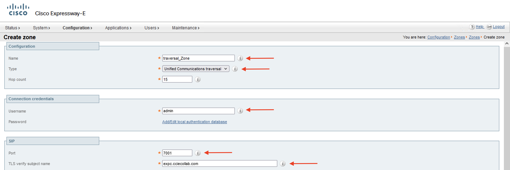

# CUCM & Expressway Integration

* Step 1 - Deploy .ova template. Ova template helps you to configure basic network parameters like :

    Ip address
    Network Mask
    Gateway
    DnS server
    NTP Server
    Hostname

    
    

* Step 2 - Deploy .ova template again for expressway-e with same procedure.
* Step 3 - Create `Host-A`record for expc and expe

* Step 4 -  After power on the virtual machine configure roo and admin password from colsole for expc and expe

* Step 5 - Login on `GUI` secure connection with admin user and password.

* Step 6 - Choose `type` and `Service` for node. Chose `Exressway-C` for expc and `expressway-E` for expe as a type, `Mobile and Remote Access including Meeting Server Web Proxy` for both device.

 

* Step 7 - Check configuration for any mistake. This area is configured at while .ova template deployment.

* Step 8 - finish intial configuration and restart servers.

* Step 9 - Configure `System Name` on expc and expe

* Step 10 - Generate CSR fron expc and expe

Mainteance -> Security -> Server Certificate

* Step 11 - Sign CSR on CA with configured certificate template (web and client authentication). Download certificate with Base 64 encoded.

* Step 12 - Download ca root certificate and upload to server for trusted CA certificate.
Mainteance -> Security -> Trusted CA certificate

* Step 13 - Upload signed certificate to expc and expe
Mainteance -> Security -> Server Certificate

* Step 14 - Repeat this all procedures for expe
* Step 15 - Enable `SIP` TCP / UDP / TLS on expc and expe

Configuration -> Protocols -> SIP

* Step 16 - Enable `MRA` from expc and expe
Configuration -> Unified Commnications -> Configuration

* Step 17 - Create `Domain`

Configuration -> Domains

* Step 18 - Add CUCM to expc
Configuration -> Unified Commnications -> Configuration -> Unified CM Servers

* Step 19 - Add IMP to expc
Configuration -> Unified Commnications -> Configuration -> IMP

* Step 20 - Create user on Local database on expe
Configuration -> Authentication -> Local Database

* Step 21 - Create `zone` on expe for expc
Configuration -> Zone -> Zones

* Step 22 - Create `zone` on expc
Configuration -> Zone -> Zones

* Step 23 - Check Connection between expc and expe

 