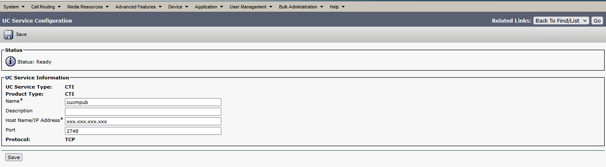
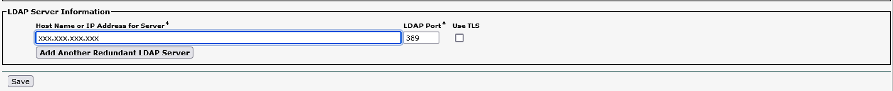
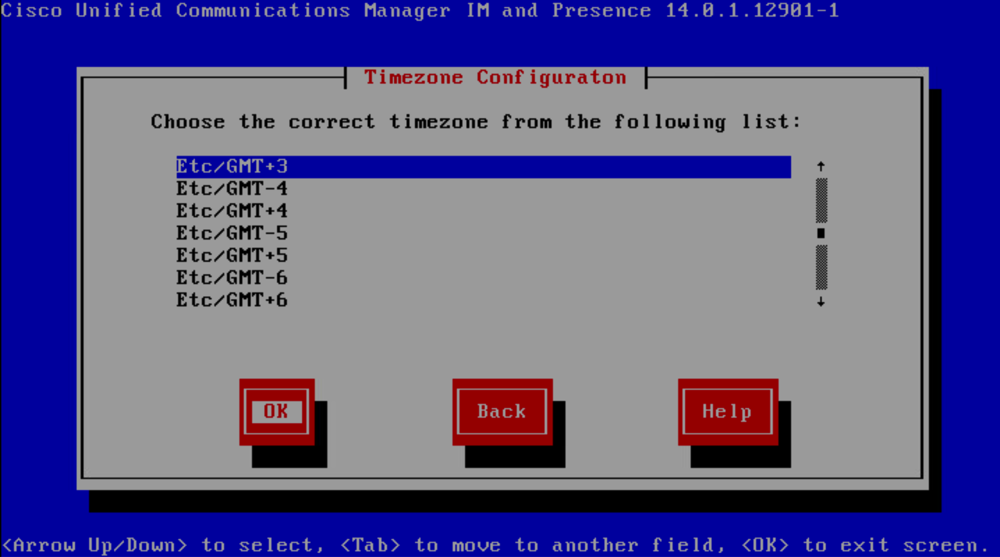
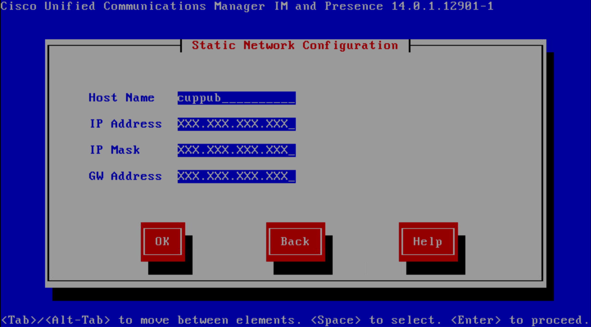
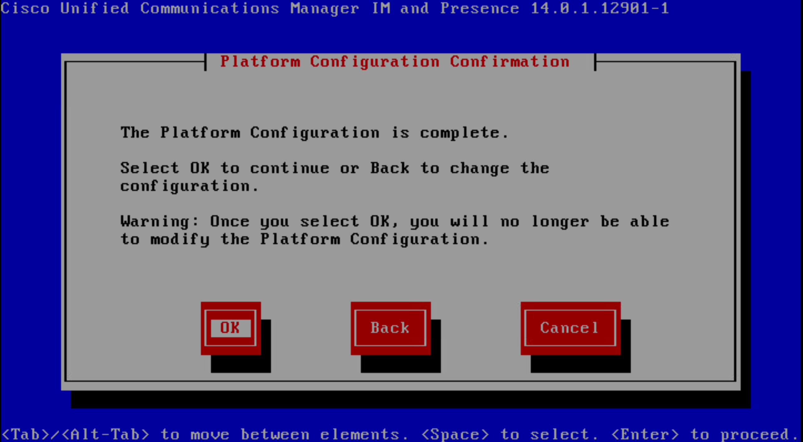

# CUCM & IMP Integration

***CUCM Side***

PS: All UC components (CUCM,CUP) `Host-A`, `PTR`, `SRV` record must be made. 

```
hqcucmpub.cciecollab.com (HOST-A)
hqcuppub.cciecollab.com (HOST-A)
_cisco-uds._tcp.cciecollab.com (SRV)
```

* Step 1 - Add IMP ip address to CUCM as a server.


* Step 2 - While the installation is runnig backstage, create `SIP TRUNK SECURITY PROFILE` for trunk.

System -> Security -> Sip Trunk Security Profile then `add new` 


* Step 3 - Create `TRUNK` for cup server

Device -> Trunk then `add new`


Configure `TRUNK` parameters


* Step 4 - Use previous trunk for Service parameter

System -> Service Parameters


* Step 5 - Create `UC SERVICES` for 'CTI' and 'CUP Services'

User Management -> User Settings -> UC Services then `add new`




* Step 6 - Create `SERVICE PROFILE` for Jabber Devices.

User Management -> User Settings -> Service Profile then `add new`


* Step 7 - Create `Access Control Group` for Jabber User

User Management -> User Settings -> Access Control Group


* Step 8 - Enable `LDAP Server` on cucm

System -> Ldap -> Ldap System


* Step 9 - Add `LDAP Directory` from 

System -> Ldap -> Ldap Directory then `add new`




then configure `LDAP Authentication` for enduser authentication


* Step 10 - Pull User for Ldap


* Step 11 - Use `Service profile`  and `Access Control Group` ,which are created previous steps, to user who use jabber device


 * Step 12 - Create Jabber Device with this user


under line configuration


* Step 13 - Add device to User under `End User` configuration


***CUP Side***

* Step 1 - Complate `CUP` server console configuration like below










* Step 2 - After installation is finished activate `CUP` services from CUCM

Cisco Unified Servicebility -> Tools -> Service Activation and Check all Services


* Step 3 - Check sip trunk which is created on CUCM from 

Presence -> Settings -> Standard Configuration


* Step 4 - Add CUCM as gateway to CUP Server from

Presence -> Gateway then `add new`


* Step 5 - Configure `Default Cisco SIP Proxy TCP Listener` as a preferred proxy listener 


* Step 6 - Create `CCMCIP Profile` from 

Application -> CCMCIP Profile then `add new` configure cucm pub and sub


* Step 7 - Reboot `CUP Server` gracefully

