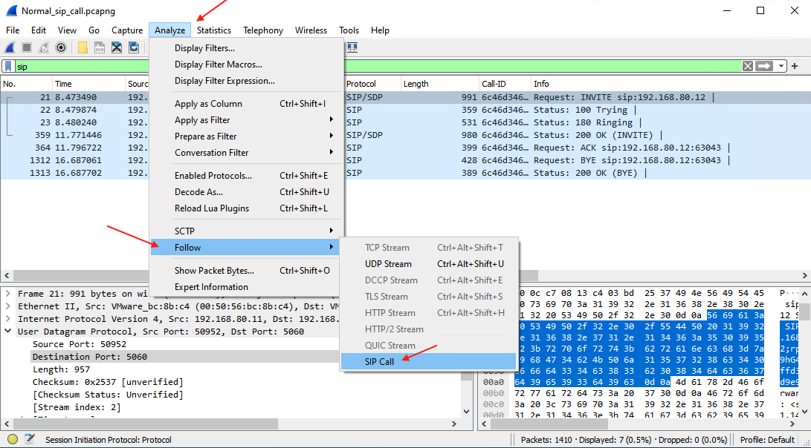
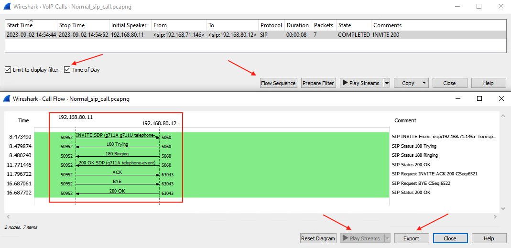
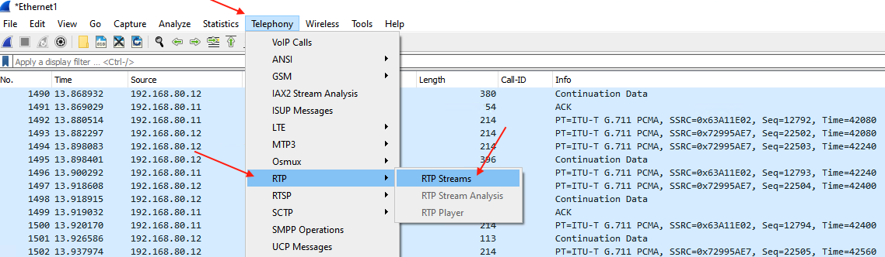
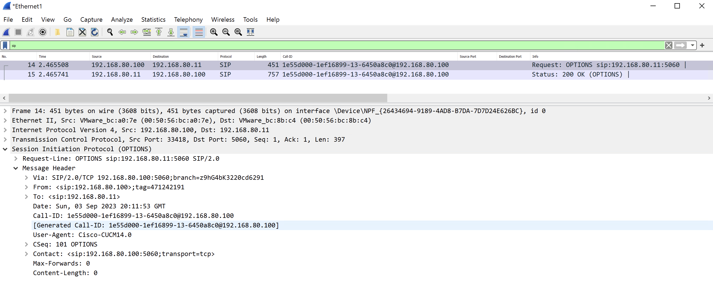
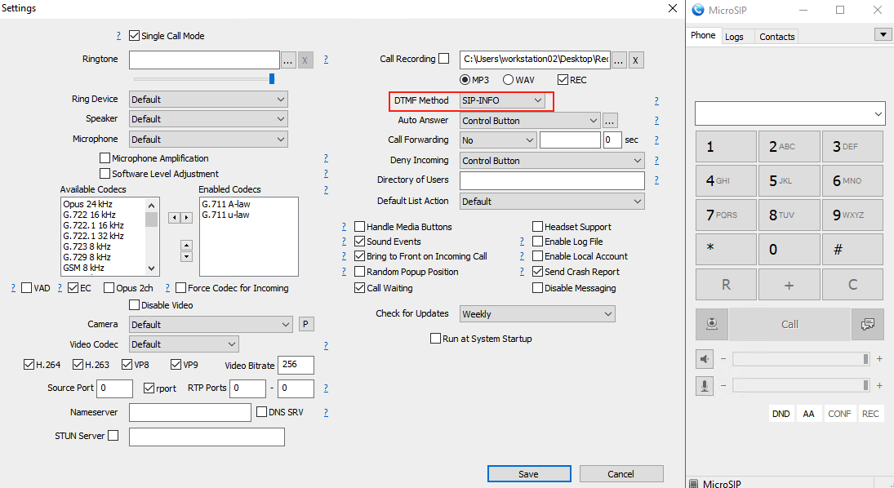

**FoSIP**

- [x] SIP is a signaling protocol used to `create`, `modify`, and `terminate` a multimedia session over the Internet Protocol. A session could be established between two endpoints or more. An endpoint can be a smartphone, a laptop, or any device that can receive and send multimedia content over the Internet.

- [x] SIP is an application layer protocol defined by IETF (Internet Engineering Task Force) standard. It is
defined in [RFC 3261](https://datatracker.ietf.org/doc/html/rfc3261). (june 2002)

- [x] SIPembodies client-server architecture and the use of URI from HTTP and a text encoding scheme and a header style from SMTP.SIP-URI = sip:x@y:port or sips:x@y:port where x=Username and y=host (domain or IP)

- [x] SIP takes the help of SDP (Session Description Protocol) which describes a session and RTP (Real Time Transport Protocol) used for delivering voice and video over IP network.

- [x] SIP can be used for two-party (unicast) or multiparty (multicast) sessions.

- [x] Other SIP applications include file transfer, instant messaging, video conferencing, online games, and steaming multimedia distribution

---
**Facts for Establishing and Terminating Multimedia Communications Using SIP**

`1 - User location:` Determination of the end system to be used for communication

`2 - User availability:` Determination of the willingness of the called party to engage in communications

`3 - User capabilities:` Determination of the media and media parameters to be used 

`4 - Session setup:` “Ringing", establishment of session parameters at both calling and called party

`5 - Session management:` Including transfer and termination of sessions, modifying session parameters, and invoking services

---

It is the simplicity of SIP that makes it so versatile. SIP is an ASCII- or text-based protocol, similar to HTTP or SMTP. Like HTTP and SMTP, SIP is a request-response protocol, meaning that it makes a request of a server, and awaits a response. Once it has established a session, other protocols handle such tasks as negotiating the type of media to be exchanged, and transporting it between the endpoints. The reusing of existing protocols and their functions means that fewer resources are used, and minimizes the complexity of SIP.


## SIP Components

==User Agent==

    - User Agent Client (UAC)
    - User Agent Server (UAS)


---

==SIP Server==

**Registrar / Location Server**


1 - The User Agent sends a `REGISTER` request to the SIP server in the registrar role <br>
2 - Once the request is accepted, the Registrar adds the `Sip Address` and `IP Address` that the User agent provides to the location service.

**Proxy Server**


1 - `invite` request is made to PROXY SRV to invite session with User Agent B<br>
2 - PROXY SRV checks with locater service to determine ip address of User Agent B<br>
3 - `invite` request is passed to User Agent B<br>
4 - User Agent B accepts request and responses to User Agent A<br>
5 - PROXY SRV passes response to User Agent A<br>
6 - Once invitation is accepted User Agent A and User Agent B can now establish a session.


**Redirect Server**


1 - `invite` request is sent to `Redirect Server`<br>
2 - `Redirect Server` checks location service to find IP Address of User agent B<br>
3 - `Redirect server` sends information back to the requesting User Agent A<br>
4 - User agent A sends `invite` to User Agent B<br>
5 - User Agent B responds to User Agent A<br>
6 - Once invitation is accepted User Agent A and User Agent B can now establish a session 

## Basic SIP Call Flow


==PS :== We will discuss every packet and `METHOD` after `Wireshark`.

## Wireshark Usage

Wireshark is a network packet analyzer. A network packet analyzer presents captured packet data in as much detail as possible.
You could think of a network packet analyzer as a measuring device for examining what’s happening inside a network cable, just like an electrician uses a voltmeter for examining what’s happening inside an electric cable (but at a higher level, of course).

In the past, such tools were either very expensive, proprietary, or both. However, with the advent of Wireshark, that has changed. Wireshark is available for free, is open source, and is one of the best packet analyzers available today.

Here are some reasons people use Wireshark:

- Network administrators use it to troubleshoot network problems
- Network security engineers use it to examine security problems
- QA engineers use it to verify network applications
- Developers use it to debug protocol implementations
- People use it to learn network protocol internals

Main program in `wireshark` is `tshark`. This name comes from ==terminal== keyword. Lets see interfaces in tshark.

C:\Program Files\Wireshark>tshark.exe -D

{height="70%" width="70%"}

we will choose `Wi-Fi` interface. Its index number is `5`

C:\Program Files\Wireshark>tshark.exe -i 5

{height="70%" width="70%"}


There are two kind of filters:

```ascii
     Traffic
     Traffic
     Traffic
   x Traffic x
    x       x
     x     x
      x   x
       x x

┌───────────────┐      ┌────────────────┐      ┌─────────────┐      ┌────────────────┐
│ Capture filter│ ───► │ Capture Engine │ ───► │ Core Engine │ ───► │ Display Filter │
└───────┬───────┘      └────────────────┘      └─────────────┘      └────────┬───────┘
        │                                                                    │
        │                                                                    │
        └────────────────────────────┐  ┌────────────────────────────────────┘
                                     │  │
                                     │  │
                                     ▼  ▼

```

**Capture filter :** [Capture filter](https://wiki.wireshark.org/CaptureFilters), capture specific data which you want then show them. ! Attention. 

==Example==

```powershell
host 172.18.5.4
net 192.168.0.0/24
src net 192.168.0.0/24
dst net 192.168.0.0/24
port 5060
tcp portrange 1501-1549
```


**Display filter :** [Display Filter](https://wiki.wireshark.org/DisplayFilters), Capture ==all traffic== but shows which you want.

```powershell
ip.addr==172.18.5.4
ip.src==192.168.0.0/16 and ip.dst==192.168.0.0/16
tcp.port eq 25 or icmp
ip.addr != 10.43.54.65
udp.dstport == 5060
udp.port == 5060
```


We can see `SIP Signalling` from two method. Every method has different detail level.

1.  From Analyze page



```
INVITE sip:192.168.80.12 SIP/2.0
Via: SIP/2.0/UDP 192.168.71.146:50952;rport;branch=z9hG4bKPj15728c40ffd34c83b084dc67d9e93d9c
Max-Forwards: 70
From: <sip:192.168.71.146>;tag=cb9e96b542084e3db354b9a6e98e5527
To: <sip:192.168.80.12>
Contact: <sip:192.168.80.11:50952;ob>
Call-ID: 6c46d346e3084913a77014b523c9e389
CSeq: 6521 INVITE
Allow: PRACK, INVITE, ACK, BYE, CANCEL, UPDATE, INFO, SUBSCRIBE, NOTIFY, REFER, MESSAGE, OPTIONS
Supported: replaces, 100rel, timer, norefersub
Session-Expires: 1800
Min-SE: 90
User-Agent: MicroSIP/3.21.3
Content-Type: application/sdp
Content-Length:   346

v=0
o=- 3902655284 3902655284 IN IP4 192.168.71.146
s=pjmedia
b=AS:84
t=0 0
a=X-nat:0
m=audio 4008 RTP/AVP 8 0 101
c=IN IP4 192.168.71.146
b=TIAS:64000
a=rtcp:4009 IN IP4 192.168.71.146
a=sendrecv
a=rtpmap:8 PCMA/8000
a=rtpmap:0 PCMU/8000
a=rtpmap:101 telephone-event/8000
a=fmtp:101 0-16
a=ssrc:1913920969 cname:1ebf1ac11af82313
SIP/2.0 100 Trying
Via: SIP/2.0/UDP 192.168.71.146:50952;rport=50952;received=192.168.80.11;branch=z9hG4bKPj15728c40ffd34c83b084dc67d9e93d9c
Call-ID: 6c46d346e3084913a77014b523c9e389
From: <sip:192.168.71.146>;tag=cb9e96b542084e3db354b9a6e98e5527
To: <sip:192.168.80.12>
CSeq: 6521 INVITE
Content-Length:  0

SIP/2.0 180 Ringing
Via: SIP/2.0/UDP 192.168.71.146:50952;rport=50952;received=192.168.80.11;branch=z9hG4bKPj15728c40ffd34c83b084dc67d9e93d9c
Call-ID: 6c46d346e3084913a77014b523c9e389
From: <sip:192.168.71.146>;tag=cb9e96b542084e3db354b9a6e98e5527
To: <sip:192.168.80.12>;tag=9d6ab2e6da5e4ad09aea771ed6a12343
CSeq: 6521 INVITE
Contact: <sip:192.168.80.12:63043>
Allow: PRACK, INVITE, ACK, BYE, CANCEL, UPDATE, INFO, SUBSCRIBE, NOTIFY, REFER, MESSAGE, OPTIONS
Content-Length:  0

SIP/2.0 200 OK
Via: SIP/2.0/UDP 192.168.71.146:50952;rport=50952;received=192.168.80.11;branch=z9hG4bKPj15728c40ffd34c83b084dc67d9e93d9c
Call-ID: 6c46d346e3084913a77014b523c9e389
From: <sip:192.168.71.146>;tag=cb9e96b542084e3db354b9a6e98e5527
To: <sip:192.168.80.12>;tag=9d6ab2e6da5e4ad09aea771ed6a12343
CSeq: 6521 INVITE
Allow: PRACK, INVITE, ACK, BYE, CANCEL, UPDATE, INFO, SUBSCRIBE, NOTIFY, REFER, MESSAGE, OPTIONS
Contact: <sip:192.168.80.12:63043>
Supported: replaces, 100rel, timer, norefersub
Session-Expires: 1800;refresher=uac
Require: timer
Content-Type: application/sdp
Content-Length:   319

v=0
o=- 3902655283 3902655284 IN IP4 192.168.80.12
s=pjmedia
b=AS:84
t=0 0
a=X-nat:0
m=audio 4008 RTP/AVP 8 101
c=IN IP4 192.168.80.12
b=TIAS:64000
a=rtcp:4009 IN IP4 192.168.80.12
a=sendrecv
a=rtpmap:8 PCMA/8000
a=rtpmap:101 telephone-event/8000
a=fmtp:101 0-16
a=ssrc:1170553184 cname:54d60ea93f0b3087
ACK sip:192.168.80.12:63043 SIP/2.0
Via: SIP/2.0/UDP 192.168.71.146:50952;rport;branch=z9hG4bKPj7547c750e9514daf911980bf590fcfae
Max-Forwards: 70
From: <sip:192.168.71.146>;tag=cb9e96b542084e3db354b9a6e98e5527
To: <sip:192.168.80.12>;tag=9d6ab2e6da5e4ad09aea771ed6a12343
Call-ID: 6c46d346e3084913a77014b523c9e389
CSeq: 6521 ACK
Content-Length:  0

BYE sip:192.168.80.12:63043 SIP/2.0
Via: SIP/2.0/UDP 192.168.71.146:50952;rport;branch=z9hG4bKPja096382a15374b02ae4f3e3928adc9f5
Max-Forwards: 70
From: <sip:192.168.71.146>;tag=cb9e96b542084e3db354b9a6e98e5527
To: <sip:192.168.80.12>;tag=9d6ab2e6da5e4ad09aea771ed6a12343
Call-ID: 6c46d346e3084913a77014b523c9e389
CSeq: 6522 BYE
User-Agent: MicroSIP/3.21.3
Content-Length:  0

SIP/2.0 200 OK
Via: SIP/2.0/UDP 192.168.71.146:50952;rport=50952;received=192.168.80.11;branch=z9hG4bKPja096382a15374b02ae4f3e3928adc9f5
Call-ID: 6c46d346e3084913a77014b523c9e389
From: <sip:192.168.71.146>;tag=cb9e96b542084e3db354b9a6e98e5527
To: <sip:192.168.80.12>;tag=9d6ab2e6da5e4ad09aea771ed6a12343
CSeq: 6522 BYE
Content-Length:  0

```

2. From Telephony / Voip Calls



with export button, you can export this flow as `PDF`<br>
with time of Day, you can convert unix time to human readable time

**Export Output PCAP file**

There are some tricks PCAP OUTPUT. Lets discus on screenshoot


* Choose `output` for export data
* Create folder for store log and input the pat of folder
* Decide how long PCAP file which you want to store. Actually there is no limit with pcap file but you sholud limit the `one file size`. I recommend maximum 1GB for one file or `ten minutes` for one file.
* Use `Use a ring buffer with`

As you see below example: I limit total 25 sec log with 5sec files. File 1 and 2 is erased because on `Use a ring buffer with` value. 


## RTP Analysis

A `SIP CALL` consist of 2 parts. One of them is `signalling` and the other is `media`. In media transferring, SIP use Real Time Transport Protocol (RTP) which is define by [RFC-3550](https://datatracker.ietf.org/doc/html/rfc3550). Real Time Protocol (RTP) carries the voice payload across the network from transmitter to receiver. This payload is a continuous stream of packets that traverses the network.

RTP Effected basicly three network phenomenons.

1. **Latency :** VoIP over high latency links may not have any quality problems, but it creates awkward communications involving interruptions, talking on top of someone else, and strange silences because you don't know if the other person has stopped talking yet. One-way latency for VoIP/UC should be below `125ms (250ms round-trip)`. Users will tend to notice higher latencies.

2. **Jitter :** In the real world, some packets may be delayed, thus causing some packets to arrive late, with the packets behind them all being bunched up and arriving too soon behind them. In general, jitter should be below `30ms` when received by the endpoint.

3. **Packet Lose :** Packet loss affects real-time protocols like VoIP and video by creating drop-outs, clipped words, and video artifacts. Entire phrases might also be missing from the conversation. If the packet loss gets really bad, one side of the audio stream can completely disconnect causing one-way audio, or if packet loss is bi-directional, the entire call can drop. In general, packet loss should be below `1 %`  when received by the endpoint.

==**How Can we detect ?**==

Answer is wireshark. We can analysis RTP performance with wireshark telephony / RTP / RTP Streams




**RTP and RTCP**

```ascii
                    +------------+-------------+-------------+-------------------------+
                    | IP Headers | UDP Headers | RTP Headers |       RTP Payload       |
                    |  20 Byte   |   8 Byte    |  12 Byte    |                         |
                    +------------+-------------+-------------+-------------------------+
```

RTP is used in conjunction with the RTP Control Protocol (RTCP). While RTP carries the media streams (e.g., audio and video), RTCP is used to monitor transmission statistics and quality of service (QoS) and aids synchronization of multiple streams. RTP is originated and received on even port numbers and the associated RTCP communication uses the next higher odd port number.


**RTP Header**

```ascii
                      0                   1                   2                   3
                      0 1 2 3 4 5 6 7 8 9 0 1 2 3 4 5 6 7 8 9 0 1 2 3 4 5 6 7 8 9 0 1
                      +-+-+-+-+-+-+-+-+-+-+-+-+-+-+-+-+-+-+-+-+-+-+-+-+-+-+-+-+-+-+-+-+
                      |V=2|P|X|  CC   |M|     PT      |       sequence number         |
                      +-+-+-+-+-+-+-+-+-+-+-+-+-+-+-+-+-+-+-+-+-+-+-+-+-+-+-+-+-+-+-+-+
                      |                           timestamp                           |
                      +-+-+-+-+-+-+-+-+-+-+-+-+-+-+-+-+-+-+-+-+-+-+-+-+-+-+-+-+-+-+-+-+
                      |           synchronization source (SSRC) identifier            |
                      +=+=+=+=+=+=+=+=+=+=+=+=+=+=+=+=+=+=+=+=+=+=+=+=+=+=+=+=+=+=+=+=+
                      |            contributing source (CSRC) identifiers             |
                      |                             ....                              |
                      +-+-+-+-+-+-+-+-+-+-+-+-+-+-+-+-+-+-+-+-+-+-+-+-+-+-+-+-+-+-+-+-+

```

**Version -** This 2-bit field defines version number. The current version is 2.<br>
**Padding –** The length of this field is 1-bit. If value is 1, then it denotes presence of padding at end of packet and if value is 0, then there is no padding.<br>
**Extension –** The length of this field is also 1-bit. If value of this field is set to 1, then its indicates an extra extension header between data and basic header and if value is 0 then, there is no extra extension.
**Contributor Count -** This 4-bit field indicates number of contributors. Here maximum possible number of contributor is 15 as a 4-bit field can allows number from 0 to 15.<br>
**Marker –** The length of this field is 1-bit and it is used as end marker by application to indicate end of its data.<br>
**Payload types -** This field is of length 7-bit to indicate type of payload. We list applications of some common types of payload.<br>

==Example :==

```ascii

+--------+--------------+
| PT     |    FORMAT    |
+--------+--------------+
| 0      |    G711u-law |
| 8      |    G711a-law |
| 9      |    G722      |
| 18     |    G729      |
| 26     |    Jpeg      |
| 34     |    H323      |
| 101    |    DTMF      |
| ...    |    ...       |
+--------+--------------+

```

**Sequence Number –** The length of this field is 16 bits. It is used to give serial numbers to RTP packets. It helps in sequencing. The sequence number for first packet is given a random number and then every next packet’s sequence number is incremented by 1. This field mainly helps in checking lost packets and order mismatch.<br>
**Time Stamp –** The length of this field is 32-bit. It is used to find relationship between times of different RTP packets. The timestamp for first packet is given randomly and then time stamp for next packets given by sum of previous timestamp and time taken to produce first byte of current packet. The value of 1 clock tick is varying from application to application.<br>
**Synchronization Source Identifier –** This is a 32-bit field used to identify and define the source. The value for this source identifier is a random number that is chosen by source itself. This mainly helps in solving conflict arises when two sources started with the same sequencing number.<br>
**Contributor Identifier –** This is also a 32-bit field used for source identification where there is more than one source present in session. The mixer source use Synchronization source identifier and other remaining sources (maximum 15) use Contributor identifier.

==Example of RTP Header==


---

**Impact of Voice Samples and Packet Size on Bandwidth**

**DSP coverts analog voice signal to digital** voice signal using a particular codec. Based on the codec used, the DSP generates so many bits per second. The bits that are generated for 10 milliseconds (ms) of analog voice signal form one digital voice sample. The size of the digital voice sample depends on the codec used. 

==For example, Assume that we are using g711 codec:==

in every 10ms period DSP generates 80 byte, there are 100 times 10ms in 1 second. Totally in 1 second DSP generates 8000 byte
If we calculate as `bit` 8000 X 8 = 64000 for one second. 

for our wireshark output, timestamp shows us in between RTP Packets there are 160 byte, that means this payload contains 20ms data, that means there are 50 RTP packets for only one second. 


Lets analysis all IP Packet, frame lenght is 214 byte


IP header shows us total lenght 200 byte, IP header is 20 byte. This means frame header is 14 byte (ethernet)


then if we calculate UDP header, RTP header and payload 


Calculation is ok.

```ascii
+-----------------------+
| RTP Payload      160  |
| RTP Header       12   |
| UDP Header       8    |
| IP Header        20   |
| Frame Header     14   |
+-----------------------+
| TOTAL            214  |
+-----------------------+
```

## SIP Methods and Headers

* Everything is `METHOD` in sip. SIP is an application layer protocol that is very similar to text based application layer protocols like HTTP. In fact, it is also uses request and response message transactions and header fields.
* For transport, SIP can run over TCP, UDP, or SCTP transport layer protocols. 
* IP borrows the Method field from HTTP to likewise determine the type of request. SIP has 14 Method request types. The most commonly used Methods are INVITE, ACK, BYE, and REGISTER which are used during voice calls. The first line of a SIP request message includes the Method type and the request URI which is the current destination of the request. 

**Example of SIP Request**


```
INVITE sip:192.168.80.12 SIP/2.0
Via: SIP/2.0/UDP 192.168.71.146:50952;rport;branch=z9hG4bKPj15728c40ffd34c83b084dc67d9e93d9c
Max-Forwards: 70
From: <sip:192.168.71.146>;tag=cb9e96b542084e3db354b9a6e98e5527
To: <sip:192.168.80.12>
Contact: <sip:192.168.80.11:50952;ob>
Call-ID: 6c46d346e3084913a77014b523c9e389
CSeq: 6521 INVITE
Allow: PRACK, INVITE, ACK, BYE, CANCEL, UPDATE, INFO, SUBSCRIBE, NOTIFY, REFER, MESSAGE, OPTIONS
Supported: replaces, 100rel, timer, norefersub
Session-Expires: 1800
Min-SE: 90
User-Agent: MicroSIP/3.21.3
Content-Type: application/sdp
Content-Length:   346
```
**Common SIP request Headers**

**VIA :** Contains an address that is used to route back replies.<br>
**MAX-FORWARDS :** Show max path like (TTL)<br>
**FROM :** Contains the SIP URI of the caller.<br>
**TO :** Contains the SIP URI of the callee.<br>
**CONTACT :** Contains the SIP URI to be used for future requests for this caller.<br>
**CALL-ID :** Contains the globally unique identification for this call using the caller's domain.<br>
**CSEQ :** Contains the sequence number of this message for this SIP conversation.<br>
**ALLOW :** Contains the support methods<br>
**SUPPORTED :** Contains the supported extentions<br>
**SESSION-EXPRIRES :** Show total sip session time. End of this time, sip session is refresh.<br>
**MIN-SE :** Show minimum session time<br>
**USER-AGENT :** Contains Information about agent <br>
**CONTENT-TYPE :** Contains the content type for the message body.<br>
**CONTENT-LENGHT :** Contains the byte count length for the message body.

**SIP  METHODS**

==- Invite :== The invite message initiates a SIP dialog with the intent to establish a call. It is sent by a user agent client to a user agent server. When sent during an established dialog `(reinvite)` it modifies the sessions, for example placing a call on hold. <br>
==- ACK :== Confirm that an entity has received a final response to an INVITE request.<br>
==- BYE :== This method signals termination of a dialog and ends a call. This message may be sent by either endpoint of a dialog.<br>
==- CANCEL :== Cancel any pending request.	Usually means terminating a SIP call while it is still ringing, before answer.<br>
==- OPTIONS :== Query the capabilities of an endpoint.	It is often used for keepalive purposes.<br>
==- REGISTER :== Register the SIP URI listed in the To header field with a location server and associates it with the network address given in a Contact header field.	It implements a location service.<br>
==- REFER :== Used for call transfer.
==- PRACK :== [PRACK](https://datatracker.ietf.org/doc/html/rfc3262) is sent in response to provisional response (1xx). SIP defines two types of responses, provisional and final.Final responses convey the result of the request processing, and are sent reliably. Provisional responses provide information on the progress of the request processing, but are not sent reliably in [RFC 3261](https://datatracker.ietf.org/doc/html/rfc3261)<br>
==- SUBSCRIBE :== Initiates a subscription for notification of events from a notifier, like presence information.	
==- NOTIFY :== The NOTIFY message is used to notify other users or devices when there are changes in a monitored entity or event. It is used to send notifications when there are changes in a monitored presence or event, such as a change in online status or a call initiation event.<br>
==- PUBLISH :== The PUBLISH message is used by a user or device to report its own presence or status to a SIP server or other subscribers. It is commonly used to update one's status or to send instant messages.<br>
==- MESSAGE :== Transport text messages.<br>
==-INFO :== Send mid-session information that does not modify the session state. This method is often used for DTMF relay.<br>
==-UPDATE :== Modifies the state of a session without changing the state of the dialog.

**SIP Transaction & Session & Dialog**

==Transaction :== Consists of a Request and final (2-6)XX response <br>
==Session :== Session  is just a media stream (e.g. audio or video) flowing between peers<br>
==Dialog :== Dialog is just a series of transactions between two SIP peers. The purpose of a dialog is to setup, possibly modify, and then teardown a session

```ascii

┌──────────────────────────────────┐       ────────────────┐
│             Invite               │                       │
│ ──────────────────────────────►  │                       │
│          100 Trying              │                       │
│ ◄──────────────────────────────  │                       │
│          180 Ringing             │ ────► Transaction     │
│ ◄──────────────────────────────  │                       │
│            200 OK                │                       │
│ ◄──────────────────────────────  │                       │
│                                  │                       │
├──────────────────────────────────┤                       │
│              ACK                 │                       │
│ ──────────────────────────────►  │ ────► Transaction     ├────► Dialog
│                                  │                       │
├──────────────────────────────────┤                       │
│            RTP Data              │                       │
│ ◄──────────────────────────────► │ ────► Session         │
│                                  │                       │
├──────────────────────────────────┤                       │
│                BYE               │                       │
│ ───────────────────────────────► │                       │
│              200 OK              │ ────► Transaction     │
│ ◄─────────────────────────────── │                       │
│                                  │                       │
└──────────────────────────────────┘       ────────────────┘
```

There are two different defination about `requests`. In one dialog, there is one `initial request` others are sequential request.

Initial Requests<br>
- Can be easily identified by the From-tag<br>
- Example: First INVITE<br>

Sequential (in-dialog) Requests<br>
- Same Call-ID, From tag and To tag<br>
- Example: BYE,ACK,RE-INVITE

**Branch, Call-ID and From/to Tag**

There are three deffination with hash in SIP. These definations guide us to folow sip message in mess sip log. This section is very important. 

==Branch :== Means transaction. As you know transaction is combination of request and its response. every transaction defined by a unique branch number.

Lets flashback to wireshark capture of normal clear sip to sip basic call. You will see three branch-id it means there three transaction on this sip call.


==Call-ID== Means SIP call. Transactions which belogs to same call define bye same call-id.


==From / To Tag== From and To define `caller` and `callee`.


PS: why there is no `to tag` in first two sip message ?

**SDP and Early Offer / Delay Offer**

The [SDP](https://datatracker.ietf.org/doc/html/rfc4566) (Session Description Protocol) contains a description of the media format and protocols supported by a device. The SDP is sent by both sides of a connection during the call set up process. The difference between Early Offer and Late Offer is in which SIP Message the SDP is sent.

In an Early Offer call, the SDP message is sent by the calling endpoint in the initial invite message. The receiving endpoint sends their SDP in the 200 OK message sent when the call is answered.

```
INVITE sip:192.168.80.12 SIP/2.0
Via: SIP/2.0/UDP 192.168.71.146:50952;rport;branch=z9hG4bKPj15728c40ffd34c83b084dc67d9e93d9c
Max-Forwards: 70
From: <sip:192.168.71.146>;tag=cb9e96b542084e3db354b9a6e98e5527
To: <sip:192.168.80.12>
Contact: <sip:192.168.80.11:50952;ob>
Call-ID: 6c46d346e3084913a77014b523c9e389
CSeq: 6521 INVITE
Allow: PRACK, INVITE, ACK, BYE, CANCEL, UPDATE, INFO, SUBSCRIBE, NOTIFY, REFER, MESSAGE, OPTIONS
Supported: replaces, 100rel, timer, norefersub
Session-Expires: 1800
Min-SE: 90
User-Agent: MicroSIP/3.21.3
Content-Type: application/sdp
Content-Length:   346
                                     ─────────────┐
v=0                                               │
o=- 3902655284 3902655284 IN IP4 192.168.71.146   │
s=pjmedia                                         │
b=AS:84                                           │
t=0 0                                             │
a=X-nat:0                                         │
m=audio 4008 RTP/AVP 8 0 101                      │
c=IN IP4 192.168.71.146                           │
b=TIAS:64000                                      ├────► SDP
a=rtcp:4009 IN IP4 192.168.71.146                 │
a=sendrecv                                        │
a=rtpmap:8 PCMA/8000                              │
a=rtpmap:0 PCMU/8000                              │
a=rtpmap:101 telephone-event/8000                 │
a=fmtp:101 0-16                                   │
a=ssrc:1913920969 cname:1ebf1ac11af82313          │
                                                  │
                                    ──────────────┘

```

Some lines in each description are REQUIRED and some are OPTIONAL,but all MUST appear in exactly the order given here (the fixed order greatly enhances error detection and allows for a simple parser).OPTIONAL items are marked with a "*".

Session description

         v=  (protocol version)
         o=  (originator and session identifier)
         s=  (session name)
         i=* (session information)
         u=* (URI of description)
         e=* (email address)
         p=* (phone number)
         c=* (connection information -- not required if included in
              all media)
         b=* (zero or more bandwidth information lines)
         One or more time descriptions ("t=" and "r=" lines; see below)
         z=* (time zone adjustments)
         k=* (encryption key)
         a=* (zero or more session attribute lines)
         Zero or more media descriptions

Time description

         t=  (time the session is active)
         r=* (zero or more repeat times)

Media description, if present

         m=  (media name and transport address)
         i=* (media title)
         c=* (connection information -- optional if included at
              session level)
         b=* (zero or more bandwidth information lines)
         k=* (encryption key)
         a=* (zero or more media attribute lines)

In a Late Offer call, the receiving endpoint still sends their SDP in the 200 OK message but the calling endpoint doesn't sent theirs until Acknowledgement message which is sent after they receive the 200 OK from the receiving endpoint.

Some sip device use delay offer by default like `cisco unified call manager`, some sip device use early offer like `micro sip`

**Cancel Method**

The CANCEL informs Jennifer that Andrew is releasing the session prematurely and Jennifer needs to do the same on her end. In other words, Jennifer’s phone should stop ringing and return to an idle state.


```
┌──────────────┐                Invite                 ┌──────────────┐
│    ANDREW    │    ──────────────────────────────►    │  JENNIFER    │
└──────────────┘                                       └──────────────┘
                             100 Trying
                    ◄──────────────────────────────

                             180 Ringing
                    ◄──────────────────────────────
               Andrew hangs up before the call is answered

                                CANCEL
                    ──────────────────────────────►

                                200 OK
                    ◄──────────────────────────────

                       487 Request Terminated
                    ◄──────────────────────────────

                                 ACK
                    ───────────────────────────────►
```
lets test in lab


Second senario for `CANCEL` method is stopping ringing the shared line. 

```
                                                        ┌──────────────┐
                                                        │  JENNIFER    │ 3 - Turn on the phone
                                                        └──────────────┘
                                                               ▲
                                                               │
                                 ┌───────┐                     │2 - Ringging
┌──────────────┐ 1 - Call 1000   │       │                     │
│    ANDREW    ├────────────────►│  PBX  ├─────────────────────┤
└──────────────┘                 │       │                     │
                                 └─────┬─┘                     │2 - Ringging
                                       │                       │
                                       │                       ▼
                                       │                ┌──────────────┐
                                       └───────────────►│  JENNIFER    │
                                         4 - PBX sends  └──────────────┘
                                         to CANCEL the
                                         shared line
```
**Message Method**

The [SIP MESSAGE](https://www.rfc-editor.org/rfc/rfc3428.html) method looks / acts very similar to a SIP INVITE, in that it’s got all the standard SIP headers, but also a Message Body, in which our message body lives (funny about that), typically we’ll send messages using the Content-Type: text/plain to denote we’re sending a plaintext message.

Lets check in our lab environment


on wireshark


```
MESSAGE sip:192.168.80.12 SIP/2.0
Via: SIP/2.0/UDP 192.168.71.146:50952;rport;branch=z9hG4bKPjb3a637173a7749388acfa945363e2935
Max-Forwards: 70
From: <sip:192.168.71.146>;tag=1f230d794d874ff98d54cbc549915971
To: <sip:192.168.80.12>
Call-ID: 135f6ded4f5c45dab6af3d5626e0b4ef
CSeq: 11151 MESSAGE
User-Agent: MicroSIP/3.21.3
Content-Type: text/plain
Content-Length:     5

selamSIP/2.0 200 OK
Via: SIP/2.0/UDP 192.168.71.146:50952;rport=50952;received=192.168.80.11;branch=z9hG4bKPjb3a637173a7749388acfa945363e2935
Call-ID: 135f6ded4f5c45dab6af3d5626e0b4ef
From: <sip:192.168.71.146>;tag=1f230d794d874ff98d54cbc549915971
To: <sip:192.168.80.12>;tag=z9hG4bKPjb3a637173a7749388acfa945363e2935
CSeq: 11151 MESSAGE
Content-Length:  0
```

**Option Method**

OPTIONS allows a user agent (UA) to query another UA or a proxy server as to its capabilities. This allows a client to discover information about the supported methods, content types, extensions, codecs, etc. without “ringing” the other party.

For testing `SIP Option` we use cisco Call Manager. send option from Cisco CUCM to  Micro Sip. For this test we need 2 configuration on CUCM:

1. Sip Profile
2. Sip trunk with sip profile which create previous step

For sip profile. Choose sip profile then clone `Default sip profile` and rename as `SP_SIP_OPTION` or something you want. Enable `ping option` with default parameters. 


then create sip trunk to micro-sip with ip address of micro-sip. Use SP_SIP_OPTION as a sip proflie.


After this configuration, restart SIP Trunk on CUCM then CUCM will begin to send sip option packet to Micro sip. Lets check on wireshark.



```ascii
OPTIONS sip:192.168.80.11:5060 SIP/2.0
Via: SIP/2.0/TCP 192.168.80.100:5060;branch=z9hG4bK3220cd6291
From: <sip:192.168.80.100>;tag=471242191
To: <sip:192.168.80.11>
Date: Sun, 03 Sep 2023 20:11:53 GMT
Call-ID: 1e55d000-1ef16899-13-6450a8c0@192.168.80.100
User-Agent: Cisco-CUCM14.0
CSeq: 101 OPTIONS
Contact: <sip:192.168.80.100:5060;transport=tcp>
Max-Forwards: 0
Content-Length: 0

SIP/2.0 200 OK
Via: SIP/2.0/TCP 192.168.80.100:5060;received=192.168.80.100;branch=z9hG4bK3220cd6291
Call-ID: 1e55d000-1ef16899-13-6450a8c0@192.168.80.100
From: <sip:192.168.80.100>;tag=471242191
To: <sip:192.168.80.11>;tag=z9hG4bK3220cd6291
CSeq: 101 OPTIONS
Allow: PRACK, INVITE, ACK, BYE, CANCEL, UPDATE, INFO, SUBSCRIBE, NOTIFY, REFER, MESSAGE, OPTIONS
Accept: application/sdp, application/pidf+xml, application/xpidf+xml, application/simple-message-summary, message/sipfrag;version=2.0, application/im-iscomposing+xml, text/plain
Supported: replaces, 100rel, timer, norefersub, trickle-ice
Allow-Events: presence, message-summary, refer
User-Agent: MicroSIP/3.21.3
Content-Length:  0

```

**SIP Register Method**

SIP is a peer-to-peer protocol where the roles client – server and exchangeable depending on who starts a session. In reality most deployments foresee a process called registration (method: REGISTER) which allows a central server (registrar) to store the location of a SIP User-Agent.

A SIP Phone is a client to the central Unified Communication Platform (registrar) – and the UC platform is a client to the SIP Server of the operator (registrar).

Once the SIP Server gets to know the location of an SIP Client, it can deliver calls and other messages to it from other Clients connected to the same Server.

==Example==

Lets check procedure on CUCM as a server and MicroSIP as a client. Firstly prepare necessary defination on CUCM for registration. 


1. Creat `End User` on server


2. Define `Sip Phone` on server and associate with end user. `Line` is important. It is used for `login` name on Sip client side.


3. Configure `Sip Device`


Lets analysis on wireshark


```ascii
REGISTER sip:192.168.80.100 SIP/2.0
Via: SIP/2.0/UDP 192.168.80.11:50952;rport;branch=z9hG4bKPj70cbe03dbec1454ab54854d64c772539
Route: <sip:192.168.80.100;lr>
Max-Forwards: 70
From: <sip:10001@192.168.80.100>;tag=4a349d82ef46410d8d78fae931640634
To: <sip:10001@192.168.80.100>
Call-ID: 26a8f5dd71574735a0224cee6701e1c5
CSeq: 24081 REGISTER
User-Agent: MicroSIP/3.21.3
Contact: <sip:10001@192.168.80.11:50952;ob>
Expires: 300
Allow: PRACK, INVITE, ACK, BYE, CANCEL, UPDATE, INFO, SUBSCRIBE, NOTIFY, REFER, MESSAGE, OPTIONS
Content-Length:  0

SIP/2.0 100 Trying
Via: SIP/2.0/UDP 192.168.80.11:50952;rport;branch=z9hG4bKPj70cbe03dbec1454ab54854d64c772539
From: <sip:10001@192.168.80.100>;tag=4a349d82ef46410d8d78fae931640634
To: <sip:10001@192.168.80.100>
Date: Mon, 04 Sep 2023 07:28:23 GMT
Call-ID: 26a8f5dd71574735a0224cee6701e1c5
CSeq: 24081 REGISTER
Content-Length: 0

SIP/2.0 401 Unauthorized
Via: SIP/2.0/UDP 192.168.80.11:50952;rport;branch=z9hG4bKPj70cbe03dbec1454ab54854d64c772539
From: <sip:10001@192.168.80.100>;tag=4a349d82ef46410d8d78fae931640634
To: <sip:10001@192.168.80.100>;tag=1745811662
Date: Mon, 04 Sep 2023 07:28:23 GMT
Call-ID: 26a8f5dd71574735a0224cee6701e1c5
CSeq: 24081 REGISTER
WWW-Authenticate: Digest realm="ccmsipline", nonce="vP42jVSdIItGRD5nYmE71/4JD/ZYUQvL", algorithm=MD5
Content-Length: 0

REGISTER sip:192.168.80.100 SIP/2.0
Via: SIP/2.0/UDP 192.168.80.11:50952;rport;branch=z9hG4bKPjfd6662cd9ec944759b6778b30e77395b
Route: <sip:192.168.80.100;lr>
Max-Forwards: 70
From: <sip:10001@192.168.80.100>;tag=4a349d82ef46410d8d78fae931640634
To: <sip:10001@192.168.80.100>
Call-ID: 26a8f5dd71574735a0224cee6701e1c5
CSeq: 24082 REGISTER
User-Agent: MicroSIP/3.21.3
Contact: <sip:10001@192.168.80.11:50952;ob>
Expires: 300
Allow: PRACK, INVITE, ACK, BYE, CANCEL, UPDATE, INFO, SUBSCRIBE, NOTIFY, REFER, MESSAGE, OPTIONS
Authorization: Digest username="microsip01", realm="ccmsipline", nonce="vP42jVSdIItGRD5nYmE71/4JD/ZYUQvL", uri="sip:192.168.80.100", response="b70fca7c592084c62c51f1a5143ea339", algorithm=MD5
Content-Length:  0

SIP/2.0 100 Trying
Via: SIP/2.0/UDP 192.168.80.11:50952;rport;branch=z9hG4bKPjfd6662cd9ec944759b6778b30e77395b
From: <sip:10001@192.168.80.100>;tag=4a349d82ef46410d8d78fae931640634
To: <sip:10001@192.168.80.100>;tag=1745811662
Date: Mon, 04 Sep 2023 07:28:23 GMT
Call-ID: 26a8f5dd71574735a0224cee6701e1c5
CSeq: 24082 REGISTER
Content-Length: 0

SIP/2.0 200 OK
Via: SIP/2.0/UDP 192.168.80.11:50952;rport;branch=z9hG4bKPjfd6662cd9ec944759b6778b30e77395b
From: <sip:10001@192.168.80.100>;tag=4a349d82ef46410d8d78fae931640634
To: <sip:10001@192.168.80.100>;tag=1745811662
Date: Mon, 04 Sep 2023 07:28:23 GMT
Call-ID: 26a8f5dd71574735a0224cee6701e1c5
Server: Cisco-CUCM14.0
CSeq: 24082 REGISTER
Expires: 120
Contact: <sip:10001@192.168.80.11:50952;ob>;x-cisco-newreg
Supported: X-cisco-sis-10.0.0
Content-Length: 0

NOTIFY sip:10001@192.168.80.11:50952;ob SIP/2.0
Via: SIP/2.0/UDP 192.168.80.100:5060;branch=z9hG4bK2cc6917b371
From: <sip:10001@192.168.80.100>;tag=1676257482
To: <sip:10001@192.168.80.11>
Call-ID: 9fdc4b00-1ef168f7-2ad-6450a8c0@192.168.80.100
CSeq: 101 NOTIFY
Max-Forwards: 70
Date: Mon, 04 Sep 2023 07:28:23 GMT
User-Agent: Cisco-CUCM14.0
Event: message-summary
Subscription-State: active
Contact: <sip:10001@192.168.80.100:5060>
Content-Type: application/simple-message-summary
Content-Length: 22

Messages-Waiting: no

```

==Attention :== Sip device attempt with `Register` method two times. The second REGISTER includes a new header Authorization which contains the username, nonce and the response which is the overmentioned hash created from nonce  user and password in order to prevent the password from traveling in plaintext format over the internet. 

As we mention before CUCM use `delay offer` lets test it with registered sip phone. For this testting we need another defination on cucm to redirect call to out of CUCM. Our test flow is like below:

```ascii
                                   ┌───────┐
┌─────────────┐     Register       │       │       Trunk        ┌─────────────┐
│ Micro SIP 1 ├────────────────────┤  PBX  ├────────────────────┤ Micro SIP 2 │
└─────────────┘                    │       │                    └─────────────┘
     10001                         └───────┘                         10002
```

Lets define `route pattern` on cucm. It is like static route. If you want to redirect call, you need basicly two things :

1. Trunk to destination


2. Redirect for the pattern. Call Routing > Route Hunt > Route Pattern


there is a extra configuration here for Micro SIP. Micro SIP uses `UDP` but cucm use `TCP`. We should change on cucm with `sip trunk security profile` then use this profile on trunk to Micro SIP like below:


Lets call from 10001 to 10002 and analysis delay offer or not.


there are two important things here one of them is call is delay offer that means SDP is not in invite, the other thing is call is not from microSIP-1 it is from Cucm by signalling. But if we use `sip or rtp` as display filter we will see that media flow is between microSIP-1 and microSIP-2.


```ascii

                                  Media Flow
       ┌────────────────────────────────────────────────────────────────┐
       │                                                                │
       │                           ┌───────┐                            │
┌──────▼──────┐                    │       │                    ┌───────▼─────┐
│ Micro SIP 1 ◄─────Signalling──── ► PBX   ◄────Signalling──────► Micro SIP 2 │
└─────────────┘                    │       │                    └─────────────┘
   10001                           └───────┘                        10002

```
**Refer Method**

`Refer Method` define in [rfc3515](https://www.ietf.org/rfc/rfc3515.txt) uses for call transfer. Lets analysis on lab like below:

```
                                   ┌───────┐
┌─────────────┐                    │       │                    ┌─────────────┐
│ Micro SIP 1 ◄───── Register ─────►  PBX  ◄────── Trunk ───────► Micro SIP 2 │
└─────────────┘                    │       │                    └─────────────┘
   10001                           └───▲───┘                        10002
                                       │
┌───────────────────────────────┐      │
│ 10002 calls to 10001,         │      │
│ 10001 transfer calls to 10003 │      │                        ┌─────────────┐
└───────────────────────────────┘      └───────────Trunk────────► Micro SIP 3 │
                                                                └─────────────┘
                                                                    10003
```
Capture from Micro SIP 1:


```

INVITE sip:10001@192.168.80.11:50952;ob SIP/2.0
Via: SIP/2.0/UDP 192.168.80.100:5060;branch=z9hG4bK3661c5dc56f
From: <sip:192.168.80.100>;tag=22130~27aa66c8-2714-422d-b044-24d65024d146-29314073
To: <sip:10001@192.168.80.100>
Date: Mon, 04 Sep 2023 09:50:43 GMT
Call-ID: 8218e100-1ef1690b-2dc-6450a8c0@192.168.80.100
Supported: timer,resource-priority,replaces
Min-SE:  1800
User-Agent: Cisco-CUCM14.0
Allow: INVITE, OPTIONS, INFO, BYE, CANCEL, ACK, PRACK, UPDATE, REFER, SUBSCRIBE, NOTIFY
CSeq: 101 INVITE
Expires: 180
Allow-Events: presence
Send-Info: conference, x-cisco-conference
Alert-Info: <file://Bellcore-dr2/>
Session-ID: 87881cd24ddf6a92abd7cfe7eab22129;remote=00000000000000000000000000000000
Remote-Party-ID: <sip:192.168.80.100>;party=calling;screen=yes;privacy=off
Contact: <sip:192.168.80.100:5060>
Max-Forwards: 69
Content-Length: 0

SIP/2.0 100 Trying
Via: SIP/2.0/UDP 192.168.80.100:5060;received=192.168.80.100;branch=z9hG4bK3661c5dc56f
Call-ID: 8218e100-1ef1690b-2dc-6450a8c0@192.168.80.100
From: <sip:192.168.80.100>;tag=22130~27aa66c8-2714-422d-b044-24d65024d146-29314073
To: <sip:10001@192.168.80.100>
CSeq: 101 INVITE
Content-Length:  0

SIP/2.0 180 Ringing
Via: SIP/2.0/UDP 192.168.80.100:5060;received=192.168.80.100;branch=z9hG4bK3661c5dc56f
Call-ID: 8218e100-1ef1690b-2dc-6450a8c0@192.168.80.100
From: <sip:192.168.80.100>;tag=22130~27aa66c8-2714-422d-b044-24d65024d146-29314073
To: <sip:10001@192.168.80.100>;tag=5613b666f44041689c0c96620ef7e026
CSeq: 101 INVITE
Contact: <sip:10001@192.168.80.11:50952;ob>
Allow: PRACK, INVITE, ACK, BYE, CANCEL, UPDATE, INFO, SUBSCRIBE, NOTIFY, REFER, MESSAGE, OPTIONS
Content-Length:  0

SIP/2.0 200 OK
Via: SIP/2.0/UDP 192.168.80.100:5060;received=192.168.80.100;branch=z9hG4bK3661c5dc56f
Call-ID: 8218e100-1ef1690b-2dc-6450a8c0@192.168.80.100
From: <sip:192.168.80.100>;tag=22130~27aa66c8-2714-422d-b044-24d65024d146-29314073
To: <sip:10001@192.168.80.100>;tag=5613b666f44041689c0c96620ef7e026
CSeq: 101 INVITE
Allow: PRACK, INVITE, ACK, BYE, CANCEL, UPDATE, INFO, SUBSCRIBE, NOTIFY, REFER, MESSAGE, OPTIONS
Contact: <sip:10001@192.168.80.11:50952;ob>
Supported: replaces, 100rel, timer, norefersub
Content-Type: application/sdp
Content-Length:   387

v=0
o=- 3902820845 3902820845 IN IP4 192.168.71.146
s=pjmedia
b=AS:84
t=0 0
a=X-nat:0
m=audio 4028 RTP/AVP 8 0 101
c=IN IP4 192.168.71.146
b=TIAS:64000
a=rtcp:4029 IN IP4 192.168.71.146
a=sendrecv
a=rtpmap:8 PCMA/8000
a=rtpmap:0 PCMU/8000
a=rtpmap:101 telephone-event/8000
a=fmtp:101 0-16
a=ssrc:917066532 cname:3f6028542ff246d5
m=video 0 RTP/AVP 31
c=IN IP4 127.0.0.1
ACK sip:10001@192.168.80.11:50952;ob SIP/2.0
Via: SIP/2.0/UDP 192.168.80.100:5060;branch=z9hG4bK367239bc604
From: <sip:192.168.80.100>;tag=22130~27aa66c8-2714-422d-b044-24d65024d146-29314073
To: <sip:10001@192.168.80.100>;tag=5613b666f44041689c0c96620ef7e026
Date: Mon, 04 Sep 2023 09:50:43 GMT
Call-ID: 8218e100-1ef1690b-2dc-6450a8c0@192.168.80.100
User-Agent: Cisco-CUCM14.0
Max-Forwards: 70
CSeq: 101 ACK
Allow-Events: presence
Session-ID: 87881cd24ddf6a92abd7cfe7eab22129;remote=a3a189dd08a5f9750c5045c3eaa22130
Content-Type: application/sdp
Content-Length: 420

v=0
o=CiscoSystemsCCM-SIP 22130 1 IN IP4 192.168.80.100
s=SIP Call
c=IN IP4 192.168.80.12
b=AS:80
t=0 0
m=audio 4070 RTP/AVP 0 101
b=TIAS:64000
a=rtpmap:0 PCMU/8000
a=rtpmap:101 telephone-event/8000
a=fmtp:101 0-15
a=rtcp:4071 IN IP4 192.168.80.12
m=video 0 RTP/AVP 31 34 96 97
a=rtpmap:31 H261/90000
a=rtpmap:34 H263/90000
a=rtpmap:96 H263-1998/90000
a=rtpmap:97 H264/90000
a=content:main
a=inactive

REFER sip:192.168.80.100:5060 SIP/2.0
Via: SIP/2.0/UDP 192.168.80.11:50952;rport;branch=z9hG4bKPjf655869cdc6842058ffb2cc963f82a6e
Max-Forwards: 70
From: <sip:10001@192.168.80.100>;tag=5613b666f44041689c0c96620ef7e026
To: <sip:192.168.80.100>;tag=22130~27aa66c8-2714-422d-b044-24d65024d146-29314073
Contact: <sip:10001@192.168.80.11:50952;ob>
Call-ID: 8218e100-1ef1690b-2dc-6450a8c0@192.168.80.100
CSeq: 15038 REFER
Event: refer
Expires: 600
Supported: replaces, 100rel, timer, norefersub, trickle-ice
Accept: message/sipfrag;version=2.0
Allow-Events: presence, message-summary, refer
Refer-To: <sip:10003@192.168.80.100>
Referred-By: <sip:10001@192.168.80.100>
User-Agent: MicroSIP/3.21.3
Content-Length:  0

SIP/2.0 202 Accepted
Via: SIP/2.0/UDP 192.168.80.11:50952;rport;branch=z9hG4bKPjf655869cdc6842058ffb2cc963f82a6e
From: <sip:10001@192.168.80.100>;tag=5613b666f44041689c0c96620ef7e026
To: <sip:192.168.80.100>;tag=22130~27aa66c8-2714-422d-b044-24d65024d146-29314073
Date: Mon, 04 Sep 2023 09:51:00 GMT
Call-ID: 8218e100-1ef1690b-2dc-6450a8c0@192.168.80.100
Server: Cisco-CUCM14.0
CSeq: 15038 REFER
Contact: <sip:192.168.80.100:5060>
Content-Length: 0


BYE sip:10001@192.168.80.11:50952;ob SIP/2.0
Via: SIP/2.0/UDP 192.168.80.100:5060;branch=z9hG4bK36f67f779d
From: <sip:192.168.80.100>;tag=22130~27aa66c8-2714-422d-b044-24d65024d146-29314073
To: <sip:10001@192.168.80.100>;tag=5613b666f44041689c0c96620ef7e026
Date: Mon, 04 Sep 2023 09:51:00 GMT
Call-ID: 8218e100-1ef1690b-2dc-6450a8c0@192.168.80.100
User-Agent: Cisco-CUCM14.0
Max-Forwards: 70
CSeq: 102 BYE
Session-ID: 87881cd24ddf6a92abd7cfe7eab22129;remote=a3a189dd08a5f9750c5045c3eaa22130
Content-Length: 0

SIP/2.0 200 OK
Via: SIP/2.0/UDP 192.168.80.100:5060;received=192.168.80.100;branch=z9hG4bK36f67f779d
Call-ID: 8218e100-1ef1690b-2dc-6450a8c0@192.168.80.100
From: <sip:192.168.80.100>;tag=22130~27aa66c8-2714-422d-b044-24d65024d146-29314073
To: <sip:10001@192.168.80.100>;tag=5613b666f44041689c0c96620ef7e026
CSeq: 102 BYE
Content-Length:  0

```

**SIP Response Code**

There are six SIP response code class types—the first digit of each code indicates the class of the code. Codes beginning with the number 1 are known as “provisional” codes, and codes beginning with numbers 2-6 are known as “final” codes. Provisional codes are sent up until a call is connected; final codes confirm whether or not the connection was successful.

You don’t need to memorize the different types of SIP codes, but it can be helpful to have a reference sheet handy and a general idea of what each code indicates.


==List of SIP Response Codes==

**1xx - Informational SIP Responses**

100 Trying – An extended search is being performed so a forking proxy must send a 100 Trying response.
180 Ringing – The Destination User Agent has received the INVITE message and is alerting the user of call.
181 Call Is Being Forwarded – Optional, send by Server to indicate a call is being forwarded.
182 Queued – Destination was temporarily unavailable, the server has queued the call until destination is available.
183 Session Progress – This response may be used to send extra information for a call which is still being set up.
199 Early Dialog Terminated – Send by the User Agent Server to indicate that an early dialog has been terminated.

**2xx - Success Responses**

200 OK – Shows that the request was successful
202 Accepted – Indicates that the request has been accepted for processing, mainly used for referrals.
204 No Notification – Indicates that the request was successful but no response will be received.
3xx - Redirection Responses
300 Multiple Choices – The address resolved to one of several options for the client to choose.
301 Moved Permanently – The original Request URI is no longer valid, the new address is given in the Contact header.
302 Moved Temporarily – The client should try at the address in the Contact field.
305 Use Proxy – The Contact field details a proxy that must be used to access the requested destination.
380 Alternative Service – The call failed, but alternatives are detailed in the message body.

**4xx - Request Failures**

400 Bad Request – The request could not be understood due to malformed syntax.
401 Unauthorized – The request requires user authentication. Only issued by registrars. NOTE: Proxies should use proxy authorization 407.
402 Payment Required – (reserved for future use).
403 Forbidden
404 Not Found – (User not found).
405 Method Not Allowed
406 Not Acceptable
407 Proxy Authentication Required – The request requires user authentication.
408 Request Timeout – Could not find the user in allowable time.
409 Conflict
410 Gone – The user existed once, but is not available here any more.
411 Length Required – The server will not accept the request without a valid content length (deprecated).
413 Request Entity Too Large – Request body too large.
414 Request URI Too Long – The server refuses to service the request. The Req-URI is longer than the server can interpret.
415 Unsupported Media Type
416 Unsupported URI Scheme
417 Unknown Resource-Priority – There was a resource-priority option tag, but no Resource-Priority header.
420 Bad Extension – Bad SIP Protocol Extension used, not understood by the server.
421 Extension Required – The server needs a specific extension not listed in the Supported header.
422 Session Interval Too Small
423 Interval Too Brief
424 Bad Location Information
433 Anonymity Disallowed – The request has been rejected because it was anonymous.
480 Temporarily Unavailable – Callee currently unavailable.
481 Call/Transaction Does Not Exist
482 Loop Detected
483 Too Many Hops
484 Address Incomplete
485 Ambiguous
486 Busy Here – Callee is busy.
487 Request Terminated – The request terminated by a bye or cancel.
488 Not Acceptable Here
491 Request Pending – Server has some pending request from the same dialog.
493 Undecipherable – Could not decrypt MIME body part.
494 Security Agreement Required – The server has received a request that requires a negotiated security mechanism.

**5xx - Server Errors**

500 Server Internal Error – The server could not fulfill the request due to some unexpected condition.
501 Not Implemented – The SIP request method is not implemented here.
502 Bad Gateway
503 Service Unavailable
504 Server Time-out
505 Version Not Supported – The SIP protocol version in the request is not supported by the server.
513 Message Too Large

**6xx - Global Failures**

600 Busy Everywhere – All possible destinations are busy.
603 Decline – Destination cannot/doesn't wish to participate in the call, no alternative destinations.
604 Does Not Exist Anywhere – The server has authoritative information that the requested user does not exist anywhere.
606 Not Acceptable

## DTMF

DTMF (Dual Tone Multi-Frequency) has clearly been extended to purposes beyond simply dialing a telephone number. InteractiveVoiceSystems(IVR)promptusforallsortsofthingsthatweanswerwithbuttonpresses. We log into our voicemail systems and retrieve our messages with DTMF.

```
       ┌───────────────────────┐
       │         DTMF          │
       ├─────┬─────┬─────┬─────┤
697  ─►│  1  │  2  │  3  │  A  │
       ├─────┼─────┼─────┼─────┤
770  ─►│  4  │  5  │  6  │  B  │
       ├─────┼─────┼─────┼─────┤
852  ─►│  7  │  8  │  9  │  C  │
       ├─────┼─────┼─────┼─────┤
941  ─►│  *  │  0  │  #  │  D  │
       └─────┴─────┴─────┴─────┘
          ▲     ▲     ▲     ▲
          │     │     │     │

        1209  1336  1477  1633

    Standard DTMF Frequencies(Hz)
```
DTMF wasn’t a problem with digital and analog telephone systems because they both use a toll quality (64 kilobit, 8000 Hz) audio connection. The tones and speech easily mixed with one another and tone detection hardware was able to separate the DTMF out for applications that required it.

• However, with VoIP and bandwidth concerns came voice compression and different techniques to send a legible voice stream using as little bytes as possible.
• With RFC 2833 you don’t send those DTMF signals on the same connection that you send your audio conversation.

DTMF is used two different type in VOIP:"in-band" and "out-of-band" DTMF (Dual-Tone Multi-Frequency) dialing:

1. **In-Band DTMF Dialing**:
   - "In-band" DTMF dialing refers to the transmission of DTMF tones within the same voice channel, meaning they are sent as part of the audio signal.
   - In this method, the DTMF tones dialed by the user are directly transmitted as part of the audio signal and can be heard by the human ear.
   - In-band DTMF dialing is commonly used on traditional telephone lines.
   - The disadvantage is that DTMF tones can mix with other sounds and potentially lead to inadvertent dialing.

2. **Out-of-Band DTMF Dialing**:
   - "Out-of-band" DTMF dialing involves transmitting DTMF tones outside of the voice channel, typically using a separate data channel or signaling channel.
   - This method prevents DTMF tones from interfering with the audio signal and provides more reliable transmission.
   - Out-of-band DTMF dialing is more commonly used in VoIP (Voice over IP) and digital telephone networks.
   - The disadvantage is that it may require an additional signaling or data channel.

In summary, in-band DTMF dialing is used on traditional telephone lines and some communication systems, while out-of-band DTMF dialing is more commonly preferred in modern digital communication infrastructures. The choice between these methods depends on the communication infrastructure and specific requirements.

Here are the commonly used DTMF (Dual-Tone Multi-Frequency) relay methods:

1. **RFC 2833 (RTP Payload for DTMF Digits)**:
   - RFC 2833 defines a method for relaying DTMF digits within the RTP (Real-time Transport Protocol) stream as a special payload. This allows DTMF digits to be transmitted outside of the audio channel, ensuring reliable transmission. RFC 2833 is frequently used in VoIP (Voice over IP) and digital communication networks.

   
   


2. **SIP INFO Method**:
   - The "SIP INFO" method is used in SIP (Session Initiation Protocol) to relay DTMF tones within SIP messages. This method carries DTMF tones as part of SIP messages and is commonly used in SIP-based communication systems.

   
   

3. **In-Band DTMF Relay**:
   - In-band DTMF relay refers to the method of transmitting DTMF tones `within the audio channel`. This means that DTMF tones are transmitted as part of the audio signal. It is often used on traditional phone lines, but DTMF tones can interfere with other sounds and potentially lead to errors.

   
   

4. **H.245 Signal**:
   - H.245 Signal is a method used in video conferencing systems that rely on the H.323 protocol. It allows for the transmission of DTMF tones as signals between H.323 devices.

Each DTMF relay method can be compatible with specific communication infrastructures and protocols. The choice of which method to use depends on the characteristics of your communication systems and requirements. If you are using VoIP, SIP, H.323, or other communication protocols, you should select the appropriate DTMF relay method accordingly.

## IOS Devices and SIP

SIP (Session Initiation Protocol) is a protocol used for initiating, terminating, and managing communication sessions, particularly in Voice over IP (VoIP) applications. It plays a crucial role in facilitating communication between Cisco IOS (Internetwork Operating System) devices and other VoIP devices. Here's a description of the relationship between SIP protocol and Cisco IOS devices:

* Cisco IOS devices use the SIP protocol to initiate, terminate, and manage VoIP calls.
* SIP is a fundamental protocol for call control in both voice and video communication.
* Cisco devices establish communication using SIP by connecting to SIP servers or other SIP-based devices.
* Cisco IOS devices use for `media resource` like conference bridge, media termination point, music on hold etc.

cisco ios devices could act two different roles one of them is `voice gateway`, the second one is `session border controller` (SBC). 
In cisco terminology, SBC named as CUBE router, that means IP-to-IP gateway generally SIP-TO-SIP.

We need some configuration for this feature, lets getting deep for this situation.

```
voice service voip
allow-connection sip to sip            --> this enable ip to ip communication (sip to sip)
!
dial-peer voice 1000 voip              --> this is virtual gate, uses for outgoing or incoming call
 session protocol sipv2                --> this virtual gate uses sip not h323 etc.
 incoming called-number 1              --> this dial-peer for calling '1'
 session target ipv4:192.168.80.11     --> this dial-peer communicate with this ip
 codec g711ulaw                        --> only accept g711ulaw codec (default value g729)
```

after this configuration, our ios device now accept call from outsite. Lets test it from MicroSIP device and enable `debug` on IOS devices with `debug ccsip message`.

```
Received:
INVITE sip:1@192.168.80.254 SIP/2.0
Via: SIP/2.0/UDP 192.168.71.146:50555;rport;branch=z9hG4bKPj4c1fe50f616945f5b4b9c4a4103efcec
Max-Forwards: 70
From: <sip:31.145.1.90>;tag=3b1d7dd63c2e42238a89541c88118e5d
To: <sip:1@192.168.80.254>
Contact: <sip:192.168.80.11:50555;ob>
Call-ID: 23ccb54af191467ab6bceb00814a5a43
CSeq: 13513 INVITE
Allow: PRACK, INVITE, ACK, BYE, CANCEL, UPDATE, INFO, SUBSCRIBE, NOTIFY, REFER, MESSAGE, OPTIONS
Supported: replaces, 100rel, timer, norefersub
Session-Expires: 1800
Min-SE: 90
User-Agent: MicroSIP/3.21.3
Content-Type: application/sdp
Content-Length:   346

v=0
o=- 3903069636 3903069636 IN IP4 192.168.71.146
s=pjmedia
b=AS:84
t=0 0
a=X-nat:1
m=audio 4022 RTP/AVP 8 0 101
c=IN IP4 192.168.71.146
b=TIAS:64000
a=rtcp:4023 IN IP4 192.168.71.146
a=sendrecv
a=rtpmap:8 PCMA/8000
a=rtpmap:0 PCMU/8000
a=rtpmap:101 telephone-event/8000
a=fmtp:101 0-16
a=ssrc:1230049490 cname:10e14846533a1224

Sep  7 06:57:10.746: //-1/xxxxxxxxxxxx/SIP/Msg/ccsipDisplayMsg:
Received:
INVITE sip:1@192.168.80.254 SIP/2.0
Via: SIP/2.0/UDP 192.168.71.146:50555;rport;branch=z9hG4bKPj4c1fe50f616945f5b4b9c4a4103efcec
Max-Forwards: 70
From: <sip:31.145.1.90>;tag=3b1d7dd63c2e42238a89541c88118e5d
To: <sip:1@192.168.80.254>
Contact: <sip:192.168.80.11:50555;ob>
Call-ID: 23ccb54af191467ab6bceb00814a5a43
CSeq: 13513 INVITE
Allow: PRACK, INVITE, ACK, BYE, CANCEL, UPDATE, INFO, SUBSCRIBE, NOTIFY, REFER, MESSAGE, OPTIONS
Supported: replaces, 100rel, timer, norefersub
Session-Expires: 1800
Min-SE: 90
User-Agent: MicroSIP/3.21.3
Content-Type: application/sdp
Content-Length:   346

v=0
o=- 3903069636 3903069636 IN IP4 192.168.71.146
s=pjmedia
b=AS:84
t=0 0
a=X-nat:1
m=audio 4022 RTP/AVP 8 0 101
c=IN IP4 192.168.71.146
b=TIAS:64000
a=rtcp:4023 IN IP4 192.168.71.146
a=sendrecv
a=rtpmap:8 PCMA/8000
a=rtpmap:0 PCMU/8000
a=rtpmap:101 telephone-event/8000
a=fmtp:101 0-16
a=ssrc:1230049490 cname:10e14846533a1224

Sep  7 06:57:11.746: //-1/xxxxxxxxxxxx/SIP/Msg/ccsipDisplayMsg:

```


there are only `invite`. There is no redirection lets configure it to another MicroSIP device on workstation-2

```
dial-peer voice 1001 voip              --> this is another virtual gate
 destination-pattern 1                 --> this gate for specific destination '1'
 session protocol sipv2                --> it is sip 
 session target ipv4:192.168.80.12     --> when match the destination pattern redirect call to this address
 codec g711ulaw                        --> use this codec

```
now it is ok


we can see active call from gateway with `show cube calls`

```
CUBE-A#show cube calls

SIP call leg info:
=============================================================
Total SIP call legs:2, User Agent Client:1, User Agent Server:1
SIP UAC CALL INFO
No.  CallId    Calling#       Called#        RmtSignalIP                                  RmtMediaIP
     dstCallId SIPState       SIPSubState
========================================================================================================================================
1    4                        1              192.168.80.12                                192.168.80.12
     3         STATE_ACTIVE   SUBSTATE_NONE
   Number of SIP User Agent Client(UAC) calls: 1

SIP UAS CALL INFO
No.  CallId    Calling#       Called#        RmtSignalIP                                  RmtMediaIP
     dstCallId SIPState       SIPSubState
========================================================================================================================================
1    3                        1              192.168.80.11                                192.168.71.146
     4         STATE_ACTIVE   SUBSTATE_NONE
   Number of SIP User Agent Server(UAS) calls: 1


show call active voice: a total of 2 audio call-legs
=============================================================

Telephony call-legs: 0
SIP call-legs: 2
H323 call-legs: 0
Call agent controlled call-legs: 0
SCCP call-legs: 0
STCAPP call-legs: 0
Multicast call-legs: 0
Total call-legs: 2

 show voip rtp connection:
 =============================================================

VoIP RTP Port Usage Information:
Max Ports Available: 19999, Ports Reserved: 101, Ports in Use: 2
Port range not configured
                                        Min   Max   Ports     Ports     Ports
Media-Address Range                     Port  Port  Available Reserved  In-use
------------------------------------------------------------------------------
Global Media Pool                       8000  48198 19999     101       2
------------------------------------------------------------------------------
VoIP RTP active connections :
No. CallId     dstCallId  LocalRTP RmtRTP   LocalIP                                     RemoteIP                                  MPSS  VRF
1     3          4          8004     4008     2.2.2.2                                   192.168.71.146                            NO    NA
2     4          3          8006     4008     192.168.80.254                            192.168.80.12                             NO    NA
Found 2 active RTP connections
Number of Calls : 1
---------- ---------- ---------- ----------- --------------- ---------------
    confID correlator    AcallID     BcallID           state           event
---------- ---------- ---------- ----------- --------------- ---------------
         1          1          3          4       ALLOCATED DETAIL_STAT_RSP

```
You dont have to choose a codec, if you dont know the codec you can use a group of codec that we called this `codec class`

```
voice class codec 100
 codec preference 1 g711ulaw
 codec preference 2 g711alaw
 codec preference 3 g729r8

```
then we should use this codec class in to dial-peer

```
dial-peer voice 1000 voip
 voice-class codec 100
!
dial-peer voice 1001 voip
 voice-class codec 100

```
this means, i prefer g711ulaw firstly then g711alaw and g729r8

We configured SIP OPTION on cucm. We can do same thing on IOS device like below:

```
!Configuring the SIP Keepalive Group
voice class sip-options-keepalive 10
up-interval 60
retry 5

!Configuring an outbound SIP Dial Peer
dial-peer voice 1001 voip
voice-class sip options-keepalive profile 10

```


On the other hand we can modify sip packet on cisco ios with `sip profile` or cucm with `sip normalization`. Lets test on our topology

```
voice class sip-profiles 2
 request ANY sip-header User-Agent modify "Cisco-SIPGateway/IOS-17.4.1a" "ilker MANSUR"
 response ANY sip-header User-Agent modify "Cisco-SIPGateway/IOS-17.4.1a" "ilker MANSUR"
!
voice service voip
 sip
  sip-profile 2
```
or you can use this into dial-peer

```
dial-peer voice 1001 voip
 voice-class sip profiles 2
 
```


sometimes you need to capture from IOS Device. For this operation

```
ip access-list standard CUBE
 10 permit 192.168.80.254
 20 deny   any
!
monitor capture ioslog access-list CUBE interface gigabitEthernet 1 both start
monitor capture ioslog stop
!
conf t
ip ftp username <username>
ip ftp password <password>
!
monitor capture ioslog export ftp://192.168.80.11/ioslog.pcap
or 
CUBE-A#show monitor capture ioslog buffer brief
 ----------------------------------------------------------------------------
 #   size   timestamp     source             destination      dscp    protocol
 ----------------------------------------------------------------------------
   0   63    0.000000   192.168.80.254   ->  192.168.80.11    48 CS6  TCP
   1   54    1.827020   192.168.80.254   ->  192.168.80.11    0  BE   TCP
   2  445    2.971010   192.168.80.254   ->  192.168.80.12    26 AF31 UDP
   3   63    7.799962   192.168.80.254   ->  192.168.80.11    48 CS6  TCP
   4   81   15.347989   192.168.80.254   ->  255.255.255.255  0  BE   UDP
   5   81   19.347989   192.168.80.254   ->  255.255.255.255  0  BE   UDP
   6   54   20.522983   192.168.80.254   ->  192.168.80.11    0  BE   TCP
   7   90   22.187994   192.168.80.254   ->  192.168.80.100   48 CS6  UDP
   8   90   24.187994   192.168.80.254   ->  192.168.80.100   48 CS6  UDP
   9   55   26.157996   192.168.80.254   ->  192.168.80.11    48 CS6  TCP
  10   90   26.187994   192.168.80.254   ->  192.168.80.100   48 CS6  UDP

```
signalling is in .pcap but RTP not WHY?


There is a concept here `media flow around` or `media flow through`


```
! under dial-peer
dial-peer voice 1 voip
media flow-through/flow-around

! or as a service parameter
voice service voip
media flow-through/flow-around
```

Virtual cube do not support media flow-through because we need media resource as MTP feature.

## NAT in SIP


```
Source:192.168.80.11:1525                 Source:182.178.80.11:17255
Destination:165.122.44.21:5060            Destination:165.122.44.21:5060

┌────────────────────────────┐            ┌─────────────────────────────┐
│                            │            │                             │
│    Local SIP Device        ├────────────►            NAT              │
│                            │            │                             │
└────────────────────────────┘            └─────────────────────────────┘

                                                   NAT Router

                                                  NAT Binding

                          Source:192.168.80.11:1525 <────────> Source:182.178.80.11:17255
```

NAT (Network Address Translation) is a network configuration technique that can introduce challenges, especially in the context of VoIP (Voice over IP) and SIP (Session Initiation Protocol) traffic. Here are the reasons explaining why NAT can create problems for SIP traffic and some tips on how to address these issues:

**Reasons**:

1. **IP Address Translation**: NAT associates the IP addresses of devices within an internal network with a single external public IP address. This can lead to the translation of source and destination IP addresses in SIP traffic, causing routing issues.

2. **Port Mapping**: NAT uses port mapping to distinguish between devices sharing the same public IP address. If port mapping is not properly configured or if it is misconfigured, incoming SIP traffic may not be correctly routed.

3. **Signaling Issues**: NAT can introduce problems in the transmission of SIP signaling messages, such as call setup or termination. This can hinder the initiation or termination of calls.

4. **Voice Quality**: SIP traffic includes not only signaling but also voice traffic. NAT may interfere with the proper transmission or introduce delays in voice packets, resulting in voice quality issues.

5. **Symmetric NAT**: Some NAT types do not map incoming and outgoing traffic using the same port numbers. This can further complicate the correct routing of SIP traffic.

**Solution Tips**:

1. **STUN (Session Traversal Utilities for NAT)**: STUN servers can help you determine the real IP addresses and port numbers behind NAT devices. SIP clients can use STUN servers to discover the IP addresses and port numbers behind NAT.

Lets check in MicroSIP


2. **ICE (Interactive Connectivity Establishment)**: ICE is a protocol designed for NAT traversal and can automatically detect and bypass NAT devices. ICE provides a reliable solution for SIP communication.

3. **TURN (Traversal Using Relays around NAT)**: A TURN (Traversal Using Relays around NAT) server is often used in conjunction with SIP (Session Initiation Protocol) to facilitate communication when devices are behind NAT (Network Address Translation) and firewall barriers. Here's how a TURN server works in the context of SIP. A TURN server acts as a relay for SIP signaling and media traffic when NAT or firewall barriers prevent direct communication between SIP devices. It allocates public IP addresses and ports, facilitating the flow of data between devices, and enables end-to-end communication despite network address translation and firewall restrictions.