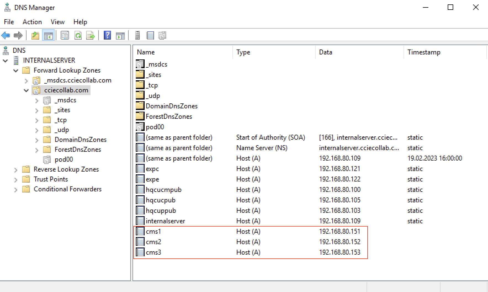
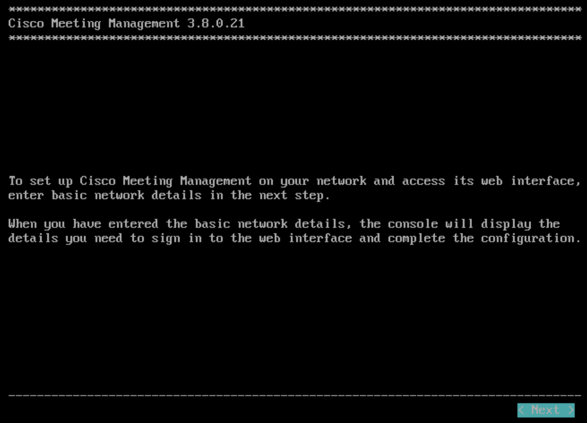
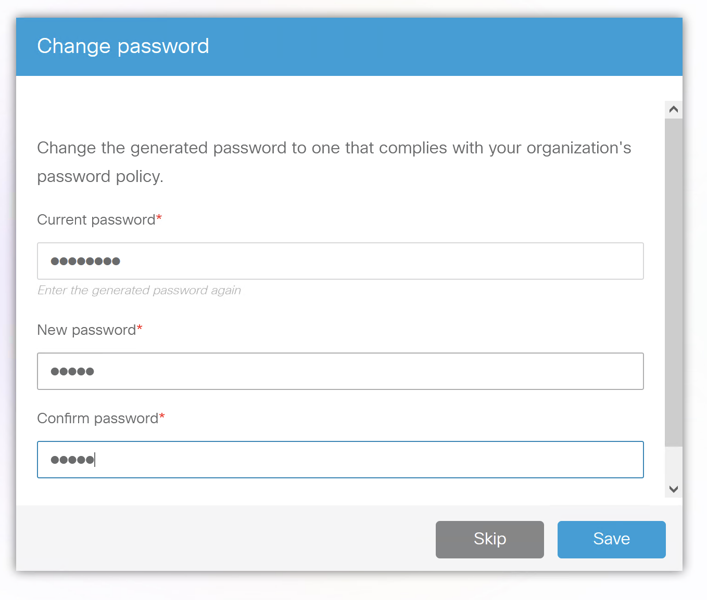
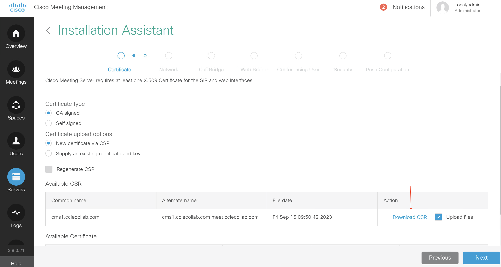
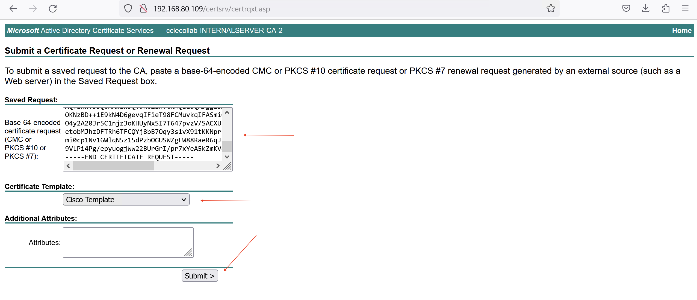
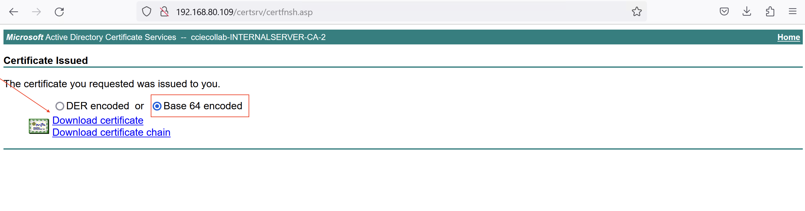
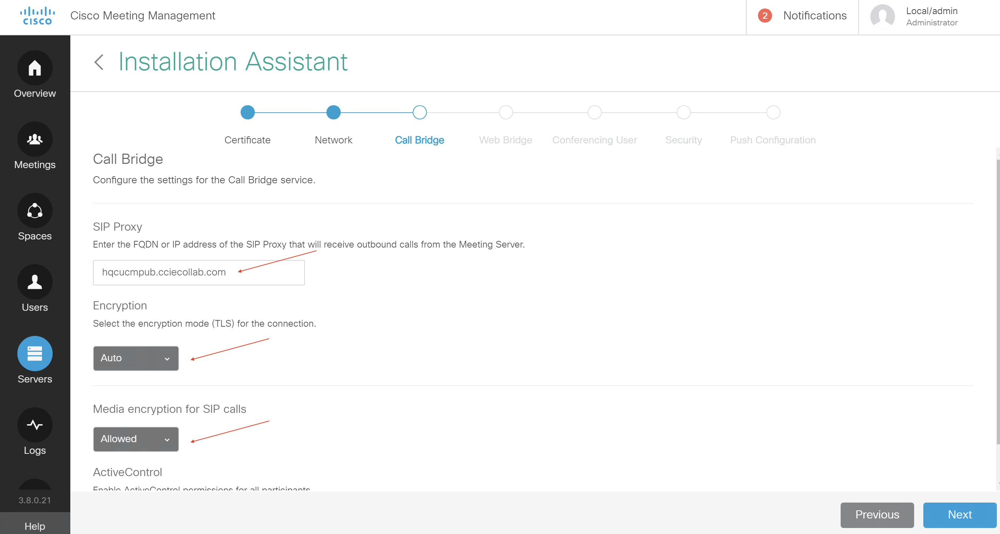

# CMS Deployment

**Database:** Allows some configuration, such as dial plan, spaces, and users to be aggregated. Supports clustering for high availability only (single master).<br>
**Call Bridge:** The audio and video conferencing bridge, including all call control and media processing. Supports clustering for high availability and scalability.<br>
**XMPP server:** Registration & authentication for CMA and WebRTC clients as well as inter-component signaling. Can be clustered for high availability only.<br>
**Web Bridge:** Provides access for WebRTC clients<br>
**Web Admin:** Administration GUI and API access, including for Unified CM ad-hoc conferencing<br>
**Recording & Streaming:** Call recording and streaming functionality

**Configuration Modes**

**Command Line (CLI):** The command-line interface, known as the MMP (or Mainboard Management Processor, from the Acano appliance days), for initial configuration tasks and certificates.<br>
**Web Admin:** Primarily for CallBridge-related configuration, especially when configuration a single, non-clustered server.<br>
**REST API:** Used for most advanced configuration tasks and those that involve a clustered database.

In addition, the SFTP protocol is used to transfer files - typically licenses, certificates, or logs - to and from the CMS server. While there may be tools that can configure much of this, it is imperative for administrators to understand and be comfortable with each of these methods of access and the type of information each provides.

**Prerequests:**

1. DNS Host-A record for all cms node

{height="60%" width="60%"}

do same record for all CMS nodes

{height="60%" width="60%"}

**Step 1 - Configure password**

Configure connectiom credential on console connection. CMS forces you to change password. Default username is `admin` and default password is also `admin`. Change password to for example `cisco`.


**Step 2 - Configure Hostname and IP address**

For your reference, the following command was used to configure the IP address on the CMS1 server:

```
CMS> hostname cms1
A reboot is required for the change to take effect
!
ipv4 a add 192.168.80.151/24 192.168.80.254
!
!
CMS> ipv4 a
IPv4 configuration:
    address         192.168.80.151
    default         true
    dhcp            false
    enabled         true
    gateway         192.168.80.254
    macaddress      00:50:56:BC:FC:7D
    prefixlen       24
IPv4 observed values
Addresses:
192.168.80.151/24
Routes:
    source          destination     gateway         global
    0.0.0.0         192.168.80.151  0.0.0.0         false
    0.0.0.0         192.168.80.0    0.0.0.0         false
    0.0.0.0         192.168.80.0    0.0.0.0         false
    0.0.0.0         192.168.80.255  0.0.0.0         false
    0.0.0.0         0.0.0.0         192.168.80.254  true
CMS>
```
**Step 3 - Installation CMM**

CMM configuration assistant getting easy to CMS configuration DNS, Certification, NTP, Timezone, LDAP etc...

{height="60%" width="60%"}

{height="60%" width="60%"}

After initial deployment, CMM generate random password for GUI

{height="60%" width="60%"}

**Step 4 - Configuration CMM**

* renew password

{height="60%" width="60%"}

* Configure CDR for CMS servers

{height="60%" width="60%"}

* Configure NTP

{height="60%" width="60%"}

then restart for applying configuration.

**Step 4 - Add CMSs to CMM**


* Enter CMS creadentials and add


* choose deployment what you want to configuration Role 


* choose certificate parameter which you desired then click next


* Configure FQDN and SIP domain. It is very important for certification. If you want to change this parameter later, you should regenerate certification.


* Download CSR



* Sign CSR on CA server with suitable template



* Download signed certificate and root certificate with Base-64 format




* Add cms certificate and root certificate of CA server


* Configure NTP, Timezone, DNS and Web Admin port


* Configure call bridge what you want



* Next this with default parameter


* Enter LDAP or LDAPS credentials


* Check summary configuration then if everything is ok, push configuration to CMS


* After pushing configuration add CMS to CMM again but in this time choose `configured server`


All this configuration for CMS1 then repeate Step 4 for all CMS servers


