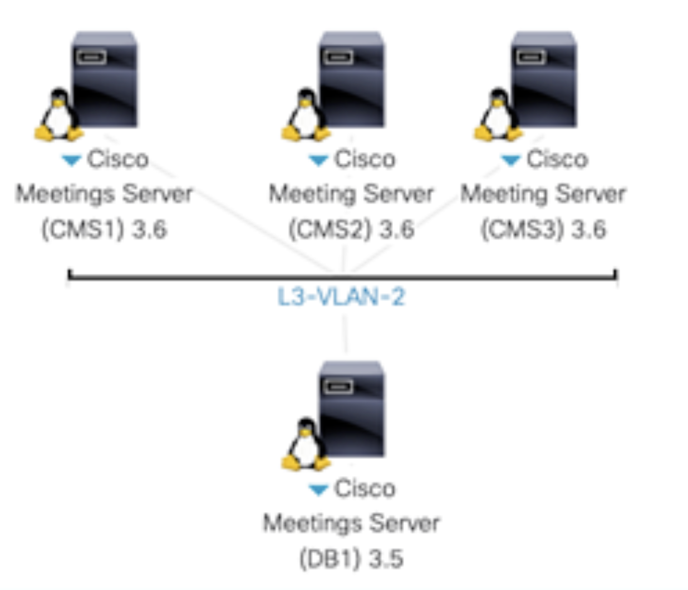

# CMS Cluster

## Database Cluster

In this chapter, we will set up a database cluster between the three CMS nodes. Each Callbridge will connect to the primary database. The slave databases are in place for resilience. 

**Certificate**

CMS requires encrypted communications between various components and as a result, X.509 certificates are required for all CMS deployments. They help ensure that a service/server can be trusted by other devices/services.

There are three types of certificates to consider: self-signed, private certificate authority (CA)-signed, and public CA-signed.

**Self-signed certificates** are certificates that the device can generate itself. They are not recommended or supported for most clustered/scalable deployments. Only the all-in-one-box deployments support self-signed certificates, and even then, it is not recommended.

**Public CA-signed certificates** require registration with a public certificate authority and are a requirement when interfacing with devices on the Internet. When deployed correctly, they are automatically trusted by browsers and mobile apps that connect to CMS. The downside is that these certificates cost money and require the domain to be registered with an external domain registrar.

**Private CA-signed certificates** are similar to the public CA-signed certificate except the CA itself is controlled by the customer and therefore not automatically trusted by devices outside the administrative control of the company managing the CA. That said, trust can be achieved by installing the root certificate from the private CA onto the devices that need to trust the certificates signed by the CA.

In this lab, you will be using a private CA to generate certificates for CMS. The CA for this lab is a Microsoft Windows Certificate Authority server. You will be installing the root CA certificate from this private CA on your various devices so that certificates generated by the CA will be trusted by the other devices in the lab. Often times this is what is found in internal customer networks, while public CA signed certificates are installed for externally facing services so that external customers or non-CMS users can trust that they are indeed communicating to your organization.

Although every service requires a certificate, creating individual certificates for each service can add unnecessary complexity. Fortunately, you can generate a certificate public and private key pair, then re-use it for multiple services. For example, in this lab you will obtain a single certificate for Call Bridge, XMPP server, Web Bridge, and Web Admin. With some additional considerations, this certificate will also be able to integrate with on-premise Microsoft Lync / Skype for Business.

Database clustering however, has some `special certificate requirements` and therefore requires its own certificates. It uses a `server certificate` that is similar to the certificates used by the other servers, but there is also a `client certificate` used for connections to the database. The database certificates are used for both authentication and encryption. Instead of presenting a username and password for the client to connect to the database, it presents the client certificate which is trusted by the server. Each server in the database cluster will share the same public and private key pair. This allows all the servers in the cluster to encrypt data in such a way that it can only be decrypted by other servers that also share the same key pair.

For all CA-signed certificates (both public and private), the general process is as follows:

* The pki csr command is used to generate certificate requests. This creates a new private key and a certificate signing request (CSR) file.

* Download the CSR file to the local PC via SFTP.

* Submit the CSR to the Certificate Authority to get the CSR signed. In this lab, you will submit the CSR and download the certificate issued by the CA via the command-line.

* Upload the issued certificate to CMS via SFTP.

**Create CSR Certificate**

When used by itself, the CN is set to the Fully Qualified Domain Name (FQDN) of the CMS server as specified in DNS, e.g `cms1a.pod1.cms.lab`. It is needed to secure the DNS identity of the server, especially when used for a single, dedicated function. For instance, it allows for browsers to display the secure icon when specifying the name of single CMS server. When used for multiple roles, as we do in this lab, the CN field is less important for certificate verification, since browsers and most other devices should verify the server identity using the multiple subjectAltName fields (see below) instead of the CN. However, when integrating with Microsoft Lync / Skype for Business, which we will later on, the CN is still important, so we will set the CN now to a DNS name we have set up for the CMS cluster FQDN for that portion of the integration, cms1.pod1.cms.lab.

`The subjectAltName` includes the FQDN that users will use to access the CMS, cms1.pod1.cms.lab. This is the DNS name for the specific CMS server, not just thw whole cluster

`The subjectAltName` includes the XMPP domain, which is the domain portion of the URI that users will use when logging into CMS, e.g. conf.pod1.cms.lab

`The subjectAltName` includes the CMS domain (which users will use for their meeting spaces and IDs), `pod1.cms.lab`

`The subjectAltName` includes the FQDN of the CMS server. This is included in case the FQDN is specified directly instead of a cluster DNS name. You could technically use cms1.pod1.cms.lab, but often it's good to use something that's easier to users to remember, or if you might have different hosts that are dedicated to the web bridge functionality. We'll use `join.pod1.cms.lab`

**Example for any CMS**

cms1a> pki csr cms1a CN:cms1.pod1.cms.lab subjectAltName:cms1a.pod1.cms.lab,pod1.cms.lab,conf.pod1.cms.lab,join.pod1.cms.lab

**Database Certification**

CMS uses a postgres database with a single master and multiple, fully-meshed replicas. There is only a single master database at a time (the “database server”). The remaining cluster members are replicas or “database clients”.

For redundancy to work, database clusters must consist of at least 3 servers but no more than 5, with a `maximum round-trip time of 200ms` between any cluster members. This limit is more restrictive than Call Bridge clustering, so it is often the limiting factor in geographically dispersed deployments.

The database role for CMS has some unique requirements. Unlike other roles, it requires a client and server certificate, where the client certificate has a specific CN field that is presented to the server.

For the database cluster, a dedicated `server certificate` and `client certificate` are required. These must be signed certificates, typically by an internal private CA. Because any of the database cluster members may become the master, the database server and client certificate pairs (containing the public and private keys) must be copied to all of the servers so they can assume the identity of a database client or server. Additionally, the CA’s `root certificate` must be loaded to ensure that the client and server certificates can be validated.

**Example DB Server CSR**

You can technically perform these actions on any server within the CMS cluster, but you will do this on cms1a.

Like before, use the `pki csr` command to generate the CSR. Notice that this CSR includes the names of all three CMS servers because the same certificate will be copied to all the servers. Connect to cms1a and issue the command below.

cms1a> pki csr dbclusterserver CN:cms1a.pod1.cms.lab subjectAltName:cms1b.pod1.cms.lab,cms1c.pod1.cms.lab

**Example DB Server CSR**

Next, create the database client certificate. This one is unique in that it requires setting CN:postgres. No other fields, such as the machine FQDN or other information, is required.

**Download All CSRs and Database Key Files**

Now that you have created all the necessary certificate requests, you can download them. You will also download the dbclusterserver and dbclusterclient key files containing the private keys because you will use the dbclusterserver and dbclusterclient certificates on all of the CMS servers, as they will all be configured as database cluster members.

The combined server certificate request, cms1a.csr 
The database cluster server certificate request, dbclusterserver.csr 
The database cluster client certificate request, dbclusterclient.csr 
The database cluster server private key, dbclusterserver.key 
The database cluster client private key, dbclusterclient.key

**Create a Certificate Bundle**

Some services, such as the XMPP clustering server, require a trust bundle to identify all certificates of clients that it will accept, as a form of authentication. To create such a bundle, you must create a file that contains all three server certificates (from cms1a, cms1b, and cms1c) in a single file.

## Callbridge Cluster