# UCCXD - Deploying Cisco Unified Contact Center Express

## Introduction to UCCX


Features 

1. (ACD) Automatic Call Distribution : Route calls, skills based route call
2. IVR Interactive voice responder : Interact with customer. Customer manage IVR with pressing button. 

    1 for Sales, 
    2 for Human Resource,
    3 for Information

3. DB Information : UCCX interract with DB and pull information about customer and agent response to customer with this information.  

There are four types of `Contact Center` ,

Unified Contact Center Express        : 400 Agent

Packaged Contact Center Enterprise    : 12000 Agent

Unified Contact Center Enterprise     : 24000 Agent

Webex Contact Center                  : Cloud Based Contact Center.

**UCCX Terminology**

Computer Telephony Integration (CTI) :

CTI Route Points : When you create `Application` on UCCX, CTI route point created automatically


Call Control Group : CCG is a group of concurrent port which is configure by manually.

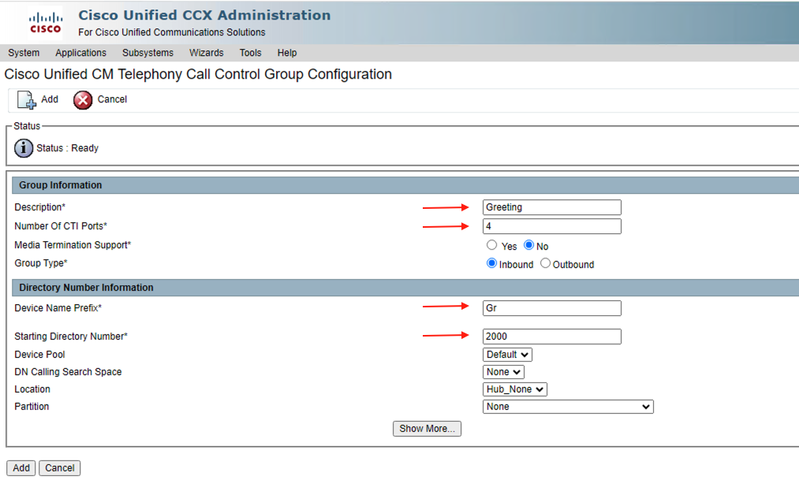


CTI Ports : When you configure `Call Control Group`, UCCX create `CTI PORTS` on Cucm due to API access.


Contact Service Queue (CSQ) : CSQ represents agent group. 


JTAPI Application User : JTAPI user manage CTI ports and CTI route point


RmCm Application User : Resource manager  is about `Agent` - Contact manager is about `queue`


Resource : Agents who can be used on CSQ etc


Skills : Used for speciality like language or expret level etc


Resource Group : RG used for grouping the agents. After creation you can assign agent to RG.


Teams : Used for supervisors. Supervisors responsible the agents. Agents who belong to `Team`, managed by same supervisor.


**UCCX Call Flow**


1 Step - `CUBE` accept call from ITSP.

2 Step - Call distribute from `CUBE`router with `dial-peer` to CUCM.

3 Step - There is a CTI route point on CUCM, call goes to `CC` from CTI route point over CTI ports.

4 Step - Contact Center accept call from trigger number and distribute to agent that you configure.

**Automatic Call Distribution (ACD)**

`Resource groups` are a static group of agents that can be assigned to one or more queues.

 `Skills` based routing can be configured to require an agent to be assigned one or more skills, and at a minimum level, before calls can be routed to them, and route the calls to agents based on the skill level assigned to them. Queues can be configured to route based on a number of functions based on the agent’s skill level, high to low, low to high, and based on weighting.

 In UCCX, skills are a simple text tag, and a skill level from 1 to 10. Agents can be assigned skills, and queues can be configured to require them.

 **Resource Group**
 
 ---

`Resource Group` based queuing is much more like traditional hunt group routing, where a fixed group of resources (agents) is selected from. You lose flexibility compared to Skills Based routing, but gain some simplicity. 

`Longest Idle` the person who has been off the phone the longest gets the next call

`Linear` Agent 1 always gets the call if the are available, if not, agent 2 gets the call. If neither are available, the call is delivered to agent 3, etc.


`Circular` Agent 1 gets a call, agent 2 gets the next one, and so on, unless the next scheduled agent is not available, when is skips to the next available agent in the ordered line.

Most Handled Contacts & Shortest Average Handle Time, (the system dynamically reorders the list based on efficiency metrics)


## CUCM & UCCX Integration

* Step 1 - Create `Access Control Group` for UCCX.


* Step 2 - Add `Standard AXL API Access` role to `ACG` which is created in Step 1.

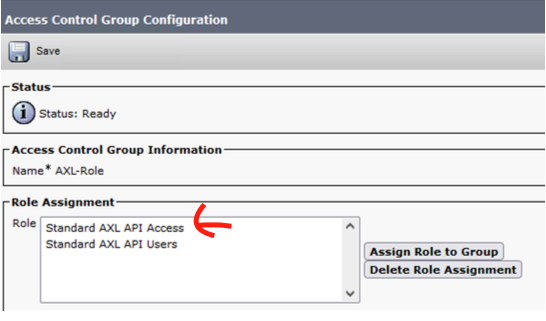

* Step 3 - Create `Application User` with this `Access Control Group`


* Step 4 - On UCCX GUI, fill the information about `CUCM`

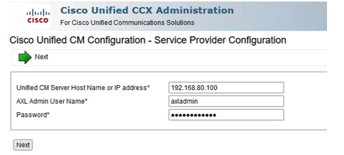

* Step 5 - This exception begun with version 12.5. You should upload `Tomcat Trust` certificate to `UCCX tomcat trust store`


* Step 6 - There are four `Tomcat Trust` certificate. Choose which belogs to `CUCM`.


* Step 7 - Download `Tomcat Trust` certificate as a .pem format, then upload it to `UCCX`. Then restart `UCCX` from cli with `utils system restart` command.


* Step 8 - Choose license type. For testing use `NFP` (Not for production).


* Step 9 - You can change license type on this page otherwise click `next` to continue.


* Step 10 - waiting for activating license then click `next`


* Step 11 - Click `next`


* Step 12 - Enter `cti` and `rmcm` user credential for managing agent and phones.


* Step 13 - Choose agent number then click `click`


* Step 14 - Choose language then click `next`


* Step 15 - Choose adminbetween users.


* Step 16 - Firstly you should assign extension as a `IPCC` Extension.


* Step 17 - Now you will see user as a resource in UCCX `Subsystems / RmCm /Resources`


* Step 18 - Now create skill and assign it `Subsystems / RmCm / Skill` and add new


* Step 19 - Add `Skill` to `Resource`

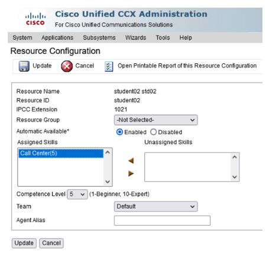

* Step 20 - Now assign supervisor capability `Wizard / RmCm Wizard / Add Supervisor` By default all users as agent capabilit. Then click `Next`

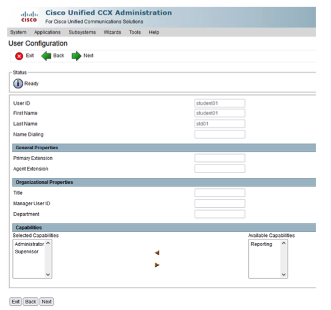

* Step 21 - Step build `Contact Service Queues` then click `Next`


- Automatic wrap UP
- Wrap up time

* Step 22 - Choose `Skill` and `Resource Selection Criteria`


* Step 23 - Congratulations you created a CSQ.


* Step 24 - Lets configure `Call Control Group`. Subsystems / Cisco Unified CM Telephony / Call Control Group then click `Add`.


* Step 25 - Check it on UCCX


and from CUCM site


## UCCX Creating Script

For creating script, we need script editor. You can download it from uccx plugin page like below.

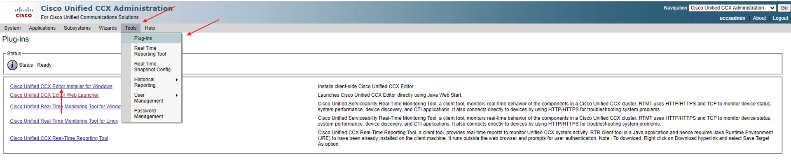

It is easy to install. a couple of `next` `next`


* There are four sites of `script editor`.Script editor has drop-down machanism, you dont need to know any scripting language.


* example diagram


## LABS

**LAB 01 - Play prompt**

Purpose: 

Caller calls the trigger number, listen prompt and hang up line automatically. Use P_101.waw as a prompt.


Answer:


**LAB 02 - Real Scenarios**

Purpose:

Caller calls the trigger number then listen prompt, prompt says in turkish "BT Egitim'e hoşgeldiniz muhasebe için 1'e, insan kaynakları için 2'ye, satış için 3'e, teknik destek için 4'e basın". Test every option and its call routing. Use P_201.waw as a prompt. In order of options:

1. Muhasebe (1021)

2. Insan Kaynakları (1022)

3. Satış (1023)

4. Teknik Destek (1024)

Answer:


**LAB 03 - Using SET in Script Editor**

Purpose:

Use `SET` item for LAB-02 scenario. In `timeout` listen greeting prompt again and again.

Answer:


**LAB 04 - Multi-Language Usage**

Purpose:

Use `English` as a second language in same scenario. 

Answer:


**LAB 05 - Calendar Usage in UCCX Script**

Purpose:

Use `calendar` in script for arranging propt and listen off business hours prompt to caller.

Answer:

First of all, you should arrange business hours / non-business hours on UCCX GUI `Calendar Management`. 


Is there any special days cnofigure them on `schedule Custom Business Days` line below


In third step, you can schedule holidays,


PS : Earlies version of 12.X you shoud use `Day of week` and `time of day`.


**LAB 06 - Get digit String**

Purpose:

In addition to previous labs, If caller know the extensions, call is redirected the Auto Attendant. 

Answer:

We should use `switch` and `get digit String` in this scenarios 


**LAB 07 - CSQ Usage**

Purpose:

Configure `CSQ` on uccx then set this `CSQ` on script.

Answer:


**LAB 08 Usage of Increment**

Purpose:

If you want to do something exact times you can use `increment` for counting and `if` for conditional routing.

Answer:


**LAB 09 Position of Queue**

Purpose:

Configure script and say caller that the `Position of the queue` with dynamically.

Answer:

Use `Get Reporting Statistic` for getting position, then use it in prompt.


**LAB 10 Estimated Wait Time**

Puspose:

In LAB 09 add `estimated wait time` to script. Caller lissten estimated wait time. Maybe he/she will wait maybe not. 

Answer:


PS: If there is no enough data for calculating estimated wait time, script output will -1. Thats mean not an error. 

## Database Integration

UCCX can be `READ / WRITE` to external database. For this procedure, UCCX database subsystem should be runing that is under ccx engine.

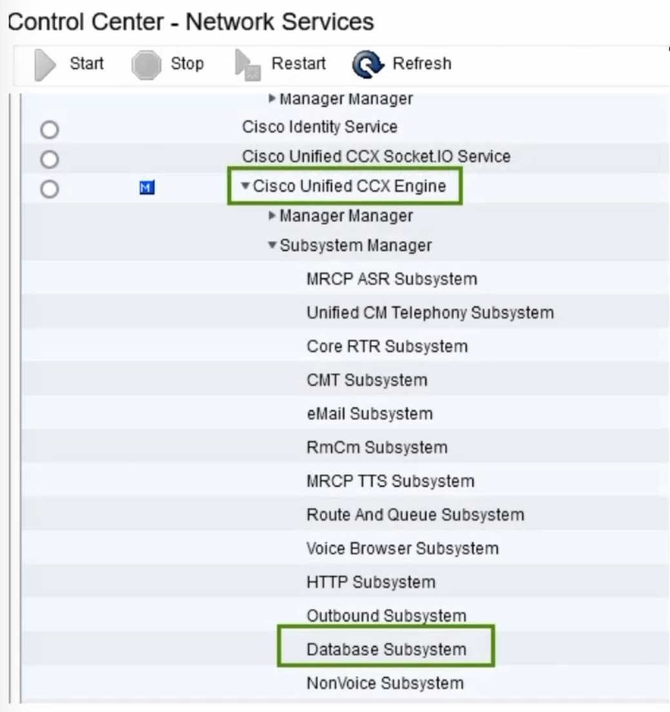

and your license must be `Premium`

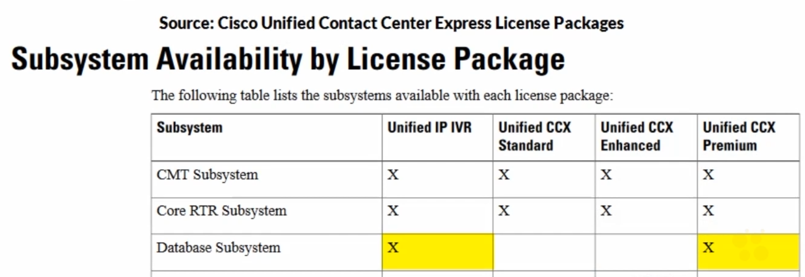

You should check which database or which version is sutiple for your UCCX version. For example for uccx 12.5.1 compatibility documantation is [UCCX 12.5 Compatibility](https://www.cisco.com/c/en/us/td/docs/voice_ip_comm/cust_contact/contact_center/crs/express_compatibility/matrix/uccxcompat12_0_5_SU2.html)

In this document


In this course we use MS SQL. We need also `jbdc` driver for connection can be [download](https://jtds.sourceforge.net/) this page. Use newer version and dowsload `jtds-x.x.x-dist` file. That is zip file extract it then use.

add driver to uccx


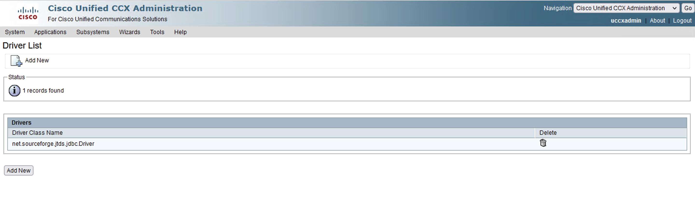

then add SQL server as a `database source`


 we should see `Successful Test Connection` like below

 

 ## LAB - Database Integration

 Purpose:

 Set script on script editor. When customer input their customer number, script check customer number on database then return to script customer name surname, customer number and their support is gold or not. At the same time if customer has gold support, agents will deal this customer as soon as possible.

 Answer:

first of all use `DB Read` with this configuration

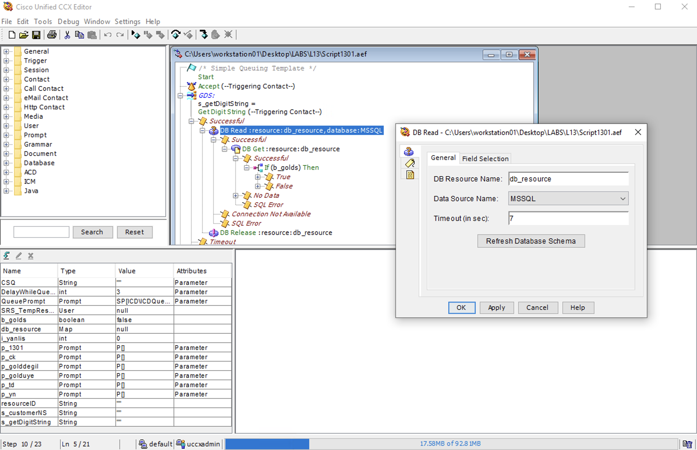

Field Selection is the most impotant part of this


Next step is `DB Get`. In this stage we will pair the values


If `b_gold` is True, set `Priority` higher then default


and then close connection with `DB Release`

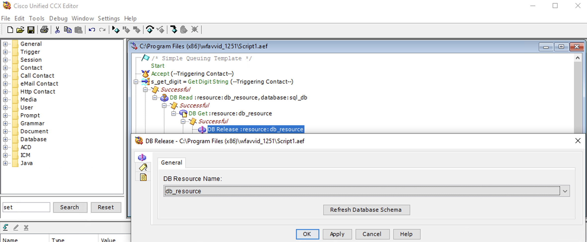

At the same time. We will display this values to agent finesse screen with `Set Enterprise Call Info` like below.


## Finess Desktop

Cisco Finesse is a web-based application and user interface framework developed by Cisco Systems. It is designed to provide a comprehensive `agent` and `supervisor` desktop for contact center environments. Finesse enables agents and supervisors to handle customer interactions across various communication channels, such as voice calls, email, web chat, and social media, all from a single interface.

**Key features of Cisco Finesse include**


`Multi-channel support:` Finesse allows agents to manage customer interactions from different channels, ensuring a consistent experience across various communication mediums.

`Call control:` Agents can handle inbound and outbound voice calls using features like call transfer, hold, conference, and call recording.

`Integrated agent desktop:` Finesse provides a unified view of customer information, including their interaction history, allowing agents to deliver personalized and efficient service.

`Collaboration tools:` Finesse supports collaboration among agents and supervisors through features like chat, team messaging, and supervisor monitoring capabilities.

`Customization and integration:` Finesse can be customized and integrated with other applications to meet specific business needs. It provides APIs and development tools for building custom workflows and integrations.

`Reporting and analytics:` Finesse offers reporting and analytics capabilities to track contact center performance, monitor agent productivity, and gather insights for continuous improvement.

Finesse Desktop URL : https://<fqdn-of-uccx>:8445

> ***PS :*** Agent phone must add to RmCm Application User controled device.


**Finesse Administration**

**Disable chat**

```xml
          <!--
	        <headercolumn width="50px">
                <component id="chat">
                    <url>/desktop/scripts/js/chat.component.js</url>
                </component>
            </headercolumn>
          -->
```


**Add Title**

You can edit the title with changing this parameter:

```xml
<config key="title" value="Cisco Finesse"/>
```


**Add Logo**


For adding `LOGO` you need `3rd party gadget` credential. Firtly you should reset this user with below command

```
utils reset_3rdpartygadget_password
```
after this, connect `UCCX` with this user over winSCP and upload `logo` to directory. (jpeg,png)


then, customize the XML file like below

```xml
<config key="logo" value="/3rdpartygadget/files/50logo.jpeg"/>
```

**Workflow**

Firstly configure pop-up URL on `workflow` Finnesse Admin panel on UCCX. 


then, determine the condition for pop-up


lastly add this flow to team


**Finnesse Supervisor Screen**

Enable `advanced capabilities` on Finnesse Administrator screeen.

```xml
<!--
			The following gadget provides Supervisor with advanced capabilities. 
			Using this gadget, supervisors can manage Queues, Prompts, Calendars, and so on. 
			Before including this gadget in Desktop Layout, 
			ensure that the advanced capability is enabled in Unified CCX Administration.
-->
            <tab>
                <id>ASCGadget</id>
                <icon>admin</icon>
                <label>finesse.container.tabs.supervisor.advancedcapabilities</label>
                <columns>
                    <column>
                        <gadgets>
                            <gadget>https://localhost:8445/ascgadget/gadgets/ascgadget.xml</gadget>
                        </gadgets>
                    </column>
                </columns>
            </tab>
```

then give permission to `Supervisor` for manage prompt, application or calendar...


## CUIC (Reporting)

## Troubleshoot of UCCX

some `cli commands` which help to troubleshoot:

```bash
file dump install system-history.log
show network eth0 details
show tech network hosts
utils diagnose test
show process load
```


