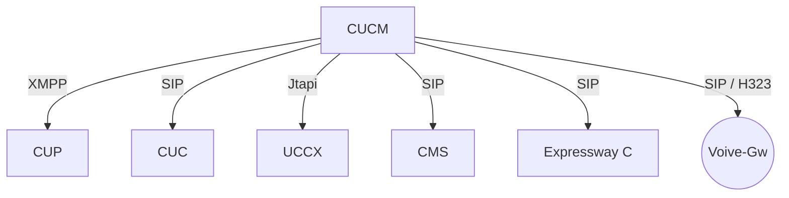
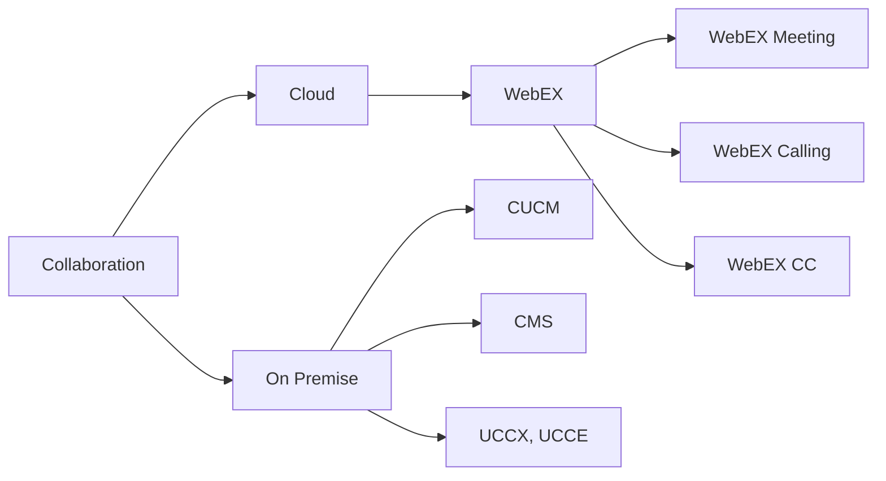
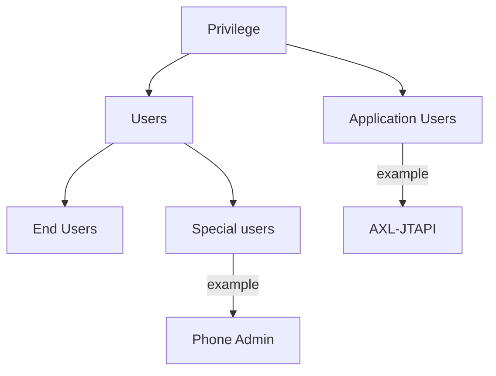
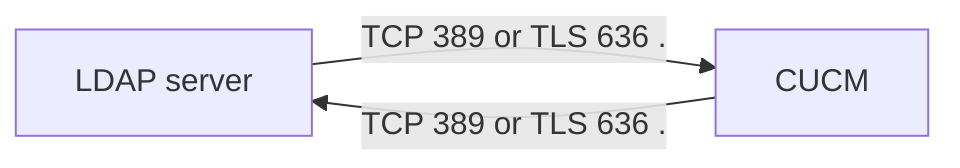

# CLCOR
<br><br><br><br><br><br><br><br><br><br>
ilker MANSUR<br>
CCIE-Collaboration #63555<br>
mail: imansur\@btegitim.com<br>
mobile: 544 208 44 97

---

### Introduction to Concepts

- Role of PBX
- What is CUCM and its components
- General Architecture of collaboration (Cloud or Onpremise)

---

### Role of PBX

Is it possible for one SIP endpoint to call another SIP endpoint without any additional equipment?


---

### Role of PBX

- Call Privilege
- Corporate Directory
- Time Based Operation
- Call Forward 
- Call Detailed Record & Call Management Record
- Hunt Group, Conference etc.

---

### CUCM Components



---

### General Architecture of Collaboration



---

### CUCM Architechture

- Important Network Protocols (TFTP, DHCP, NTP, RTP)

- [Used Port](https://www.cisco.com/c/en/us/td/docs/voice_ip_comm/cucm/im_presence/configAdminGuide/11_5_1/cup0_b_config-and-admin-guide-1151su5/cup0_b_imp-system-configuration-1151su5_chapter_0100000.pdf)

---

### Publisher 

- Cisco Database Layer Monitor (DBL)
- Cisco DRF Master (Disaster Recovery Framework Master)
- Extension mobility

**User-facing Features :** Call Forward All(CFA), Message Waiting Indication (MWI), Do Not Disturb, Hunt Group logout, Device Mobility. 


---


### Subscriber

- Cisco CallManager (CCM)
- Cisco TFTP
- Cisco Computer telephony Integration Manager (CTI)
- Cisco Administrative XML Web Service (AXL)
- Cisco IP Voice Media Streaming App
	

---

### DB Replication


---

### Database Access Control

Database access between members of af a cluster is protected:

- By Internet Protocol (IP) access control
- By security Password


---

### CUCM Signaling and Media Path


---

### Deployment Options

There are three kind of deployment model acording to your company and number of **IPT**

==**Models :**==

- Single-site Deployment
- Multisite WAN centralize call process
- Multisite WAN with distributed call Process

---

### Single-Site Deployment
- CUCM servers, applications, DSP resource are at the same physical location.


---

### Multisite WAN with Centralized Call Processing
- CUCM at the central site, DSP sources distributed.


---

### Multisite WAN with Distributed Call Processing
- CUCM servers and DSP resources distributed


---

### Clustering over the IP WAN

- IP carries ==intracluster== server communication.


---

### Redundancy Design 
- (1:1 or 2:1)


---

### CUCM Panel

- Application User
- Administrator User


---

### Enterprise Parameters

- It affects all cluster parameters


---

### Service Parameters

- It affects specific servers


---

### Day 0 Configuration

- Don't forget ==service activation!==
- Change server info from name to ip
- Change Enterprise p from name to ip
- Enable CDR for every server
- Change Max Ad-Hoc conference
- Adjust T302 inter-digit timeout

---

### User Management



---

### LDAP For Users


<br>

- Enable Syncronizing from LDAP Server
- Configure LDAP Directory (for User)
- Configure LDAP Directory (for Authentication)
- Configure LDAP Filter (for filtering)

---

### LDAP Filter

Ldap filter should be used for creating special corporate Directory.

==Example Base DN :==

```
OU=NetworkUsers, DC=example, DC=com
```

==Example Attribute :==
```
(objectClass=User,Computer,Group)
(telephonyNumber=*)
(mail=*)

```


---

### Bulk Administration Tool

- For bulk process you should use BAT or AXL


---

### Phone Registeration Process

```mermaid
sequenceDiagram

Phone ->> Switch : What is voice-vlan ID
Switch ->> Phone : <response> 
Phone ->> DHCP : What is option 150? (TFTP Server)
DHCP ->> Phone : <response>
Phone ->> TFTP Server : Give me <SEP_or_SIP>mac_address.cnf.xml
TFTP Server ->> Phone : Send configuration file or default configuration file
Phone ->> CUCM : Register to cucm if it has conf file or auto-registration is enable 

---

### Auto Registration


---

### Deployment

| Feature | Single Site | Multi Site |
|--|--|--|
| Call Manager Group | high | high |
| Date Time Group | low | high |
| Region | low | high |
| Location | low | high |
| Phone Button Template | high | high |
| Softkey Template | high | high |
| Phone Security Profile | high | high |

---

### Call Privilege


---

### Phone Button Template


---

### Softkey Template


---

### Phone Configuration


