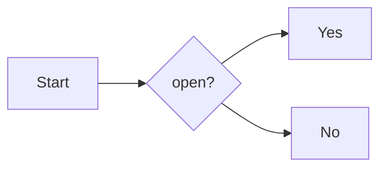

# MD Tutorial

This is code example 

```python title="Python Code Test" linenums="1" hl_lines="3-5"

def addition (a,b): # (1)
    # This is defination
    result = a + b
    print (result)
    return result

```

1.  :simple-python: I'm a code annotation! I can contain `code`, __formatted
    text__, images, ... basically anything that can be written in Markdown.


=== "plain text"

    some plain text

=== "unordered list"

    * first item
    * second item
    * third item

=== "ordered list"

    1. ilk item
    2. ikinci item
    3. üçüncü item


??? info "Important Notes"

    this is the important note. Dont forget it.

another text here 



==highlight==

++ctrl+c++ and ++ctrl+v++

++option+","++ for back tic

2^4^ = 16

H~2~O

{--delete--} and {++adding++}

## Image resize and Alignment

{ width="300", align=left }
some text in here lorem ipsum some text in here lorem ipsum some text in here lorem ipsum some text in here lorem ipsum some text in here lorem ipsum some text in here lorem ipsum some text in here lorem ipsum some text in here lorem ipsum some text in here lorem ipsum.

some text in here lorem ipsum some text in here lorem ipsum some text in here lorem ipsum some text in here lorem ipsum.


